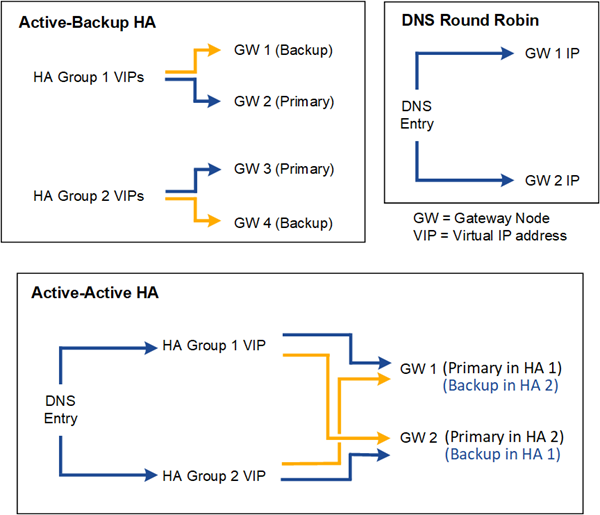

= Opzioni di configurazione per i gruppi HA
:allow-uri-read: 
:icons: font
:imagesdir: ../media/

[role="lead"]
I diagrammi seguenti forniscono esempi di diversi modi in cui è possibile configurare i gruppi HA.  Ogni opzione presenta vantaggi e svantaggi.

Nei diagrammi, il blu indica l'interfaccia primaria nel gruppo HA e il giallo indica l'interfaccia di backup nel gruppo HA.

La tabella riassume i vantaggi di ciascuna configurazione HA mostrata nel diagramma.

[cols="1a,2a,2a"]
|===
| Configurazione | Vantaggi | Svantaggi 

 a| 
HA con backup attivo
 a| 
* Gestito da StorageGRID senza dipendenze esterne.
* Failover rapido.

 a| 
* In un gruppo HA è attivo solo un nodo.  Almeno un nodo per gruppo HA sarà inattivo.

 a| 
DNS Round Robin
 a| 
* Aumento della produttività aggregata.
* Nessun host inattivo.

 a| 
* Failover lento, che potrebbe dipendere dal comportamento del client.
* Richiede la configurazione dell'hardware al di fuori di StorageGRID.
* Richiede un controllo sanitario implementato dal cliente.

 a| 
HA attivo-attivo
 a| 
* Il traffico è distribuito su più gruppi HA.
* Elevata produttività aggregata che aumenta con il numero di gruppi HA.
* Failover rapido.

 a| 
* Più complesso da configurare.
* Richiede la configurazione dell'hardware al di fuori di StorageGRID.
* Richiede un controllo sanitario implementato dal cliente.

|===