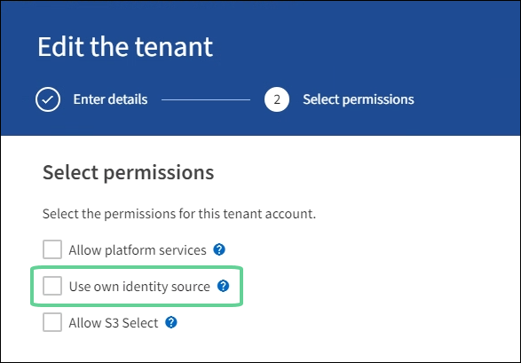

= Conferma che gli utenti federati possono accedere
:allow-uri-read: 
:icons: font
:imagesdir: ../media/

[role="lead"]
Prima di abilitare l'accesso Single Sign-On (SSO), è necessario confermare che almeno un utente federato possa accedere a Grid Manager e a Tenant Manager per tutti gli account tenant esistenti.

.Prima di iniziare
* Hai effettuato l'accesso a Grid Manager utilizzando unlink:../admin/web-browser-requirements.html["browser web supportato"] .
* Hailink:admin-group-permissions.html["autorizzazioni di accesso specifiche"] .
* Hai già configurato la federazione delle identità.

.Passi
. Se sono già presenti account tenant, verificare che nessuno dei tenant utilizzi la propria fonte di identità.
+

TIP: Quando si abilita SSO, un'origine identità configurata in Tenant Manager viene sostituita dall'origine identità configurata in Grid Manager.  Gli utenti appartenenti all'origine identità del tenant non potranno più effettuare l'accesso a meno che non dispongano di un account con l'origine identità di Grid Manager.

+
.. Sign in al Tenant Manager per ogni account tenant.
.. Selezionare *GESTIONE ACCESSI* > *Federazione identità*.
.. Verificare che la casella di controllo *Abilita federazione delle identità* non sia selezionata.
.. In tal caso, verificare che tutti i gruppi federati eventualmente utilizzati per questo account tenant non siano più necessari, deselezionare la casella di controllo e selezionare *Salva*.

. Verificare che un utente federato possa accedere a Grid Manager:
+
.. Da Grid Manager, seleziona *CONFIGURAZIONE* > *Controllo accessi* > *Gruppi amministratori*.
.. Assicurarsi che almeno un gruppo federato sia stato importato dall'origine identità di Active Directory e che gli sia stata assegnata l'autorizzazione di accesso Root.
.. Disconnessione.
.. Conferma di poter accedere nuovamente a Grid Manager come utente del gruppo federato.

. Se sono presenti account tenant, verificare che un utente federato con autorizzazione di accesso Root possa accedere:
+
.. Da Grid Manager, seleziona *TENANTS*.
.. Selezionare l'account tenant e selezionare *Azioni* > *Modifica*.
.. Nella scheda Inserisci dettagli, seleziona *Continua*.
.. Se è selezionata la casella di controllo *Usa la propria fonte di identità*, deselezionarla e selezionare *Salva*.
+

+
Viene visualizzata la pagina Inquilino.

.. Selezionare l'account tenant, selezionare * Sign in* e accedere all'account tenant come utente root locale.
.. Da Tenant Manager, seleziona *GESTIONE ACCESSI* > *Gruppi*.
.. Assicurarsi che almeno a un gruppo federato di Grid Manager sia stata assegnata l'autorizzazione di accesso Root per questo tenant.
.. Disconnessione.
.. Conferma di poter accedere nuovamente al tenant come utente nel gruppo federato.

.Informazioni correlate
* link:requirements-for-sso.html["Requisiti e considerazioni per l'accesso singolo"]
* link:managing-admin-groups.html["Gestisci gruppi di amministratori"]
* link:../tenant/index.html["Utilizzare un account tenant"]

