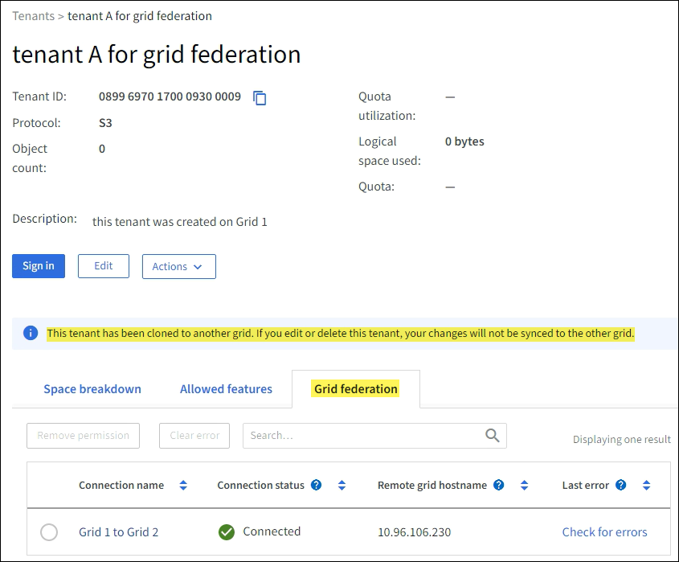

= Gestire gli inquilini autorizzati per la federazione della rete
:allow-uri-read: 
:icons: font
:imagesdir: ../media/

[role="lead"]
È possibile consentire agli account tenant S3 di utilizzare una connessione federata di griglia tra due sistemi StorageGRID .  Quando agli inquilini è consentito utilizzare una connessione, sono necessari passaggi speciali per modificare i dettagli dell'inquilino o per rimuovere definitivamente l'autorizzazione di un inquilino a utilizzare la connessione.

.Prima di iniziare
* Hai effettuato l'accesso a Grid Manager su entrambe le griglie utilizzando unlink:../admin/web-browser-requirements.html["browser web supportato"] .
* Tu hai illink:admin-group-permissions.html["Permesso di accesso root"] per la griglia a cui hai effettuato l'accesso.
* Hailink:grid-federation-create-connection.html["ha creato una connessione di federazione di rete"] tra due griglie.
* Hai esaminato i flussi di lavoro perlink:grid-federation-what-is-account-clone.html["clonazione dell'account"] Elink:grid-federation-what-is-cross-grid-replication.html["replicazione cross-grid"] .
* Come richiesto, hai già configurato l'accesso singolo (SSO) o identificato la federazione per entrambe le griglie nella connessione. Vedere link:grid-federation-what-is-account-clone.html["Che cosa è il clone dell'account"] .

== Creare un inquilino autorizzato

Se si desidera consentire a un account tenant nuovo o esistente di utilizzare una connessione di federazione di griglia per la clonazione dell'account e la replica tra griglie, seguire le istruzioni generali perlink:creating-tenant-account.html["creare un nuovo tenant S3"] Olink:editing-tenant-account.html["modificare un account inquilino"] e notare quanto segue:

* È possibile creare il tenant da entrambe le griglie nella connessione.  La griglia in cui viene creato un tenant è la _griglia di origine del tenant_.
* Lo stato della connessione deve essere *Connesso*.
* Quando il tenant viene creato o modificato per abilitare l'autorizzazione *Usa connessione federazione griglia* e quindi salvato sulla prima griglia, un tenant identico viene automaticamente replicato sull'altra griglia.  La griglia in cui viene replicato il tenant è la _griglia di destinazione del tenant_.
* Gli inquilini su entrambe le griglie avranno lo stesso ID account di 20 cifre, nome, descrizione, quota e autorizzazioni.  Facoltativamente, puoi utilizzare il campo *Descrizione* per identificare quale sia il tenant di origine e quale quello di destinazione.  Ad esempio, questa descrizione per un tenant creato sulla Griglia 1 apparirà anche per il tenant replicato sulla Griglia 2: "Questo tenant è stato creato sulla Griglia 1".
* Per motivi di sicurezza, la password di un utente root locale non viene copiata nella griglia di destinazione.
+

TIP: Prima che un utente root locale possa accedere al tenant replicato sulla griglia di destinazione, un amministratore di griglia per quella griglia develink:changing-password-for-tenant-local-root-user.html["cambiare la password per l'utente root locale"] .

* Dopo che il tenant nuovo o modificato è disponibile su entrambe le griglie, gli utenti del tenant possono eseguire queste operazioni:
+
** Dalla griglia di origine del tenant, crea gruppi e utenti locali, che vengono automaticamente clonati nella griglia di destinazione del tenant. Vedere link:../tenant/grid-federation-account-clone.html["Clona gruppi tenant e utenti"] .
** Crea nuove chiavi di accesso S3, che possono essere facoltativamente clonate nella griglia di destinazione del tenant. Vedere link:../tenant/grid-federation-clone-keys-with-api.html["Clona le chiavi di accesso S3 utilizzando l'API"] .
** Crea bucket identici su entrambe le griglie nella connessione e abilita la replica tra griglie in una direzione o in entrambe le direzioni. Vedere link:../tenant/grid-federation-manage-cross-grid-replication.html["Gestire la replicazione tra griglie"] .

== Visualizza un inquilino autorizzato

È possibile visualizzare i dettagli di un tenant autorizzato a utilizzare una connessione di federazione di rete.

.Passi
. Selezionare *INQUILINI*.
. Dalla pagina Inquilini, seleziona il nome dell'inquilino per visualizzare la pagina dei dettagli dell'inquilino.
+
Se questa è la griglia di origine del tenant (ovvero se il tenant è stato creato su questa griglia), viene visualizzato un banner per ricordare che il tenant è stato clonato in un'altra griglia.  Se modifichi o elimini questo tenant, le modifiche non verranno sincronizzate con l'altra griglia.

+

. Facoltativamente, seleziona la scheda *Federazione griglia* perlink:../monitor/grid-federation-monitor-connections.html["monitorare la connessione della federazione di rete"] .

== Modifica un inquilino autorizzato

Se è necessario modificare un tenant che dispone dell'autorizzazione *Usa connessione federazione griglia*, seguire le istruzioni generali perlink:editing-tenant-account.html["modifica di un account inquilino"] e notare quanto segue:

* Se un tenant dispone dell'autorizzazione *Usa connessione federazione griglia*, è possibile modificare i dettagli del tenant da entrambe le griglie nella connessione.  Tuttavia, le modifiche apportate non verranno copiate nell'altra griglia.  Se si desidera mantenere sincronizzati i dettagli del tenant tra le griglie, è necessario apportare le stesse modifiche su entrambe le griglie.
* Non è possibile cancellare l'autorizzazione *Usa connessione federazione griglia* quando si modifica un tenant.
* Non è possibile selezionare una connessione di federazione di griglia diversa quando si modifica un tenant.

== Elimina un inquilino autorizzato

Se è necessario rimuovere un tenant che dispone dell'autorizzazione *Usa connessione federazione griglia*, seguire le istruzioni generali perlink:deleting-tenant-account.html["eliminazione di un account tenant"] e notare quanto segue:

* Prima di poter rimuovere il tenant originale dalla griglia di origine, è necessario rimuovere tutti i bucket per l'account dalla griglia di origine.
* Prima di poter rimuovere il tenant clonato dalla griglia di destinazione, è necessario rimuovere tutti i bucket per l'account dalla griglia di destinazione.
* Se si rimuove il tenant originale o quello clonato, l'account non potrà più essere utilizzato per la replica tra griglie.
* Se si rimuove il tenant originale dalla griglia di origine, eventuali gruppi di tenant, utenti o chiavi clonati nella griglia di destinazione non saranno interessati.  È possibile eliminare il tenant clonato oppure consentirgli di gestire i propri gruppi, utenti, chiavi di accesso e bucket.
* Se si rimuove il tenant clonato dalla griglia di destinazione, si verificheranno errori di clonazione se nuovi gruppi o utenti vengono aggiunti al tenant originale.
+
Per evitare questi errori, rimuovere l'autorizzazione del tenant a utilizzare la connessione federata della griglia prima di eliminare il tenant da questa griglia.

== [[remove-grid-federation-connection-permission]]Rimuovi Usa autorizzazione di connessione alla federazione della griglia

Per impedire a un tenant di utilizzare una connessione federata alla griglia, è necessario rimuovere l'autorizzazione *Usa connessione federata alla griglia*.

image::../media/grid-federation-remove-permission.png[passaggi per rimuovere la connessione della federazione di rete]

Prima di revocare l'autorizzazione di un tenant a utilizzare una connessione di federazione di rete, tenere presente quanto segue:

* Non è possibile rimuovere l'autorizzazione *Usa connessione federazione griglia* se uno qualsiasi dei bucket del tenant ha abilitata la replica tra griglie.  L'account tenant deve prima disabilitare la replica tra griglie per tutti i propri bucket.
* La rimozione dell'autorizzazione *Usa connessione federazione griglia* non elimina gli elementi che sono già stati replicati tra le griglie.  Ad esempio, tutti gli utenti, i gruppi e gli oggetti tenant presenti su entrambe le griglie non vengono eliminati da nessuna delle due griglie quando viene rimossa l'autorizzazione del tenant.  Se si desidera eliminare questi elementi, è necessario eliminarli manualmente da entrambe le griglie.
* Se si desidera riattivare questa autorizzazione con la stessa connessione di federazione della griglia, eliminare prima questo tenant sulla griglia di destinazione; in caso contrario, la riattivazione di questa autorizzazione genererà un errore.

NOTE: Riattivando l'autorizzazione *Usa connessione federazione griglia*, la griglia locale diventa la griglia di origine e viene attivata la clonazione sulla griglia remota specificata dalla connessione federazione griglia selezionata.  Se l'account tenant esiste già sulla griglia remota, la clonazione genererà un errore di conflitto.

.Prima di iniziare
* Stai utilizzando unlink:../admin/web-browser-requirements.html["browser web supportato"] .
* Tu hai illink:admin-group-permissions.html["Permesso di accesso root"] per entrambe le griglie.

=== Disabilita la replica per i bucket tenant

Come primo passaggio, disabilitare la replica tra griglie per tutti i bucket tenant.

.Passi
. Partendo da una delle due griglie, accedi a Grid Manager dal nodo di amministrazione principale.
. Selezionare *CONFIGURAZIONE* > *Sistema* > *Federazione di griglia*.
. Selezionare il nome della connessione per visualizzarne i dettagli.
. Nella scheda *Tenant consentiti*, determinare se il tenant sta utilizzando la connessione.
. Se l'inquilino è elencato, istruirlo alink:../tenant/grid-federation-manage-cross-grid-replication.html["disabilitare la replicazione tra griglie"] per tutti i loro bucket su entrambe le griglie nella connessione.
+

TIP: Non è possibile rimuovere l'autorizzazione *Usa connessione federazione griglia* se in uno qualsiasi dei bucket tenant è abilitata la replica tra griglie.  Il tenant deve disabilitare la replica tra griglie per i propri bucket su entrambe le griglie.

=== Rimuovi l'autorizzazione per l'inquilino

Dopo aver disabilitato la replica tra griglie per i bucket tenant, è possibile rimuovere l'autorizzazione del tenant a utilizzare la connessione federata della griglia.

.Passi
. Sign in a Grid Manager dal nodo di amministrazione principale.
. Rimuovere l'autorizzazione dalla pagina Federazione della griglia o dalla pagina Tenant.
+
[role="tabbed-block"]
====
.Pagina della federazione della griglia
--
.. Selezionare *CONFIGURAZIONE* > *Sistema* > *Federazione di griglia*.
.. Selezionare il nome della connessione per visualizzarne la pagina dei dettagli.
.. Nella scheda *Locatari consentiti*, selezionare il pulsante di opzione per il locatario.
.. Seleziona *Rimuovi autorizzazione*.

--
.Pagina degli inquilini
--
.. Selezionare *INQUILINI*.
.. Selezionare il nome dell'inquilino per visualizzare la pagina dei dettagli.
.. Nella scheda *Federazione di griglia*, selezionare il pulsante di opzione per la connessione.
.. Seleziona *Rimuovi autorizzazione*.

--
====
. Esaminare gli avvisi nella finestra di dialogo di conferma e selezionare *Rimuovi*.
+
** Se l'autorizzazione può essere rimossa, verrai reindirizzato alla pagina dei dettagli e verrà visualizzato un messaggio di conferma dell'operazione.  Questo tenant non può più utilizzare la connessione alla federazione di rete.
** Se uno o più bucket tenant hanno ancora la replica tra griglie abilitata, viene visualizzato un errore.
+
image::../media/grid-federation-remove-permission-error.png[messaggio di errore visualizzato se il tenant ha cgr abilitato per un bucket]

+
Puoi procedere in uno dei seguenti modi:

+
*** (Raccomandato.)  Sign in a Tenant Manager e disabilita la replica per ciascun bucket del tenant. Vedere link:../tenant/grid-federation-manage-cross-grid-replication.html["Gestire la replicazione tra griglie"] .  Quindi, ripetere i passaggi per rimuovere l'autorizzazione *Usa connessione alla rete*.
*** Rimuovere l'autorizzazione con la forza.  Vedere la sezione successiva.

. Passare all'altra griglia e ripetere questi passaggi per rimuovere l'autorizzazione per lo stesso tenant sull'altra griglia.

== [[force_remove_permission]]Rimuovi il permesso con la forza

Se necessario, è possibile forzare la rimozione dell'autorizzazione di un tenant a utilizzare una connessione di federazione di griglia anche se nei bucket del tenant è abilitata la replica tra griglie.

Prima di revocare con la forza il permesso di un inquilino, tenere presente le considerazioni generali per<<remove-grid-federation-connection-permission,rimozione del permesso>> oltre a queste considerazioni aggiuntive:

* Se si rimuove forzatamente l'autorizzazione *Usa connessione federazione griglia*, tutti gli oggetti in attesa di replica sull'altra griglia (ingeriti ma non ancora replicati) continueranno a essere replicati.  Per impedire che questi oggetti in corso raggiungano il bucket di destinazione, è necessario rimuovere l'autorizzazione del tenant anche sull'altra griglia.
* Tutti gli oggetti inseriti nel bucket di origine dopo aver rimosso l'autorizzazione *Usa connessione federazione griglia* non verranno mai replicati nel bucket di destinazione.

.Passi
. Sign in a Grid Manager dal nodo di amministrazione principale.
. Selezionare *CONFIGURAZIONE* > *Sistema* > *Federazione di griglia*.
. Selezionare il nome della connessione per visualizzarne la pagina dei dettagli.
. Nella scheda *Locatari consentiti*, selezionare il pulsante di opzione per il locatario.
. Seleziona *Rimuovi autorizzazione*.
. Rivedi gli avvisi nella finestra di dialogo di conferma e seleziona *Forza rimozione*.
+
Viene visualizzato un messaggio di successo.  Questo tenant non può più utilizzare la connessione alla federazione di rete.

. Se necessario, vai all'altra griglia e ripeti questi passaggi per forzare la rimozione dell'autorizzazione per lo stesso account tenant sull'altra griglia.  Ad esempio, dovresti ripetere questi passaggi sull'altra griglia per impedire che gli oggetti in corso di elaborazione raggiungano il bucket di destinazione.

