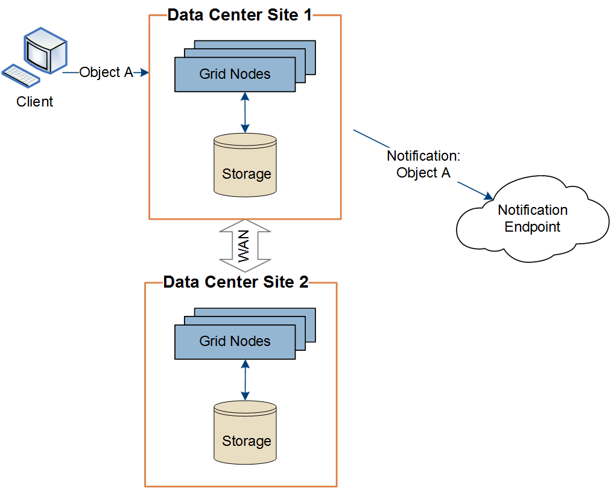

= Consegna per sito di messaggi di servizi di piattaforma
:allow-uri-read: 
:icons: font
:imagesdir: ../media/

[role="lead"]
Tutte le operazioni dei servizi della piattaforma vengono eseguite per ogni sito.

Ciò significa che se un tenant utilizza un client per eseguire un'operazione di creazione API S3 su un oggetto connettendosi a un nodo gateway nel sito del data center 1, la notifica relativa a tale azione viene attivata e inviata dal sito del data center 1.

Se successivamente il client esegue un'operazione di eliminazione dell'API S3 sullo stesso oggetto dal sito del Data Center 2, la notifica relativa all'azione di eliminazione viene attivata e inviata dal sito del Data Center 2.

image::../media/notifications_site_2.gif[diagramma che mostra l'azione sull'oggetto dal sito 2 che attiva le notifiche dal sito 2]

Assicurarsi che la rete in ogni sito sia configurata in modo tale che i messaggi dei servizi della piattaforma possano essere recapitati alle rispettive destinazioni.
