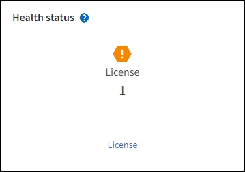

= Visualizza le informazioni sulla licenza StorageGRID
:allow-uri-read: 
:icons: font
:imagesdir: ../media/

[role="lead"]
Ogni volta che è necessario, è possibile visualizzare le informazioni sulla licenza del sistema StorageGRID , ad esempio la capacità di archiviazione massima della griglia.

.Prima di iniziare
Hai effettuato l'accesso a Grid Manager utilizzando unlink:../admin/web-browser-requirements.html["browser web supportato"] .

.Informazioni su questo compito
Se si verifica un problema con la licenza software per questo sistema StorageGRID , la scheda Stato di integrità nella dashboard include un'icona Stato licenza e un collegamento *Licenza*.  Il numero indica il numero di problemi relativi alla licenza.

.Passi
. Accedi alla pagina Licenza eseguendo una delle seguenti operazioni:
+
** Selezionare *MANUTENZIONE* > *Sistema* > *Licenza*.
** Dalla scheda Stato di integrità nella dashboard, seleziona l'icona Stato licenza o il collegamento *Licenza*.
+
Questo collegamento appare solo se c'è un problema con la licenza.

. Visualizza i dettagli di sola lettura per la licenza corrente:
+
** ID di sistema StorageGRID , ovvero il numero di identificazione univoco per questa installazione StorageGRID
** Numero di serie della licenza
** Tipo di licenza, *Perpetua* o *Abbonamento*
** Capacità di stoccaggio autorizzata della rete
** Capacità di archiviazione supportata
** Data di scadenza della licenza.  *N/D* appare per una licenza perpetua.
** Data di fine del supporto
+
Questa data viene letta dal file di licenza corrente e potrebbe non essere aggiornata se hai esteso o rinnovato il contratto di assistenza dopo aver ottenuto il file di licenza.  Per aggiornare questo valore, vederelink:updating-storagegrid-license-information.html["Aggiorna le informazioni sulla licenza StorageGRID"] .  È anche possibile visualizzare la data di fine effettiva del contratto utilizzando Active IQ.

** Contenuto del file di testo della licenza

