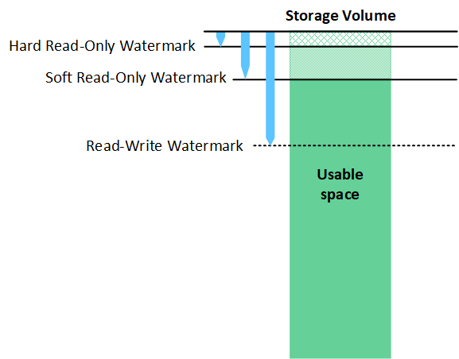

= Cosa sono le filigrane del volume di archiviazione?
:allow-uri-read: 
:icons: font
:imagesdir: ../media/

[role="lead"]
StorageGRID utilizza tre filigrane di volume di archiviazione per garantire che i nodi di archiviazione vengano trasferiti in modo sicuro a uno stato di sola lettura prima che lo spazio si esaurisca in modo critico e per consentire ai nodi di archiviazione che sono stati trasferiti a uno stato di sola lettura di tornare allo stato di lettura-scrittura.

NOTE: Le filigrane del volume di archiviazione si applicano solo allo spazio utilizzato per i dati degli oggetti replicati e codificati per la cancellazione.  Per informazioni sullo spazio riservato ai metadati degli oggetti sul volume 0, vai alink:managing-object-metadata-storage.html["Gestire l'archiviazione dei metadati degli oggetti"] .

== Cos'è la filigrana di sola lettura?

La *filigrana di sola lettura software del volume di archiviazione* è la prima filigrana a indicare che lo spazio utilizzabile di un nodo di archiviazione per i dati degli oggetti si sta esaurendo.

Se ogni volume in un nodo di archiviazione ha meno spazio libero rispetto alla filigrana di sola lettura software di quel volume, il nodo di archiviazione passa alla _modalità di sola lettura_.  La modalità di sola lettura significa che il nodo di archiviazione pubblicizza servizi di sola lettura al resto del sistema StorageGRID , ma soddisfa tutte le richieste di scrittura in sospeso.

Ad esempio, supponiamo che ogni volume in un nodo di archiviazione abbia una filigrana di sola lettura software di 10 GB.  Non appena ogni volume ha meno di 10 GB di spazio libero, il nodo di archiviazione passa alla modalità di sola lettura software.

== Cos'è la filigrana di sola lettura?

La *filigrana di sola lettura fissa del volume di archiviazione* è la filigrana successiva che indica che lo spazio utilizzabile di un nodo per i dati degli oggetti si sta riempiendo.

Se lo spazio libero su un volume è inferiore al limite di sola lettura fisso del volume, le scritture sul volume non riusciranno.  Tuttavia, le scritture su altri volumi possono continuare finché lo spazio libero su tali volumi non è inferiore alle relative filigrane di sola lettura.

Ad esempio, supponiamo che ogni volume in un nodo di archiviazione abbia una filigrana di sola lettura fissa di 5 GB.  Non appena ogni volume ha meno di 5 GB di spazio libero, il nodo di archiviazione non accetta più richieste di scrittura.

La filigrana di sola lettura fissa è sempre inferiore alla filigrana di sola lettura flessibile.

== Cos'è la filigrana di lettura-scrittura?

La *filigrana di lettura-scrittura del volume di archiviazione* si applica solo ai nodi di archiviazione che sono passati alla modalità di sola lettura.  Determina quando il nodo può tornare ad essere di lettura-scrittura.  Quando lo spazio libero su un volume di archiviazione in un nodo di archiviazione è maggiore del limite di lettura-scrittura del volume, il nodo torna automaticamente allo stato di lettura-scrittura.

Supponiamo, ad esempio, che il nodo di archiviazione sia passato alla modalità di sola lettura.  Supponiamo inoltre che ogni volume abbia una filigrana di lettura-scrittura di 30 GB.  Non appena lo spazio libero per un volume aumenta a 30 GB, il nodo torna ad essere di lettura-scrittura.

La filigrana di lettura-scrittura è sempre più grande sia della filigrana di sola lettura software che di quella di sola lettura hardware.

== Visualizza le filigrane del volume di archiviazione

È possibile visualizzare le impostazioni correnti della filigrana e i valori ottimizzati dal sistema.  Se non vengono utilizzate filigrane ottimizzate, puoi valutare se puoi o dovresti modificare le impostazioni.

.Prima di iniziare
* Hai completato l'aggiornamento a StorageGRID 11.6 o versione successiva.
* Hai effettuato l'accesso a Grid Manager utilizzando unlink:../admin/web-browser-requirements.html["browser web supportato"] .
* Tu hai illink:admin-group-permissions.html["Permesso di accesso root"] .

=== Visualizza le impostazioni correnti della filigrana

È possibile visualizzare le impostazioni correnti della filigrana di archiviazione in Grid Manager.

.Passi
. Selezionare *SUPPORTO* > *Altro* > *Filigrane di archiviazione*.
. Nella pagina Filigrane di archiviazione, controlla la casella di controllo Usa valori ottimizzati.
+
** Se la casella di controllo è selezionata, tutte e tre le filigrane vengono ottimizzate per ogni volume di archiviazione su ogni nodo di archiviazione, in base alle dimensioni del nodo di archiviazione e alla capacità relativa del volume.
+
Questa è l'impostazione predefinita e consigliata.  Non aggiornare questi valori. Facoltativamente, puoi<<view-optimized-storage-watermarks,Visualizza le filigrane di archiviazione ottimizzate>> .

** Se la casella di controllo Usa valori ottimizzati non è selezionata, vengono utilizzate filigrane personalizzate (non ottimizzate).  Si sconsiglia di utilizzare impostazioni di filigrana personalizzate.  Utilizzare le istruzioni perlink:../troubleshoot/troubleshoot-low-watermark-alert.html["risoluzione dei problemi avvisi di override della filigrana di sola lettura bassa"] per determinare se è possibile o opportuno modificare le impostazioni.
+
Quando si specificano impostazioni di filigrana personalizzate, è necessario immettere valori maggiori di 0.

=== [[view-optimized-storage-watermarks]]Visualizza le filigrane di archiviazione ottimizzate

StorageGRID utilizza due metriche Prometheus per mostrare i valori ottimizzati calcolati per la filigrana di sola lettura software del volume di archiviazione.  È possibile visualizzare i valori ottimizzati minimi e massimi per ciascun nodo di archiviazione nella griglia.

. Selezionare *SUPPORTO* > *Strumenti* > *Metriche*.
. Nella sezione Prometheus, seleziona il collegamento per accedere all'interfaccia utente di Prometheus.
. Per visualizzare il watermark minimo consigliato per la sola lettura software, immettere la seguente metrica Prometheus e selezionare *Esegui*:
+
`storagegrid_storage_volume_minimum_optimized_soft_readonly_watermark`

+
L'ultima colonna mostra il valore minimo ottimizzato della filigrana di sola lettura software per tutti i volumi di archiviazione su ciascun nodo di archiviazione.  Se questo valore è maggiore dell'impostazione personalizzata per la filigrana di sola lettura software del volume di archiviazione, viene attivato l'avviso *Sostituzione filigrana di sola lettura insufficiente* per il nodo di archiviazione.

. Per visualizzare il limite massimo consigliato per la sola lettura software, immettere la seguente metrica Prometheus e selezionare *Esegui*:
+
`storagegrid_storage_volume_maximum_optimized_soft_readonly_watermark`

+
L'ultima colonna mostra il valore massimo ottimizzato della filigrana di sola lettura software per tutti i volumi di archiviazione su ciascun nodo di archiviazione.

