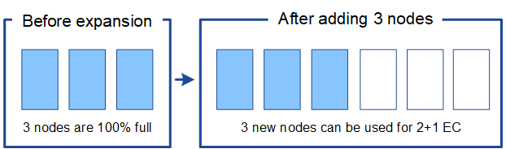

= Considerazioni per il ribilanciamento dei dati codificati con cancellazione
:allow-uri-read: 
:icons: font
:imagesdir: ../media/

[role="lead"]
Se si esegue un'espansione per aggiungere nodi di archiviazione e si utilizzano regole ILM per cancellare i dati del codice, potrebbe essere necessario eseguire la procedura di ribilanciamento del codice di cancellazione (EC) se non è possibile aggiungere un numero sufficiente di nodi di archiviazione per lo schema di codice di cancellazione utilizzato.

Dopo aver esaminato queste considerazioni, esegui l'espansione e poi vai alink:rebalancing-erasure-coded-data-after-adding-storage-nodes.html["Ribilancia i dati codificati tramite cancellazione dopo l'aggiunta di nodi di archiviazione"] per eseguire la procedura.

== Che cosa è il ribilanciamento della CE?

Il ribilanciamento EC è una procedura StorageGRID che potrebbe essere necessaria dopo l'espansione di un nodo di archiviazione.  La procedura viene eseguita come script da riga di comando dal nodo di amministrazione primario.  Quando si esegue la procedura di ribilanciamento EC, StorageGRID ridistribuisce i frammenti con codice di cancellazione tra i nodi di archiviazione esistenti e quelli appena aggiunti in un sito.

La procedura di riequilibrio della CE:

* Sposta solo i dati degli oggetti con codice di cancellazione.  Non sposta i dati degli oggetti replicati.
* Ridistribuisce i dati all'interno di un sito.  Non sposta dati tra siti.
* Ridistribuisce i dati tra tutti i nodi di archiviazione di un sito.  Non ridistribuisce i dati all'interno dei volumi di archiviazione.
* Non considera l'utilizzo dei dati replicati su ciascun nodo di archiviazione quando si determina dove spostare i dati codificati in modo da essere cancellati.
* Ridistribuisce i dati codificati in modo uniforme tra i nodi di archiviazione senza considerare le capacità relative di ciascun nodo.
* Non distribuirà i dati con codice di cancellazione ai nodi di archiviazione pieni per oltre l'80%.
* Potrebbe ridurre le prestazioni delle operazioni ILM e delle operazioni client S3 durante l'esecuzione. Sono necessarie risorse aggiuntive per ridistribuire i frammenti di codifica di cancellazione.

Una volta completata la procedura di ribilanciamento della CE:

* I dati con codice di cancellazione verranno spostati dai nodi di archiviazione con meno spazio disponibile ai nodi di archiviazione con più spazio disponibile.
* La protezione dei dati degli oggetti con codice di cancellazione rimarrà invariata.
* I valori utilizzati (%) potrebbero essere diversi tra i nodi di archiviazione per due motivi:
+
** Le copie degli oggetti replicati continueranno a consumare spazio sui nodi esistenti: la procedura di ribilanciamento EC non sposta i dati replicati.
** I nodi con capacità maggiore saranno relativamente meno pieni rispetto ai nodi con capacità minore, anche se tutti i nodi finiranno con circa la stessa quantità di dati codificati in modo da essere cancellati.
+
Ad esempio, supponiamo che tre nodi da 200 TB siano riempiti all'80% (200 ± 0,8 = 160 TB su ciascun nodo, ovvero 480 TB per il sito).  Se si aggiunge un nodo da 400 TB ed si esegue la procedura di ribilanciamento, tutti i nodi avranno ora approssimativamente la stessa quantità di dati del codice di cancellazione (480/4 = 120 TB).  Tuttavia, la percentuale utilizzata per il nodo più grande sarà inferiore alla percentuale utilizzata per i nodi più piccoli.

+
image::../media/used_space_with_larger_node.png[Spazio utilizzato prima dell'espansione]

== Quando ribilanciare i dati codificati con cancellazione

Consideriamo il seguente scenario:

* StorageGRID è in esecuzione in un unico sito, che contiene tre nodi di archiviazione.
* La policy ILM utilizza una regola di codifica di cancellazione 2+1 per tutti gli oggetti più grandi di 1,0 MB e una regola di replica a 2 copie per gli oggetti più piccoli.
* Tutti i nodi di archiviazione sono completamente pieni.  L'avviso *Archiviazione oggetti insufficiente* è stato attivato al livello di gravità maggiore.
+
image::../media/used_space_before_expansion.png[Spazio utilizzato prima dell'espansione]

=== Il ribilanciamento non è necessario se si aggiungono abbastanza nodi

Per capire quando non è necessario il ribilanciamento EC, supponiamo di aver aggiunto tre (o più) nuovi nodi di archiviazione.  In questo caso non è necessario eseguire il ribilanciamento EC.  I nodi di archiviazione originali rimarranno pieni, ma i nuovi oggetti utilizzeranno i tre nuovi nodi per la codifica di cancellazione 2+1: i due frammenti di dati e il frammento di parità possono essere archiviati ciascuno su un nodo diverso.

CAUTION: Sebbene in questo caso sia possibile eseguire la procedura di ribilanciamento EC, lo spostamento dei dati con codice di cancellazione esistenti ridurrà temporaneamente le prestazioni della griglia, il che potrebbe avere un impatto sulle operazioni del client.

=== È necessario ribilanciare se non è possibile aggiungere abbastanza nodi

Per capire quando è necessario il ribilanciamento EC, supponiamo di poter aggiungere solo due nodi di archiviazione anziché tre.  Poiché lo schema 2+1 richiede che almeno tre nodi di archiviazione abbiano spazio disponibile, i nodi vuoti non possono essere utilizzati per nuovi dati con codice di cancellazione.

image::../media/used_space_after_2_node_expansion.png[Spazio utilizzato dopo l'espansione a 2 nodi]

Per utilizzare i nuovi nodi di archiviazione, è necessario eseguire la procedura di ribilanciamento EC.  Quando questa procedura viene eseguita, StorageGRID ridistribuisce i dati codificati in modo da essere cancellati e i frammenti di parità tra tutti i nodi di archiviazione del sito.  In questo esempio, una volta completata la procedura di ribilanciamento EC, tutti e cinque i nodi sono ora pieni solo al 60% e gli oggetti possono continuare a essere inseriti nello schema di codifica di cancellazione 2+1 su tutti i nodi di archiviazione.

image::../media/used_space_after_ec_rebalance.png[Spazio utilizzato dopo il ribilanciamento della CE]

== Raccomandazioni per il riequilibrio della CE

NetApp richiede il ribilanciamento EC se _tutte_ le seguenti affermazioni sono vere:

* Per i dati degli oggetti si utilizza la codifica di cancellazione.
* L'avviso *Low Object Storage* è stato attivato per uno o più nodi di archiviazione in un sito, indicando che i nodi sono pieni all'80% o più.
* Non è possibile aggiungere un numero sufficiente di nuovi nodi di archiviazione per lo schema di codifica di cancellazione in uso. Vedere link:adding-storage-capacity-for-erasure-coded-objects.html["Aggiungere capacità di archiviazione per oggetti con codice di cancellazione"] .
* I client S3 possono tollerare prestazioni inferiori per le operazioni di scrittura e lettura mentre è in esecuzione la procedura di ribilanciamento EC.

Facoltativamente, è possibile eseguire la procedura di ribilanciamento EC se si preferisce che i nodi di archiviazione siano riempiti a livelli simili e i client S3 possono tollerare prestazioni inferiori per le operazioni di scrittura e lettura mentre è in esecuzione la procedura di ribilanciamento EC.

== Come la procedura di ribilanciamento EC interagisce con altre attività di manutenzione

Non è possibile eseguire determinate procedure di manutenzione contemporaneamente alla procedura di ribilanciamento EC.

[cols="1a,2a"]
|===
| Procedura | Consentito durante la procedura di ribilanciamento della CE? 

 a| 
Ulteriori procedure di ribilanciamento della CE
 a| 
NO.

È possibile eseguire una sola procedura di ribilanciamento EC alla volta.

 a| 
Procedura di dismissione

Lavoro di riparazione dei dati EC
 a| 
NO.

* Non è possibile avviare una procedura di dismissione o una riparazione dei dati EC mentre è in esecuzione la procedura di ribilanciamento EC.
* Non è possibile avviare la procedura di ribilanciamento EC mentre è in esecuzione una procedura di dismissione del nodo di archiviazione o una riparazione dei dati EC.

 a| 
Procedura di espansione
 a| 
NO.

Se è necessario aggiungere nuovi nodi di archiviazione in un'espansione, eseguire la procedura di ribilanciamento EC dopo aver aggiunto tutti i nuovi nodi.

 a| 
Procedura di aggiornamento
 a| 
NO.

Se è necessario aggiornare il software StorageGRID , eseguire la procedura di aggiornamento prima o dopo aver eseguito la procedura di ribilanciamento EC.  Se necessario, è possibile interrompere la procedura di ribilanciamento EC per eseguire un aggiornamento del software.

 a| 
Procedura di clonazione del nodo dell'appliance
 a| 
NO.

Se è necessario clonare un nodo di archiviazione dell'appliance, eseguire la procedura di ribilanciamento EC dopo aver aggiunto il nuovo nodo.

 a| 
Procedura di hotfix
 a| 
Sì.

È possibile applicare un hotfix StorageGRID mentre è in esecuzione la procedura di ribilanciamento EC.

 a| 
Altre procedure di manutenzione
 a| 
NO.

È necessario terminare la procedura di ribilanciamento EC prima di eseguire altre procedure di manutenzione.

|===

== Come la procedura di ribilanciamento della CE interagisce con l'ILM

Mentre è in esecuzione la procedura di ribilanciamento EC, evitare di apportare modifiche ILM che potrebbero modificare la posizione degli oggetti con codice di cancellazione esistenti.  Ad esempio, non iniziare a utilizzare una regola ILM che abbia un profilo di codifica di cancellazione diverso.  Se è necessario apportare tali modifiche all'ILM, è necessario interrompere la procedura di ribilanciamento EC.
