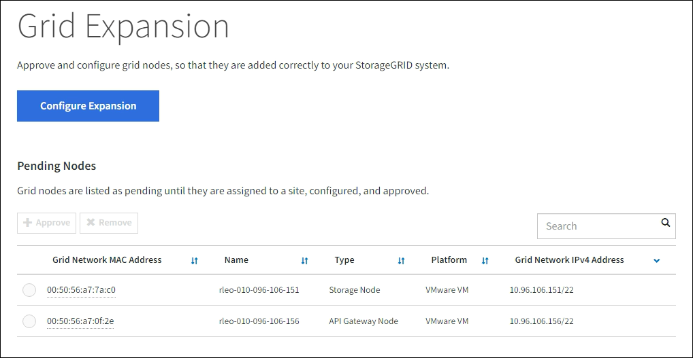
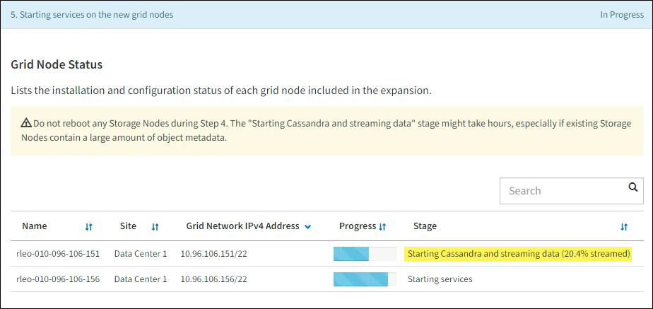

= Eseguire l'espansione
:allow-uri-read: 
:icons: font
:imagesdir: ../media/

[role="lead"]
Quando esegui l'espansione, i nuovi nodi della griglia vengono aggiunti alla distribuzione StorageGRID esistente.

.Prima di iniziare
* Hai effettuato l'accesso a Grid Manager utilizzando unlink:../admin/web-browser-requirements.html["browser web supportato"] .
* Hai la passphrase di provisioning.
* Hai distribuito tutti i nodi della griglia che verranno aggiunti in questa espansione.
* Tu hai illink:../admin/admin-group-permissions.html["Autorizzazione di accesso alla manutenzione o alla root"] .
* Se si aggiungono nodi di archiviazione, si conferma che tutte le operazioni di riparazione dei dati eseguite come parte di un ripristino sono state completate. Vedere link:../maintain/checking-data-repair-jobs.html["Controlla i lavori di riparazione dei dati"] .
* Se si aggiungono nodi di archiviazione e si desidera assegnare un grado di archiviazione personalizzato a tali nodi, è già stato fattolink:../ilm/creating-and-assigning-storage-grades.html["creato il grado di archiviazione personalizzato"] .  Si dispone inoltre dell'autorizzazione di accesso Root oppure di entrambe le autorizzazioni Maintenance e ILM.
* Se stai aggiungendo un nuovo sito, hai esaminato e aggiornato le regole ILM.  È necessario assicurarsi che le copie degli oggetti non vengano archiviate nel nuovo sito finché l'espansione non sarà completata.  Ad esempio, se una regola utilizza il pool di archiviazione predefinito (*Tutti i nodi di archiviazione*), è necessariolink:../ilm/creating-storage-pool.html["creare un nuovo pool di archiviazione"] che contiene solo i nodi di archiviazione esistenti elink:../ilm/working-with-ilm-rules-and-ilm-policies.html["aggiornare le regole ILM"] e la politica ILM per utilizzare quel nuovo pool di archiviazione.  In caso contrario, gli oggetti verranno copiati nel nuovo sito non appena il primo nodo di quel sito diventerà attivo.

.Informazioni su questo compito
L'esecuzione dell'espansione comprende le seguenti attività principali da parte dell'utente:

. Configurare l'espansione.
. Avviare l'espansione.
. Scarica un nuovo file del pacchetto di ripristino.
. Monitorare le fasi e i passaggi di espansione finché tutti i nuovi nodi non saranno installati e configurati e tutti i servizi non saranno avviati.
+

CAUTION: Alcune fasi e passaggi di espansione potrebbero richiedere molto tempo per essere eseguiti su una griglia di grandi dimensioni.  Ad esempio, lo streaming di Cassandra su un nuovo nodo di archiviazione potrebbe richiedere solo pochi minuti se il database Cassandra è vuoto.  Tuttavia, se il database Cassandra include una grande quantità di metadati di oggetti, questa fase potrebbe richiedere diverse ore o più.  Non riavviare alcun nodo di archiviazione durante le fasi "Espansione del cluster Cassandra" o "Avvio di Cassandra e streaming dei dati".

.Passi
. Selezionare *MANUTENZIONE* > *Attività* > *Espansione*.
+
Viene visualizzata la pagina Espansione griglia.  Nella sezione Nodi in sospeso sono elencati i nodi pronti per essere aggiunti.

+

. Selezionare *Configura espansione*.
+
Viene visualizzata la finestra di dialogo Selezione sito.

. Seleziona il tipo di espansione che vuoi avviare:
+
** Se si desidera aggiungere un nuovo sito, selezionare *Nuovo* e immettere il nome del nuovo sito.
** Se si desidera aggiungere uno o più nodi a un sito esistente, selezionare *Esistente*.

. Seleziona *Salva*.
. Esaminare l'elenco *Nodi in sospeso* e verificare che mostri tutti i nodi della griglia distribuiti.
+
Se necessario, puoi posizionare il cursore sull'indirizzo MAC della rete di griglia di un nodo per visualizzare i dettagli relativi a quel nodo.

+
image::../media/grid_node_details.png[screenshot dei dettagli del nodo della griglia]

+

NOTE: Se un nodo risulta mancante, verificare che sia stato distribuito correttamente.

. Dall'elenco dei nodi in sospeso, approva i nodi che vuoi aggiungere a questa espansione.
+
.. Selezionare il pulsante di opzione accanto al primo nodo della griglia in sospeso che si desidera approvare.
.. Seleziona *Approva*.
+
Viene visualizzato il modulo di configurazione del nodo della griglia.

.. Se necessario, modificare le impostazioni generali:
+
[cols="1a,2a"]
|===
| Campo | Descrizione 

 a| 
Sito
 a| 
Nome del sito a cui verrà associato il nodo della griglia.  Se si aggiungono più nodi, assicurarsi di selezionare il sito corretto per ciascun nodo.  Se si aggiunge un nuovo sito, tutti i nodi vengono aggiunti al nuovo sito.

 a| 
Nome
 a| 
Nome di sistema per il nodo. I nomi di sistema sono necessari per le operazioni interne StorageGRID e non possono essere modificati.

 a| 
Tipo di archiviazione (solo nodi di archiviazione)
 a| 
*** *Dati e metadati* ("combinati"): nodo di archiviazione di dati e metadati oggetto
*** *Solo dati*: nodo di archiviazione contenente solo dati oggetto (nessun metadato)
*** *Solo metadati*: nodo di archiviazione contenente solo metadati (nessun dato oggetto)

 a| 
Ruolo NTP
 a| 
Il ruolo del Network Time Protocol (NTP) del nodo della griglia:

*** Selezionare *Automatico* (predefinito) per assegnare automaticamente il ruolo NTP al nodo.  Il ruolo primario verrà assegnato ai nodi di amministrazione, ai nodi di archiviazione con servizi ADC, ai nodi gateway e a tutti i nodi della griglia dotati di indirizzi IP non statici.  Il ruolo Client verrà assegnato a tutti gli altri nodi della griglia.
*** Selezionare *Primario* per assegnare manualmente il ruolo NTP primario al nodo.  Almeno due nodi in ogni sito dovrebbero avere il ruolo primario per fornire un accesso ridondante al sistema alle fonti di temporizzazione esterne.
*** Selezionare *Client* per assegnare manualmente il ruolo Client NTP al nodo.

 a| 
Servizio ADC (nodi di archiviazione combinati o solo metadati)
 a| 
Se questo nodo di archiviazione eseguirà il servizio ADC (Administrative Domain Controller). Il servizio ADC tiene traccia della posizione e della disponibilità dei servizi di rete. Almeno tre nodi di archiviazione in ogni sito devono includere il servizio ADC. Non è possibile aggiungere il servizio ADC a un nodo dopo averlo distribuito.

*** Selezionare *Sì* se il nodo di archiviazione che si sta sostituendo include il servizio ADC. Poiché non è possibile dismettere un nodo di archiviazione se rimangono troppo pochi servizi ADC, ciò garantisce che un nuovo servizio ADC sia disponibile prima che il vecchio servizio venga rimosso.
*** Selezionare *Automatico* per consentire al sistema di determinare se questo nodo richiede il servizio ADC.

Scopri di più sulink:../maintain/understanding-adc-service-quorum.html["Quorum ADC"] .

 a| 
Grado di archiviazione (nodi di archiviazione combinati o solo dati)
 a| 
Utilizzare il grado di archiviazione *Predefinito* oppure selezionare il grado di archiviazione personalizzato che si desidera assegnare a questo nuovo nodo.

I gradi di archiviazione vengono utilizzati dai pool di archiviazione ILM, pertanto la selezione può influire sugli oggetti che verranno posizionati sul nodo di archiviazione.

|===
.. Se necessario, modificare le impostazioni per la rete Grid, la rete amministrativa e la rete client.
+
*** *Indirizzo IPv4 (CIDR)*: l'indirizzo di rete CIDR per l'interfaccia di rete.  Ad esempio: 172.16.10.100/24
+

NOTE: Se durante l'approvazione dei nodi si scopre che i nodi hanno indirizzi IP duplicati sulla rete Grid, è necessario annullare l'espansione, ridistribuire le macchine virtuali o le appliance con un IP non duplicato e riavviare l'espansione.

*** *Gateway*: il gateway predefinito del nodo della griglia.  Ad esempio: 172.16.10.1
*** *Sottoreti (CIDR)*: una o più sottoreti per la rete di amministrazione.

.. Seleziona *Salva*.
+
Il nodo della griglia approvato viene spostato nell'elenco dei nodi approvati.

+
*** Per modificare le proprietà di un nodo della griglia approvato, seleziona il relativo pulsante di scelta e seleziona *Modifica*.
*** Per spostare nuovamente un nodo della griglia approvato nell'elenco dei nodi in sospeso, seleziona il relativo pulsante di opzione e seleziona *Reimposta*.
*** Per rimuovere definitivamente un nodo di rete approvato, spegnerlo.  Quindi, seleziona il pulsante di opzione e seleziona *Rimuovi*.

.. Ripetere questi passaggi per ogni nodo della griglia in sospeso che si desidera approvare.
+

NOTE: Se possibile, dovresti approvare tutte le note della griglia in sospeso ed eseguire una singola espansione.  Se si eseguono più piccole espansioni, sarà necessario più tempo.

. Dopo aver approvato tutti i nodi della griglia, immettere la *Passphrase di provisioning* e selezionare *Espandi*.
+
Dopo alcuni minuti, questa pagina si aggiorna per visualizzare lo stato della procedura di espansione.  Quando sono in corso attività che interessano singoli nodi della griglia, la sezione Stato nodo griglia elenca lo stato corrente di ciascun nodo della griglia.

+

NOTE: Durante la fase di "Installazione dei nodi della griglia" per una nuova appliance, StorageGRID Appliance Installer mostra il passaggio dell'installazione dalla Fase 3 alla Fase 4, Finalizzazione dell'installazione.  Una volta completata la Fase 4, il controller viene riavviato.

+
image::../media/grid_expansion_progress.png[Questa immagine è spiegata dal testo circostante.]

+

NOTE: L'espansione di un sito include un'attività aggiuntiva per configurare Cassandra per il nuovo sito.

. Non appena appare il link *Scarica pacchetto di ripristino*, scarica il file del pacchetto di ripristino.
+
Dopo aver apportato modifiche alla topologia della griglia nel sistema StorageGRID , è necessario scaricare una copia aggiornata del file del pacchetto di ripristino il prima possibile.  Il file Recovery Package consente di ripristinare il sistema in caso di errore.

+
.. Seleziona il link per il download.
.. Immettere la passphrase di provisioning e selezionare *Avvia download*.
.. Una volta completato il download, apri il `.zip` file e confermare che è possibile accedere al contenuto, incluso il `Passwords.txt` file.
.. Copia il file del pacchetto di ripristino scaricato(`.zip` ) in due luoghi sicuri, protetti e separati.
+

CAUTION: Il file del pacchetto di ripristino deve essere protetto perché contiene chiavi di crittografia e password che possono essere utilizzate per ottenere dati dal sistema StorageGRID .

. Se si aggiungono nodi di archiviazione a un sito esistente o si aggiunge un sito, monitorare le fasi di Cassandra, che si verificano quando i servizi vengono avviati sui nuovi nodi della griglia.
+

CAUTION: Non riavviare alcun nodo di archiviazione durante le fasi "Espansione del cluster Cassandra" o "Avvio di Cassandra e streaming dei dati".  Il completamento di queste fasi potrebbe richiedere molte ore per ogni nuovo nodo di archiviazione, soprattutto se i nodi di archiviazione esistenti contengono una grande quantità di metadati di oggetti.

+
[role="tabbed-block"]
====
.Aggiunta di nodi di archiviazione
--
Se si aggiungono nodi di archiviazione a un sito esistente, verificare la percentuale visualizzata nel messaggio di stato "Avvio di Cassandra e streaming dei dati".

Questa percentuale stima il livello di completezza dell'operazione di streaming di Cassandra, in base alla quantità totale di dati Cassandra disponibili e alla quantità già scritta sul nuovo nodo.

--
.Aggiunta del sito
--
Se stai aggiungendo un nuovo sito, usa `nodetool status` per monitorare l'avanzamento dello streaming di Cassandra e per vedere quanti metadati sono stati copiati sul nuovo sito durante la fase di "Espansione del cluster Cassandra".  Il carico dati totale sul nuovo sito dovrebbe essere pari a circa il 20% del carico totale di un sito attuale.

--
====
. Continuare a monitorare l'espansione finché tutte le attività non saranno completate e il pulsante *Configura espansione* non riapparirà.

.Dopo aver finito
A seconda dei tipi di nodi della griglia aggiunti, eseguire ulteriori passaggi di integrazione e configurazione. Vedere link:configuring-expanded-storagegrid-system.html["Fasi di configurazione dopo l'espansione"] .
