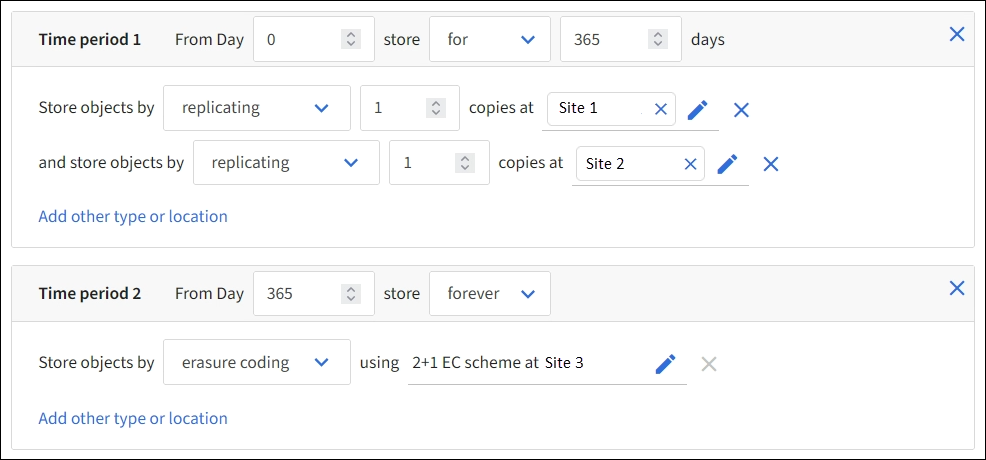

= Fase 2 di 3: definire i posizionamenti
:allow-uri-read: 
:icons: font
:imagesdir: ../media/

[role="lead"]
Il passaggio *Definisci posizionamenti* della procedura guidata Crea regola ILM consente di definire le istruzioni di posizionamento che determinano per quanto tempo gli oggetti vengono archiviati, il tipo di copie (replicate o con codice di cancellazione), la posizione di archiviazione e il numero di copie.

NOTE: Gli screenshot mostrati sono esempi.  I risultati potrebbero variare a seconda della versione StorageGRID .

.Informazioni su questo compito
Una regola ILM può includere una o più istruzioni di posizionamento.  Ogni istruzione di posizionamento si applica a un singolo periodo di tempo.  Quando si utilizzano più istruzioni, i periodi di tempo devono essere contigui e almeno un'istruzione deve iniziare il giorno 0.  Le istruzioni possono continuare all'infinito oppure finché non avrai più bisogno di copie dell'oggetto.

Ogni istruzione di posizionamento può avere più righe se si desidera creare diversi tipi di copie o utilizzare posizioni diverse durante quel periodo di tempo.

In questo esempio, la regola ILM memorizza una copia replicata nel Sito 1 e una copia replicata nel Sito 2 per il primo anno.  Dopo un anno, viene realizzata una copia con codice di cancellazione 2+1 e salvata in un solo sito.

.Passi
. Per *Tempo di riferimento*, seleziona il tipo di tempo da utilizzare per calcolare l'ora di inizio di un'istruzione di tirocinio.
+
[cols="1a,2a"]
|===
| Opzione | Descrizione 

 a| 
Tempo di ingestione
 a| 
Il momento in cui l'oggetto è stato ingerito.

 a| 
Ultimo orario di accesso
 a| 
Ora dell'ultima volta in cui l'oggetto è stato recuperato (letto o visualizzato).

Per utilizzare questa opzione, è necessario abilitare gli aggiornamenti all'ora dell'ultimo accesso per il bucket S3. Fare riferimento a link:using-last-access-time-in-ilm-rules.html["Utilizzare l'orario dell'ultimo accesso nelle regole ILM"] .

 a| 
Ora di creazione definita dall'utente
 a| 
Un orario specificato nei metadati definiti dall'utente.

 a| 
Tempo non corrente
 a| 
"Tempo non corrente" viene selezionato automaticamente se hai selezionato *Sì* per la domanda "Applicare questa regola solo alle versioni precedenti degli oggetti (nei bucket S3 con controllo delle versioni abilitato)?" inlink:create-ilm-rule-enter-details.html["Passaggio 1 della procedura guidata Crea una regola ILM"] .

|===
+
Se vuoi creare una regola _conforme_, devi selezionare *Ora di inserimento*. Fare riferimento a link:managing-objects-with-s3-object-lock.html["Gestisci gli oggetti con S3 Object Lock"] .

. Nella sezione *Periodo di tempo e posizionamenti*, inserisci un orario di inizio e una durata per il primo periodo di tempo.
+
Ad esempio, potresti voler specificare dove archiviare gli oggetti per il primo anno (_Dal giorno 0 archivia per 365 giorni_).  Almeno un'istruzione deve iniziare al giorno 0.

. Se si desidera creare copie replicate:
+
.. Dall'elenco a discesa *Memorizza oggetti per*, seleziona *replica*.
.. Seleziona il numero di copie che desideri effettuare.
+
Se si modifica il numero di copie in 1, viene visualizzato un avviso.  Una regola ILM che crea una sola copia replicata per qualsiasi periodo di tempo espone i dati al rischio di perdita permanente. Fare riferimento a link:why-you-should-not-use-single-copy-replication.html["Perché non dovresti usare la replicazione a copia singola"] .

+
Per evitare il rischio, eseguire una o più delle seguenti operazioni:

+
*** Aumentare il numero di copie per il periodo di tempo.
*** Aggiungere copie ad altri pool di archiviazione o a un pool di archiviazione cloud.
*** Selezionare *codifica di cancellazione* invece di *replicazione*.
+
È possibile ignorare tranquillamente questo avviso se questa regola crea già più copie per tutti i periodi di tempo.

.. Nel campo *copie in*, seleziona i pool di archiviazione che desideri aggiungere.
+
*Se si specifica un solo pool di archiviazione*, tenere presente che StorageGRID può archiviare solo una copia replicata di un oggetto su un dato nodo di archiviazione.  Se la griglia include tre nodi di archiviazione e si seleziona 4 come numero di copie, verranno effettuate solo tre copie, una copia per ciascun nodo di archiviazione.

+
L'avviso *Posizionamento ILM non realizzabile* viene attivato per indicare che la regola ILM non può essere applicata completamente.

+
*Se si specifica più di un pool di archiviazione*, tenere a mente queste regole:

+
*** Il numero di copie non può essere maggiore del numero di pool di archiviazione.
*** Se il numero di copie è uguale al numero di pool di archiviazione, una copia dell'oggetto viene archiviata in ciascun pool di archiviazione.
*** Se il numero di copie è inferiore al numero di pool di archiviazione, una copia viene archiviata nel sito di acquisizione, quindi il sistema distribuisce le copie rimanenti per mantenere bilanciato l'utilizzo del disco tra i pool, garantendo al contempo che nessun sito riceva più di una copia di un oggetto.
*** Se i pool di archiviazione si sovrappongono (contengono gli stessi nodi di archiviazione), tutte le copie dell'oggetto potrebbero essere salvate in un solo sito.  Per questo motivo, non specificare il pool di archiviazione All Storage Nodes (StorageGRID 11.6 e versioni precedenti) e un altro pool di archiviazione.

. Se vuoi creare una copia con codice di cancellazione:
+
.. Dall'elenco a discesa *Memorizza oggetti per*, seleziona *codifica di cancellazione*.
+

NOTE: La codifica di cancellazione è più adatta per oggetti di dimensioni superiori a 1 MB.  Non utilizzare la codifica di cancellazione per oggetti di dimensioni inferiori a 200 KB per evitare il sovraccarico dovuto alla gestione di frammenti molto piccoli con codifica di cancellazione.

.. Se non hai aggiunto un filtro Dimensione oggetto per un valore superiore a 200 KB, seleziona *Precedente* per tornare al passaggio 1.  Quindi, seleziona *Aggiungi un filtro avanzato* e imposta un filtro *Dimensione oggetto* su un valore maggiore di 200 KB.
.. Selezionare il pool di archiviazione che si desidera aggiungere e lo schema di codifica di cancellazione che si desidera utilizzare.
+
La posizione di archiviazione per una copia con codice di cancellazione include il nome dello schema di codifica di cancellazione, seguito dal nome del pool di archiviazione.

+
Gli schemi di codifica di cancellazione disponibili sono limitati dal numero di nodi di archiviazione nel pool di archiviazione selezionato.  UN `Recommended` Il badge appare accanto agli schemi che forniscono entrambi ilink:../ilm/what-erasure-coding-schemes-are.html["migliore protezione o il minimo sovraccarico di archiviazione"] .

. Facoltativamente:
+
.. Seleziona *Aggiungi altro tipo o posizione* per creare copie aggiuntive in posizioni diverse.
.. Seleziona *Aggiungi un altro periodo di tempo* per aggiungere periodi di tempo diversi.
+
[NOTE]
====
L'eliminazione degli oggetti avviene in base alle seguenti impostazioni:

*** Gli oggetti vengono eliminati automaticamente alla fine del periodo di tempo finale, a meno che un altro periodo di tempo non termini con *per sempre*.
*** A seconda dilink:../ilm/example-8-priorities-for-s3-bucket-lifecycle-and-ilm-policy.html#example-of-bucket-lifecycle-taking-priority-over-ilm-policy["impostazioni del periodo di conservazione del bucket e del tenant"] , gli oggetti potrebbero non essere eliminati anche se termina il periodo di conservazione ILM.

====

. Se si desidera archiviare oggetti in un Cloud Storage Pool:
+
.. Nell'elenco a discesa *Archivia oggetti per*, seleziona *replica*.
.. Selezionare il campo *copie in*, quindi selezionare un Cloud Storage Pool.
+
Quando si utilizzano i Cloud Storage Pool, tenere a mente queste regole:

+
*** Non è possibile selezionare più di un Cloud Storage Pool in una singola istruzione di posizionamento.  Allo stesso modo, non è possibile selezionare un Cloud Storage Pool e un pool di archiviazione nella stessa istruzione di posizionamento.
*** È possibile archiviare solo una copia di un oggetto in un determinato Cloud Storage Pool.  Se si imposta *Copie* su 2 o più, viene visualizzato un messaggio di errore.
*** Non è possibile archiviare più di una copia dell'oggetto contemporaneamente in un Cloud Storage Pool.  Viene visualizzato un messaggio di errore se più posizionamenti che utilizzano un Cloud Storage Pool hanno date sovrapposte o se più righe nello stesso posizionamento utilizzano un Cloud Storage Pool.
*** È possibile archiviare un oggetto in un Cloud Storage Pool nello stesso momento in cui l'oggetto viene archiviato come copie replicate o con codice di cancellazione in StorageGRID.  Tuttavia, è necessario includere più di una riga nelle istruzioni di posizionamento per il periodo di tempo, in modo da poter specificare il numero e il tipo di copie per ogni posizione.

. Nel diagramma di ritenzione, conferma le istruzioni di posizionamento.
+
In questo esempio, la regola ILM memorizza una copia replicata nel Sito 1 e una copia replicata nel Sito 2 per il primo anno.  Dopo un anno e per altri 10 anni, una copia con codice di cancellazione 6+3 verrà salvata in tre siti.  Dopo 11 anni totali, gli oggetti verranno eliminati da StorageGRID.

+
La sezione Analisi delle regole del diagramma di conservazione afferma:

+
** La protezione contro le perdite del sito StorageGRID sarà valida per tutta la durata di questa regola.
** Gli oggetti elaborati da questa regola verranno eliminati dopo il giorno 4015.
+
Fare riferimento a link:using-multiple-storage-pools-for-cross-site-replication.html["Abilita la protezione contro la perdita del sito."]

+
image::../media/ilm_rule_retention_diagram.png[Diagramma di conservazione delle regole ILM]

. Selezionare *Continua*. link:create-ilm-rule-select-ingest-behavior.html["Passaggio 3 (selezionare il comportamento di acquisizione)"]viene visualizzata la procedura guidata Crea una regola ILM.

