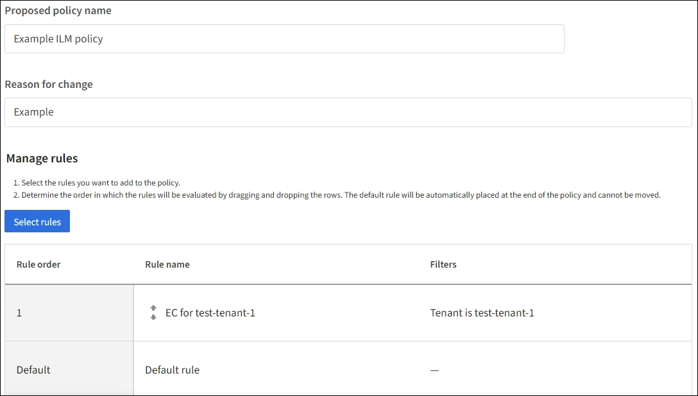

= Crea una regola ILM predefinita
:allow-uri-read: 
:icons: font
:imagesdir: ../media/

[role="lead"]
Prima di creare un criterio ILM, è necessario creare una regola predefinita per posizionare nel criterio tutti gli oggetti non corrispondenti a un'altra regola.  La regola predefinita non può utilizzare alcun filtro.  Deve essere applicato a tutti i tenant, a tutti i bucket e a tutte le versioni degli oggetti.

.Prima di iniziare
* Hai effettuato l'accesso a Grid Manager utilizzando unlink:../admin/web-browser-requirements.html["browser web supportato"] .
* Hailink:../admin/admin-group-permissions.html["autorizzazioni di accesso specifiche"] .

.Informazioni su questo compito
La regola predefinita è l'ultima regola da valutare in un criterio ILM, quindi non può utilizzare alcun filtro.  Le istruzioni di posizionamento per la regola predefinita vengono applicate a tutti gli oggetti che non corrispondono a un'altra regola nel criterio.

In questo esempio di policy, la prima regola si applica solo agli oggetti appartenenti a test-tenant-1.  La regola predefinita, che è l'ultima, si applica agli oggetti appartenenti a tutti gli altri account tenant.

Quando crei la regola predefinita, tieni a mente questi requisiti:

* La regola predefinita verrà automaticamente posizionata come ultima regola quando la aggiungi a un criterio.
* La regola predefinita non può utilizzare filtri di base o avanzati.
* La regola predefinita deve essere applicata a tutte le versioni dell'oggetto.
* La regola predefinita dovrebbe creare copie replicate.
+

NOTE: Non utilizzare una regola che crea copie con codice di cancellazione come regola predefinita per una policy.  Le regole di codifica di cancellazione dovrebbero utilizzare un filtro avanzato per impedire che gli oggetti più piccoli vengano codificati in modo errato.

* In generale, la regola predefinita dovrebbe conservare gli oggetti per sempre.
* Se si utilizza (o si prevede di abilitare) l'impostazione globale S3 Object Lock, la regola predefinita deve essere conforme.

.Passi
. Selezionare *ILM* > *Regole*.
. Seleziona *Crea*.
+
Viene visualizzato il passaggio 1 (Immissione dei dettagli) della procedura guidata Crea regola ILM.

. Immettere un nome univoco per la regola nel campo *Nome regola*.
. Facoltativamente, inserisci una breve descrizione della regola nel campo *Descrizione*.
. Lasciare vuoto il campo *Account inquilino*.
+
La regola predefinita deve essere applicata a tutti gli account tenant.

. Lasciare la selezione a discesa Nome bucket come *applicabile a tutti i bucket*.
+
La regola predefinita deve essere applicata a tutti i bucket S3.

. Mantenere la risposta predefinita, *No*, per la domanda "Applicare questa regola solo alle versioni precedenti degli oggetti (nei bucket S3 con controllo delle versioni abilitato)?"
. Non aggiungere filtri avanzati.
+
La regola predefinita non può specificare alcun filtro.

. Selezionare *Avanti*.
+
Viene visualizzato il passaggio 2 (Definizione dei posizionamenti).

. Per Tempo di riferimento, selezionare un'opzione qualsiasi.
+
Se hai mantenuto la risposta predefinita, *No*, alla domanda "Applicare questa regola solo alle versioni precedenti dell'oggetto?"  Il tempo non corrente non verrà incluso nell'elenco a discesa.  La regola predefinita deve essere applicata a tutte le versioni dell'oggetto.

. Specificare le istruzioni di posizionamento per la regola predefinita.
+
** La regola predefinita dovrebbe conservare gli oggetti per sempre.  Quando si attiva un nuovo criterio, viene visualizzato un avviso se la regola predefinita non conserva gli oggetti per sempre.  Devi confermare che questo è il comportamento che ti aspetti.
** La regola predefinita dovrebbe creare copie replicate.
+

NOTE: Non utilizzare una regola che crea copie con codice di cancellazione come regola predefinita per una policy.  Le regole di codifica di cancellazione dovrebbero includere il filtro avanzato *Dimensione oggetto (MB) maggiore di 200 KB* per impedire che oggetti più piccoli vengano codificati in modo da essere cancellati.

** Se si utilizza (o si prevede di abilitare) l'impostazione globale S3 Object Lock, la regola predefinita deve essere conforme:
+
*** Deve creare almeno due copie replicate dell'oggetto o una copia con codice di cancellazione.
*** Queste copie devono essere presenti sui nodi di archiviazione per l'intera durata di ciascuna riga nelle istruzioni di posizionamento.
*** Le copie degli oggetti non possono essere salvate in un Cloud Storage Pool.
*** Almeno una riga delle istruzioni di posizionamento deve iniziare dal giorno 0, utilizzando l'ora di acquisizione come ora di riferimento.
*** Almeno una riga delle istruzioni di posizionamento deve essere "per sempre".

. Consultare il diagramma di ritenzione per confermare le istruzioni di posizionamento.
. Selezionare *Continua*.
+
Viene visualizzato il passaggio 3 (Seleziona comportamento di acquisizione).

. Seleziona l'opzione di acquisizione da utilizzare e seleziona *Crea*.

