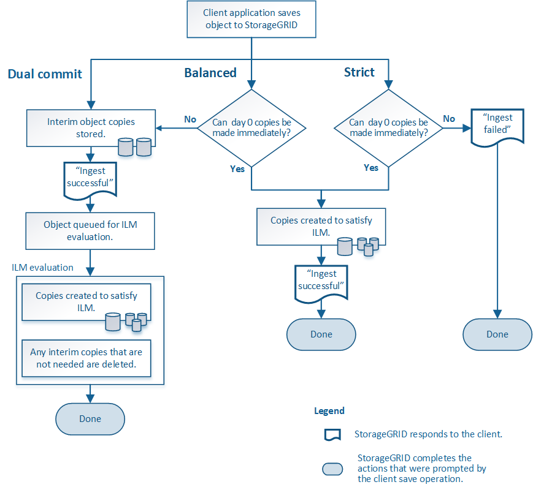

= Opzioni di acquisizione
:allow-uri-read: 
:icons: font
:imagesdir: ../media/

[role="lead"]
Quando si crea una regola ILM, si specifica una delle tre opzioni per la protezione degli oggetti in fase di acquisizione: Doppio commit, Rigoroso o Bilanciato.

A seconda della scelta, StorageGRID esegue copie provvisorie e mette in coda gli oggetti per una successiva valutazione ILM, oppure utilizza il posizionamento sincrono ed esegue immediatamente copie per soddisfare i requisiti ILM.

== Diagramma di flusso delle opzioni di acquisizione

Il diagramma di flusso mostra cosa accade quando gli oggetti vengono abbinati da una regola ILM che utilizza ciascuna delle tre opzioni di acquisizione.

== Doppio impegno

Quando si seleziona l'opzione Dual commit, StorageGRID esegue immediatamente copie provvisorie degli oggetti su due diversi nodi di archiviazione e restituisce al client un messaggio di "ingest riuscito".  L'oggetto viene messo in coda per la valutazione ILM e in seguito vengono create copie che soddisfano le istruzioni di posizionamento della regola.  Se la policy ILM non può essere elaborata immediatamente dopo il doppio commit, la protezione contro la perdita del sito potrebbe richiedere del tempo.

Utilizzare l'opzione Dual commit in uno di questi casi:

* Stai utilizzando regole ILM multi-sito e la latenza di acquisizione del client è la tua considerazione principale.  Quando si utilizza il Dual commit, è necessario assicurarsi che la griglia possa eseguire il lavoro aggiuntivo di creazione e rimozione delle copie dual-commit se non soddisfano ILM.  Nello specifico:
+
** Il carico sulla rete deve essere sufficientemente basso da evitare un arretrato ILM.
** La griglia deve disporre di risorse hardware in eccesso (IOPS, CPU, memoria, larghezza di banda di rete e così via).

* Si utilizzano regole ILM multi-sito e la connessione WAN tra i siti presenta solitamente un'elevata latenza o una larghezza di banda limitata.  In questo scenario, l'utilizzo dell'opzione Dual commit può aiutare a prevenire i timeout del client.  Prima di scegliere l'opzione Dual commit, è opportuno testare l'applicazione client con carichi di lavoro realistici.

== Bilanciato (predefinito)

Quando si seleziona l'opzione Bilanciato, StorageGRID utilizza anche il posizionamento sincrono durante l'acquisizione ed esegue immediatamente tutte le copie specificate nelle istruzioni di posizionamento della regola.  A differenza dell'opzione Strict, se StorageGRID non riesce a effettuare immediatamente tutte le copie, utilizza invece Dual commit.  Se la policy ILM utilizza posizionamenti su più siti e non è possibile ottenere una protezione immediata contro la perdita del sito, viene attivato l'avviso *Posizionamento ILM non realizzabile*.

Utilizzare l'opzione Bilanciata per ottenere la migliore combinazione di protezione dei dati, prestazioni della griglia e successo dell'acquisizione.  Bilanciato è l'opzione predefinita nella procedura guidata Crea regola ILM.

== Rigoroso

Quando si seleziona l'opzione Rigorosa, StorageGRID utilizza il posizionamento sincrono durante l'acquisizione ed esegue immediatamente tutte le copie degli oggetti specificate nelle istruzioni di posizionamento della regola.  L'acquisizione non riesce se StorageGRID non riesce a creare tutte le copie, ad esempio perché una posizione di archiviazione richiesta non è temporaneamente disponibile.  Il client deve riprovare l'operazione.

Utilizzare l'opzione Rigorosa se si ha un requisito operativo o normativo che impone di archiviare immediatamente gli oggetti solo nelle posizioni indicate nella regola ILM.  Ad esempio, per soddisfare un requisito normativo, potrebbe essere necessario utilizzare l'opzione Rigorosa e un filtro avanzato Vincolo di posizione per garantire che gli oggetti non vengano mai archiviati in determinati data center.

Vedere link:example-5-ilm-rules-and-policy-for-strict-ingest-behavior.html["Esempio 5: regole e policy ILM per un comportamento di acquisizione rigoroso"] .
