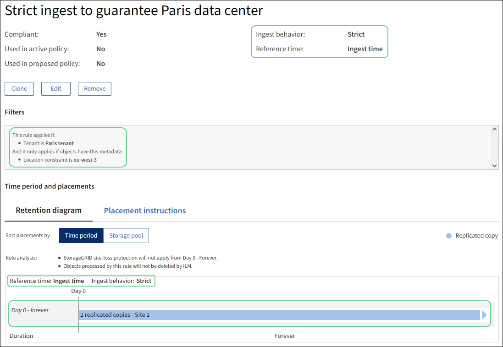

= Esempio 5: regole e policy ILM per un comportamento di acquisizione rigoroso
:allow-uri-read: 
:icons: font
:imagesdir: ../media/

[role="lead"]
È possibile utilizzare un filtro di posizione e il comportamento di acquisizione Rigoroso in una regola per impedire che gli oggetti vengano salvati in una posizione specifica del data center.

In questo esempio, un inquilino con sede a Parigi non vuole immagazzinare alcuni oggetti al di fuori dell'UE a causa di problemi normativi.  Altri oggetti, compresi tutti gli oggetti provenienti da altri account tenant, possono essere archiviati nel data center di Parigi o in quello degli Stati Uniti.

CAUTION: Le seguenti regole e policy ILM sono solo esempi.  Esistono molti modi per configurare le regole ILM.  Prima di attivare una nuova policy, simulala per verificare che funzioni come previsto per proteggere i contenuti dalla perdita.

.Informazioni correlate
* link:data-protection-options-for-ingest.html["Opzioni di acquisizione"]
* link:create-ilm-rule-select-ingest-behavior.html["Crea regola ILM: seleziona il comportamento di acquisizione"]

== Regola ILM 1 per esempio 5: Ingestione rigorosa per garantire il data center di Parigi

Questa regola ILM di esempio utilizza il comportamento di ingestione Strict per garantire che gli oggetti salvati da un tenant con sede a Parigi nei bucket S3 con la regione impostata su eu-west-3 (Parigi) non vengano mai archiviati nel data center statunitense.

Questa regola si applica agli oggetti che appartengono al tenant di Parigi e che hanno la regione del bucket S3 impostata su eu-west-3 (Parigi).

[cols="1a,2a"]
|===
| Definizione della regola | Valore di esempio 

 a| 
Conto inquilino
 a| 
inquilino di Parigi

 a| 
Filtro avanzato
 a| 
Il vincolo di posizione è uguale a eu-west-3

 a| 
Pool di stoccaggio
 a| 
Sito 1 (Parigi)

 a| 
Nome della regola
 a| 
Rigoroso inserimento per garantire il data center di Parigi

 a| 
Tempo di riferimento
 a| 
Tempo di ingestione

 a| 
Posizionamenti
 a| 
Il giorno 0, conserva due copie replicate per sempre nel sito 1 (Parigi)

 a| 
Comportamento di ingestione
 a| 
Rigoroso.  Utilizzare sempre i posizionamenti di questa regola durante l'acquisizione.  L'acquisizione fallisce se non è possibile archiviare due copie dell'oggetto nel data center di Parigi.

|===

== Regola ILM 2 per esempio 5: Ingestione bilanciata per altri oggetti

Questa regola ILM di esempio utilizza il comportamento di acquisizione bilanciato per garantire un'efficienza ILM ottimale per tutti gli oggetti non corrispondenti alla prima regola.  Verranno conservate due copie di tutti gli oggetti che soddisfano questa regola: una nel centro dati degli Stati Uniti e una nel centro dati di Parigi.  Se la regola non può essere soddisfatta immediatamente, vengono conservate copie provvisorie in qualsiasi posizione disponibile.

Questa regola si applica agli oggetti che appartengono a qualsiasi tenant e a qualsiasi regione.

[cols="1a,2a"]
|===
| Definizione della regola | Valore di esempio 

 a| 
Conto inquilino
 a| 
Ignorare

 a| 
Filtro avanzato
 a| 
_Non specificato_

 a| 
Pool di stoccaggio
 a| 
Sito 1 (Parigi) e Sito 2 (Stati Uniti)

 a| 
Nome della regola
 a| 
2 copie 2 data center

 a| 
Tempo di riferimento
 a| 
Tempo di ingestione

 a| 
Posizionamenti
 a| 
Il giorno 0, conserva due copie replicate per sempre in due data center

 a| 
Comportamento di ingestione
 a| 
Equilibrato.  Se possibile, gli oggetti che corrispondono a questa regola vengono posizionati secondo le istruzioni di posizionamento della regola.  In caso contrario, vengono effettuate copie provvisorie in qualsiasi luogo disponibile.

|===

== Politica ILM per l'esempio 5: combinazione di comportamenti di acquisizione

L'esempio di policy ILM include due regole con comportamenti di acquisizione diversi.

Una policy ILM che utilizza due diversi comportamenti di acquisizione potrebbe includere regole ILM come le seguenti:

* Archiviare gli oggetti che appartengono al tenant di Parigi e che hanno la regione del bucket S3 impostata su eu-west-3 (Parigi) solo nel data center di Parigi.  L'acquisizione non riesce se il data center di Parigi non è disponibile.
* Archiviare tutti gli altri oggetti (inclusi quelli che appartengono al tenant di Parigi ma che hanno una regione bucket diversa) sia nel data center statunitense che in quello di Parigi.  Se non è possibile soddisfare le istruzioni di posizionamento, effettuare copie provvisorie in qualsiasi luogo disponibile.

Quando si simula la policy di esempio, ci si aspetta che gli oggetti di prova vengano valutati come segue:

* Tutti gli oggetti che appartengono al tenant di Parigi e che hanno la regione del bucket S3 impostata su eu-west-3 vengono abbinati alla prima regola e vengono archiviati nel data center di Parigi.  Poiché la prima regola utilizza l'acquisizione rigorosa, questi oggetti non vengono mai archiviati nel data center statunitense.  Se i nodi di archiviazione nel data center di Parigi non sono disponibili, l'acquisizione fallisce.
* Tutti gli altri oggetti vengono abbinati dalla seconda regola, compresi gli oggetti che appartengono al tenant di Parigi e che non hanno la regione del bucket S3 impostata su eu-west-3.  In ogni data center viene salvata una copia di ogni oggetto.  Tuttavia, poiché la seconda regola utilizza l'acquisizione bilanciata, se un data center non è disponibile, vengono salvate due copie provvisorie in qualsiasi posizione disponibile.

