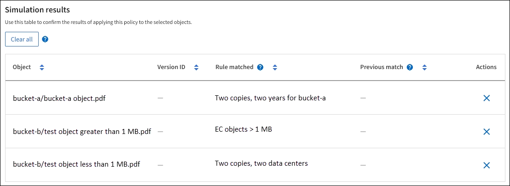

= Esempio di simulazioni di policy ILM
:allow-uri-read: 
:icons: font
:imagesdir: ../media/

[role="lead"]
Gli esempi di simulazioni di policy ILM forniscono linee guida per strutturare e modificare le simulazioni per il tuo ambiente.

== Esempio 1: verificare le regole durante la simulazione di una policy ILM

Questo esempio descrive come verificare le regole durante la simulazione di una policy.

In questo esempio, la *politica ILM di esempio* viene simulata sugli oggetti acquisiti in due bucket.  La politica comprende tre regole, come segue:

* La prima regola, *Due copie, due anni per il bucket-a*, si applica solo agli oggetti nel bucket-a.
* La seconda regola, *Oggetti EC > 1 MB*, si applica a tutti i bucket ma filtra gli oggetti di dimensioni superiori a 1 MB.
* La terza regola, *Due copie, due data center*, è la regola predefinita.  Non include alcun filtro e non utilizza il tempo di riferimento non corrente.

Dopo aver simulato la policy, verificare che a ciascun oggetto corrisponda la regola corretta.

In questo esempio:

* `bucket-a/bucket-a object.pdf`ha abbinato correttamente la prima regola, che filtra gli oggetti in `bucket-a` .
* `bucket-b/test object greater than 1 MB.pdf`è dentro `bucket-b` , quindi non corrispondeva alla prima regola.  Invece, è stato correttamente abbinato dalla seconda regola, che filtra gli oggetti di dimensioni superiori a 1 MB.
* `bucket-b/test object less than 1 MB.pdf`non corrisponde ai filtri nelle prime due regole, quindi verrà inserito dalla regola predefinita, che non include filtri.

== Esempio 2: riordinare le regole durante la simulazione di una policy ILM

Questo esempio mostra come è possibile riordinare le regole per modificare i risultati durante la simulazione di una policy.

In questo esempio viene simulata la policy *Demo*.  Questa politica, che ha lo scopo di trovare oggetti che hanno metadati utente series=x-men, include tre regole, come segue:

* La prima regola, *PNG*, filtra i nomi delle chiavi che terminano in `.png` .
* La seconda regola, *X-men*, si applica solo agli oggetti per l'inquilino A e ai filtri per `series=x-men` metadati dell'utente.
* L'ultima regola, *Due copie due data center*, è la regola predefinita, che corrisponde a tutti gli oggetti che non corrispondono alle prime due regole.

.Passi
. Dopo aver aggiunto le regole e salvato il criterio, seleziona *Simula*.
. Nel campo *Oggetto*, immettere il bucket S3/chiave oggetto per un oggetto di prova e selezionare *Simula*.
+
Vengono visualizzati i risultati della simulazione, che mostrano che `Havok.png` l'oggetto è stato abbinato dalla regola *PNG*.

+
image::../media/simulate_reorder_rules_pngs_result.png[Esempio 2: Regole di riordino durante la simulazione di una policy ILM]

+
Tuttavia, `Havok.png` aveva lo scopo di testare la regola degli *X-men*.

. Per risolvere il problema, riordina le regole.
+
.. Selezionare *Fine* per chiudere la finestra Simula criterio ILM.
.. Selezionare *Modifica* per modificare la policy.
.. Trascina la regola *X-men* in cima all'elenco.
.. Seleziona *Salva*.

. Selezionare *Simula*.
+
Gli oggetti precedentemente testati vengono rivalutati in base alla policy aggiornata e vengono mostrati i nuovi risultati della simulazione.  Nell'esempio, la colonna Regola corrispondente mostra che `Havok.png` l'oggetto ora corrisponde alla regola dei metadati degli X-men, come previsto.  La colonna Corrispondenza precedente mostra che la regola PNG corrispondeva all'oggetto nella simulazione precedente.

+
image::../media/simulate_reorder_rules_correct_result.png[Esempio 2: Regole di riordino durante la simulazione di una policy ILM]

== Esempio 3: correggere una regola durante la simulazione di una policy ILM

Questo esempio mostra come simulare una policy, correggere una regola nella policy e continuare la simulazione.

In questo esempio viene simulata la policy *Demo*.  Questa politica ha lo scopo di trovare oggetti che hanno `series=x-men` metadati dell'utente.  Tuttavia, si sono verificati risultati inaspettati quando si è simulata questa politica contro il `Beast.jpg` oggetto.  Invece di corrispondere alla regola dei metadati degli X-Men, l'oggetto corrispondeva alla regola predefinita: due copie di due data center.

image::../media/simulate_results_for_object_wrong_metadata.png[Esempio 3: Correzione di una regola durante la simulazione di una policy ILM]

Quando un oggetto di prova non corrisponde alla regola prevista nel criterio, è necessario esaminare ogni regola nel criterio e correggere eventuali errori.

.Passi
. Selezionare *Fine* per chiudere la finestra di dialogo Simula criterio.  Nella pagina dei dettagli della policy, seleziona *Diagramma di conservazione*.  Quindi seleziona *Espandi tutto* o *Visualizza dettagli* per ogni regola, a seconda delle necessità.
. Esaminare l'account tenant della regola, l'ora di riferimento e i criteri di filtraggio.
+
Ad esempio, supponiamo che i metadati per la regola X-men siano stati inseriti come "x-men01" anziché "x-men".

. Per risolvere l'errore, correggere la regola come segue:
+
** Se la regola fa parte della policy, puoi clonarla o rimuoverla dalla policy e poi modificarla.
** Se la regola fa parte della policy attiva, è necessario clonarla.  Non è possibile modificare o rimuovere una regola dal criterio attivo.

. Eseguire nuovamente la simulazione.
+
In questo esempio, la regola corretta degli X-men ora corrisponde a `Beast.jpg` oggetto basato su `series=x-men` metadati dell'utente, come previsto.

+
image::../media/simulate_results_for_object_corrected_metadata.png[Esempio 3: Correzione di una regola durante la simulazione di una policy ILM]

