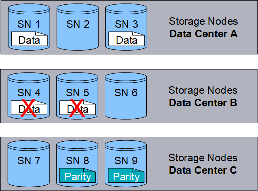

= Che cos'è la codifica di cancellazione?
:allow-uri-read: 
:icons: font
:imagesdir: ../media/

[role="lead"]
La codifica di cancellazione è uno dei due metodi utilizzati StorageGRID per archiviare i dati degli oggetti (l'altro metodo è la replica).  Quando gli oggetti corrispondono a una regola ILM che utilizza la codifica di cancellazione, tali oggetti vengono suddivisi in frammenti di dati, vengono calcolati frammenti di parità aggiuntivi e ogni frammento viene archiviato su un diverso nodo di archiviazione.

Quando si accede a un oggetto, questo viene riassemblato utilizzando i frammenti memorizzati.  Se un dato o un frammento di parità si danneggia o viene perso, l'algoritmo di codifica di cancellazione può ricreare quel frammento utilizzando un sottoinsieme dei dati e dei frammenti di parità rimanenti.

Quando si creano regole ILM, StorageGRID crea profili di codifica di cancellazione che supportano tali regole.  È possibile visualizzare un elenco di profili di codifica di cancellazione,link:manage-erasure-coding-profiles.html#rename-an-erasure-coding-profile["rinominare un profilo di codifica di cancellazione"] , Olink:manage-erasure-coding-profiles.html#deactivate-an-erasure-coding-profile["disattivare un profilo di codifica di cancellazione se non è attualmente utilizzato in nessuna regola ILM"] .

L'esempio seguente illustra l'uso di un algoritmo di codifica di cancellazione sui dati di un oggetto.  In questo esempio, la regola ILM utilizza uno schema di codifica di cancellazione 4+2.  Ogni oggetto viene suddiviso in quattro frammenti di dati uguali e dai dati dell'oggetto vengono calcolati due frammenti di parità.  Ciascuno dei sei frammenti viene archiviato su un nodo diverso in tre siti di data center per garantire la protezione dei dati in caso di guasti dei nodi o perdite del sito.

image::../media/ec_three_sites_4_plus_2.png[Erasure Coding Three Sites 4 Plus 2]

Lo schema di codifica a cancellazione 4+2 può essere configurato in vari modi.  Ad esempio, è possibile configurare un pool di archiviazione a sito singolo contenente sei nodi di archiviazione.  Perlink:using-multiple-storage-pools-for-cross-site-replication.html["protezione contro la perdita del sito"] , è possibile utilizzare un pool di archiviazione contenente tre siti con tre nodi di archiviazione in ciascun sito.  Un oggetto può essere recuperato finché rimangono disponibili quattro dei sei frammenti (dati o parità).  È possibile perdere fino a due frammenti senza perdere i dati dell'oggetto.  Se un intero sito viene perso, l'oggetto può comunque essere recuperato o riparato, a patto che tutti gli altri frammenti rimangano accessibili.

Se vengono persi più di due nodi di archiviazione, l'oggetto non sarà recuperabile.

image::../media/ec_unrecoverable_4_plus_2.png[Erasure Coding Unrecoverable 4 Plus 2]

.Informazioni correlate
* link:what-replication-is.html["Che cosa è la replicazione"]
* link:what-storage-pool-is.html["Che cos'è un pool di archiviazione"]
* link:what-erasure-coding-schemes-are.html["Cosa sono gli schemi di codifica di cancellazione"]
* link:manage-erasure-coding-profiles.html#rename-an-erasure-coding-profile["Rinominare un profilo di codifica di cancellazione"]
* link:manage-erasure-coding-profiles.html#deactivate-an-erasure-coding-profile["Disattivare un profilo di codifica di cancellazione"]

