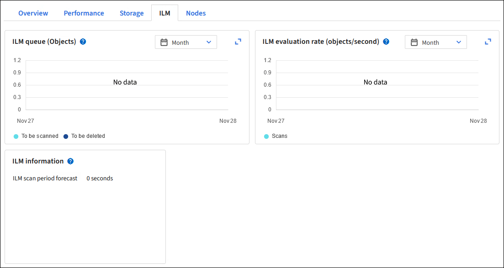

= Lavorare con le policy e le regole ILM
:allow-uri-read: 
:icons: font
:imagesdir: ../media/

[role="lead"]
Man mano che cambiano i requisiti di archiviazione, potrebbe essere necessario implementare policy aggiuntive o modificare le regole ILM associate a una policy.  È possibile visualizzare le metriche ILM per determinare le prestazioni del sistema.

.Prima di iniziare
* Hai effettuato l'accesso a Grid Manager utilizzando unlink:../admin/web-browser-requirements.html["browser web supportato"] .
* Hailink:../admin/admin-group-permissions.html["autorizzazioni di accesso specifiche"] .

== Visualizza le policy ILM

Per visualizzare le policy ILM attive e inattive e la cronologia delle attivazioni delle policy:

. Selezionare *ILM* > *Criteri*.
. Selezionare *Criteri* per visualizzare un elenco dei criteri attivi e inattivi.  Nella tabella sono elencati il nome di ciascun criterio, i tag a cui è assegnato e se il criterio è attivo o inattivo.
. Selezionare *Cronologia attivazioni* per visualizzare un elenco delle date di inizio e fine dell'attivazione delle polizze.
. Selezionare il nome di una policy per visualizzarne i dettagli.
+

NOTE: Se si visualizzano i dettagli di una policy il cui stato è Modificato o Eliminato, viene visualizzato un messaggio che spiega che si sta visualizzando la versione della policy che era attiva per l'intervallo di tempo specificato e che da allora è stata modificata o eliminata.

== Modifica una policy ILM

È possibile modificare solo una policy inattiva.  Se si desidera modificare una policy attiva, è possibile disattivarla oppure creare un clone e modificarlo.

Per modificare una policy:

. Selezionare *ILM* > *Criteri*.
. Seleziona la casella di controllo relativa alla policy che desideri modificare, quindi seleziona *Modifica*.
. Modifica la policy seguendo le istruzioni inlink:creating-ilm-policy.html["Creare policy ILM"] .
. Simulare la policy prima di riattivarla.

CAUTION: Una policy ILM configurata in modo errato può comportare una perdita di dati irrecuperabile.  Prima di attivare una policy ILM, esaminare attentamente la policy ILM e le relative regole ILM, quindi simulare la policy ILM.  Verificare sempre che la politica ILM funzioni come previsto.

== Clonare una policy ILM

Per clonare una policy ILM:

. Selezionare *ILM* > *Criteri*.
. Seleziona la casella di controllo relativa alla policy che desideri clonare, quindi seleziona *Clona*.
. Crea una nuova policy partendo dalla policy che hai clonato seguendo le istruzioni inlink:creating-ilm-policy.html["Creare policy ILM"] .

CAUTION: Una policy ILM configurata in modo errato può comportare una perdita di dati irrecuperabile.  Prima di attivare una policy ILM, esaminare attentamente la policy ILM e le relative regole ILM, quindi simulare la policy ILM.  Verificare sempre che la politica ILM funzioni come previsto.

== Rimuovere una policy ILM

È possibile rimuovere un criterio ILM solo se è inattivo.  Per rimuovere una policy:

. Selezionare *ILM* > *Criteri*.
. Seleziona la casella di controllo relativa al criterio inattivo che desideri rimuovere.
. Seleziona *Rimuovi*.

== Visualizza i dettagli della regola ILM

Per visualizzare i dettagli di una regola ILM, inclusi il diagramma di conservazione e le istruzioni di posizionamento per la regola:

. Selezionare *ILM* > *Regole*.
. Seleziona il nome della regola di cui vuoi visualizzare i dettagli. Esempio:
+
image::../media/ilm_rule_details_page.png[Pagina dei dettagli della regola ILM]

Inoltre, puoi utilizzare la pagina dei dettagli per clonare, modificare o rimuovere una regola.  Non è possibile modificare o rimuovere una regola se è utilizzata in una policy.

== Clona una regola ILM

È possibile clonare una regola esistente se si desidera creare una nuova regola che utilizzi alcune delle impostazioni della regola esistente.  Se è necessario modificare una regola utilizzata in una policy, è sufficiente clonare la regola e apportare le modifiche al clone.  Dopo aver apportato modifiche al clone, è possibile rimuovere la regola originale dal criterio e sostituirla con la versione modificata, se necessario.

NOTE: Non è possibile clonare una regola ILM se è stata creata utilizzando StorageGRID versione 10.2 o precedente.

.Passi
. Selezionare *ILM* > *Regole*.
. Seleziona la casella di controllo relativa alla regola che desideri clonare, quindi seleziona *Clona*.  In alternativa, seleziona il nome della regola, quindi seleziona *Clona* dalla pagina dei dettagli della regola.
. Aggiorna la regola clonata seguendo i passaggi per<<Modifica una regola ILM,modifica di una regola ILM>> Elink:create-ilm-rule-enter-details.html#use-advanced-filters-in-ilm-rules["utilizzo di filtri avanzati nelle regole ILM"] .
+
Quando si clona una regola ILM, è necessario immettere un nuovo nome.

== Modifica una regola ILM

Potrebbe essere necessario modificare una regola ILM per cambiare un filtro o un'istruzione di posizionamento.

Non è possibile modificare una regola se è utilizzata in una policy ILM.  Invece, puoi<<clone-ilm-rule,clonare la regola>> e apportare tutte le modifiche necessarie alla copia clonata.

CAUTION: Una policy ILM configurata in modo errato può comportare una perdita di dati irrecuperabile.  Prima di attivare una policy ILM, esaminare attentamente la policy ILM e le relative regole ILM, quindi simulare la policy ILM.  Verificare sempre che la politica ILM funzioni come previsto.

.Passi
. Selezionare *ILM* > *Regole*.
. Verificare che la regola che si desidera modificare non sia utilizzata in alcuna policy ILM.
. Se la regola che vuoi modificare non è in uso, seleziona la casella di controllo per la regola e seleziona *Azioni* > *Modifica*.  In alternativa, seleziona il nome della regola, quindi seleziona *Modifica* nella pagina dei dettagli della regola.
. Completare i passaggi della procedura guidata Modifica regola ILM.  Se necessario, seguire i passaggi perlink:create-ilm-rule-enter-details.html["creazione di una regola ILM"] Elink:create-ilm-rule-enter-details.html#use-advanced-filters-in-ilm-rules["utilizzo di filtri avanzati nelle regole ILM"] .
+
Quando si modifica una regola ILM, non è possibile modificarne il nome.

== Rimuovere una regola ILM

Per mantenere gestibile l'elenco delle regole ILM correnti, rimuovi tutte le regole ILM che probabilmente non utilizzerai.

.Passi
Per rimuovere una regola ILM attualmente utilizzata in un criterio attivo:

. Clonare la policy.
. Rimuovere la regola ILM dal clone della policy.
. Salvare, simulare e attivare la nuova policy per assicurarsi che gli oggetti siano protetti come previsto.
. Vai ai passaggi per rimuovere una regola ILM attualmente utilizzata in un criterio inattivo.

Per rimuovere una regola ILM attualmente utilizzata in un criterio inattivo:

. Selezionare la policy inattiva.
. Rimuovere la regola ILM dalla policy o<<remove-ilm-policy,rimuovere la politica>> .
. Vai ai passaggi per rimuovere una regola ILM attualmente non utilizzata.

Per rimuovere una regola ILM attualmente non utilizzata:

. Selezionare *ILM* > *Regole*.
. Verificare che la regola che si desidera rimuovere non sia utilizzata in alcun criterio.
. Se la regola che vuoi rimuovere non è in uso, selezionala e seleziona *Azioni* > *Rimuovi*.  È possibile selezionare più regole e rimuoverle tutte contemporaneamente.
. Selezionare *Sì* per confermare che si desidera rimuovere la regola ILM.

== Visualizza le metriche ILM

È possibile visualizzare le metriche per ILM, come il numero di oggetti nella coda e la frequenza di valutazione.  È possibile monitorare queste metriche per determinare le prestazioni del sistema.  Una coda o una frequenza di valutazione elevate potrebbero indicare che il sistema non è in grado di tenere il passo con la frequenza di acquisizione, che il carico delle applicazioni client è eccessivo o che si è verificata una condizione anomala.

.Passi
. Selezionare *Dashboard* > *ILM*.
+

NOTE: Poiché la dashboard può essere personalizzata, la scheda ILM potrebbe non essere disponibile.

. Monitorare le metriche nella scheda ILM.
+
Puoi selezionare il punto interrogativoimage:../media/icon_nms_question.png["icona punto interrogativo"] per visualizzare una descrizione degli elementi nella scheda ILM.

+

