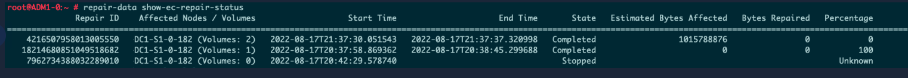

= Controlla i lavori di riparazione dei dati
:allow-uri-read: 
:icons: font
:imagesdir: ../media/

[role="lead"]
Prima di dismettere un nodo della griglia, è necessario confermare che non siano attivi processi di riparazione dei dati. Se una riparazione non ha avuto successo, è necessario riavviarla e lasciarla completare prima di eseguire la procedura di dismissione.

.Informazioni su questo compito
Se è necessario dismettere un nodo di archiviazione disconnesso, è necessario completare anche questi passaggi al termine della procedura di dismissione per garantire che il processo di riparazione dei dati sia stato completato correttamente.  È necessario assicurarsi che tutti i frammenti con codice di cancellazione presenti sul nodo rimosso siano stati ripristinati correttamente.

Questi passaggi si applicano solo ai sistemi che dispongono di oggetti con codice di cancellazione.

.Passi
. Accedi al nodo di amministrazione principale:
+
.. Immettere il seguente comando: `ssh admin@_grid_node_IP_`
.. Inserisci la password elencata nel `Passwords.txt` file.
.. Immettere il seguente comando per passare alla root: `su -`
.. Inserisci la password elencata nel `Passwords.txt` file.
+
Quando si accede come root, il prompt cambia da `$` A `#` .

. Controllare le riparazioni in corso: `repair-data show-ec-repair-status`
+
** Se non hai mai eseguito un processo di riparazione dei dati, l'output è `No job found` .  Non è necessario riavviare alcun lavoro di riparazione.
** Se il processo di riparazione dei dati è stato eseguito in precedenza o è in esecuzione attualmente, l'output elenca le informazioni per la riparazione.  Ogni riparazione ha un ID di riparazione univoco.
+

+

TIP: Facoltativamente, è possibile utilizzare Grid Manager per monitorare i processi di ripristino in corso e visualizzare una cronologia dei ripristini. Vedere link:../maintain/restoring-volume.html["Ripristina i dati degli oggetti utilizzando Grid Manager"] .

. Se lo Stato per tutte le riparazioni è `Completed` , non è necessario riavviare alcun processo di riparazione.
. Se lo Stato per qualsiasi riparazione è `Stopped` , è necessario riavviare la riparazione.
+
.. Ottieni l'ID di riparazione per la riparazione non riuscita dall'output.
.. Esegui il  `repair-data start-ec-node-repair` comando.
+
Utilizzare il `--repair-id` opzione per specificare l'ID di riparazione.  Ad esempio, se si desidera riprovare una riparazione con ID di riparazione 949292, eseguire questo comando: `repair-data start-ec-node-repair --repair-id 949292`

.. Continuare a monitorare lo stato delle riparazioni dei dati EC finché lo Stato per tutte le riparazioni non è `Completed` .

