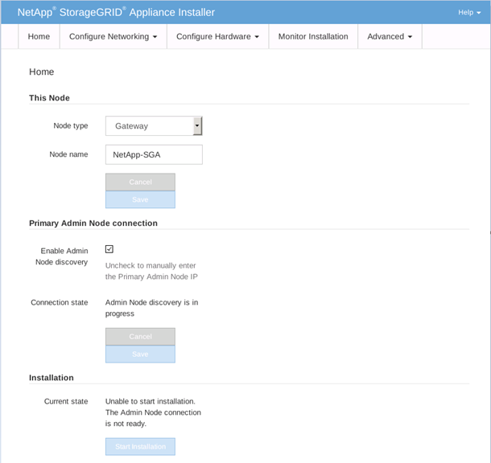

= Avvia l'installazione del software sull'appliance dei servizi
:allow-uri-read: 
:icons: font
:imagesdir: ../media/

[role="lead"]
Per installare un Gateway Node o un Admin Node su un'appliance di servizi, utilizzare StorageGRID Appliance Installer, incluso nell'appliance.

.Prima di iniziare
* L'apparecchio è installato in un rack, connesso alle reti e acceso.
* I collegamenti di rete e gli indirizzi IP vengono configurati per l'appliance tramite StorageGRID Appliance Installer.
* Se si installa un Gateway Node o un Admin Node non primario, si conosce l'indirizzo IP del Admin Node primario per la griglia StorageGRID .
* Tutte le subnet della rete Grid elencate nella pagina Configurazione IP del programma di installazione dell'appliance StorageGRID sono definite nell'elenco delle subnet della rete Grid sul nodo di amministrazione primario.
+
Vedere https://docs.netapp.com/us-en/storagegrid-appliances/installconfig/index.html["Avvio rapido per l'installazione dell'hardware"^] .

* Stai utilizzando unlink:../admin/web-browser-requirements.html["browser web supportato"] .
* Hai uno degli indirizzi IP assegnati all'appliance.  È possibile utilizzare l'indirizzo IP per la rete amministrativa, la rete Grid o la rete client.
* Se si installa un nodo di amministrazione primario, sono disponibili i file di installazione di Ubuntu o Debian per questa versione di StorageGRID .
+

NOTE: Una versione recente del software StorageGRID viene precaricata sull'appliance dei servizi durante la produzione.  Se la versione precaricata del software corrisponde alla versione utilizzata nella distribuzione StorageGRID , i file di installazione non sono necessari.

.Informazioni su questo compito
Per installare il software StorageGRID su un'appliance di servizi:

* Per un nodo di amministrazione primario, è necessario specificare il nome del nodo e quindi caricare i pacchetti software appropriati (se necessario).
* Per un nodo amministrativo non primario o un nodo gateway, specificare o confermare l'indirizzo IP del nodo amministrativo primario e il nome del nodo.
* Si avvia l'installazione e si attende che i volumi vengano configurati e il software installato.
* A metà del processo, l'installazione si interrompe.  Per riprendere l'installazione, è necessario accedere a Grid Manager e configurare il nodo in sospeso come sostituto del nodo non riuscito.
* Dopo aver configurato il nodo, il processo di installazione dell'appliance viene completato e l'appliance viene riavviata.

.Passi
. Aprire un browser e immettere uno degli indirizzi IP per l'appliance dei servizi.
+
`https://_Controller_IP_:8443`

+
Viene visualizzata la home page del programma di installazione dell'appliance StorageGRID .

+

. Per installare un nodo di amministrazione primario:
+
.. Nella sezione Questo nodo, per *Tipo di nodo*, seleziona *Amministratore principale*.
.. Nel campo *Nome nodo*, immettere lo stesso nome utilizzato per il nodo che si sta ripristinando e fare clic su *Salva*.
.. Nella sezione Installazione, controlla la versione del software elencata in Stato attuale
+
Se la versione del software pronta per l'installazione è corretta, passare direttamente alla sezione<<installation_section_step,Fase di installazione>> .

.. Se è necessario caricare una versione diversa del software, nel menu *Avanzate* selezionare *Carica software StorageGRID *.
+
Viene visualizzata la pagina Carica software StorageGRID .

+
image::../media/upload_sw_for_pa_on_sga1000.png[Screenshot descritto dal testo circostante]

.. Fare clic su *Sfoglia* per caricare il *Pacchetto software* e il *File di checksum* per il software StorageGRID .
+
I file vengono caricati automaticamente dopo averli selezionati.

.. Fare clic su *Home* per tornare alla home page del programma di installazione dell'appliance StorageGRID .

. Per installare un nodo gateway o un nodo amministratore non primario:
+
.. Nella sezione Questo nodo, per *Tipo di nodo*, seleziona *Gateway* o *Amministratore non primario*, a seconda del tipo di nodo che stai ripristinando.
.. Nel campo *Nome nodo*, immettere lo stesso nome utilizzato per il nodo che si sta ripristinando e fare clic su *Salva*.
.. Nella sezione Connessione al nodo di amministrazione primario, determinare se è necessario specificare l'indirizzo IP per il nodo di amministrazione primario.
+
Il programma di installazione dell'appliance StorageGRID può rilevare automaticamente questo indirizzo IP, presupponendo che il nodo di amministrazione primario o almeno un altro nodo della griglia con ADMIN_IP configurato sia presente sulla stessa subnet.

.. Se questo indirizzo IP non viene visualizzato o è necessario modificarlo, specificare l'indirizzo:

+
[cols="1a,2a"]
|===
| Opzione | Descrizione 

 a| 
Inserimento manuale dell'IP
 a| 
.. Deselezionare la casella di controllo *Abilita individuazione nodo amministratore*.
.. Inserire manualmente l'indirizzo IP.
.. Fare clic su *Salva*.
.. Attendi che lo stato di connessione per il nuovo indirizzo IP diventi "pronto".

 a| 
Rilevamento automatico di tutti i nodi amministrativi primari connessi
 a| 
.. Selezionare la casella di controllo *Abilita individuazione nodo amministratore*.
.. Dall'elenco degli indirizzi IP rilevati, seleziona il nodo di amministrazione primario per la griglia in cui verrà distribuito questo dispositivo di servizi.
.. Fare clic su *Salva*.
.. Attendi che lo stato di connessione per il nuovo indirizzo IP diventi "pronto".

|===
. [[installation_section_step]]Nella sezione Installazione, confermare che lo stato corrente sia Pronto per avviare l'installazione del nome del nodo e che il pulsante *Avvia installazione* sia abilitato.
+
Se il pulsante *Avvia installazione* non è abilitato, potrebbe essere necessario modificare la configurazione di rete o le impostazioni della porta.  Per le istruzioni, consultare le istruzioni di manutenzione dell'apparecchio.

. Dalla home page di StorageGRID Appliance Installer, fare clic su *Avvia installazione*.
+
Lo stato corrente cambia in "Installazione in corso" e viene visualizzata la pagina Installazione del monitor.

+

NOTE: Se è necessario accedere manualmente alla pagina Installazione monitor, fare clic su *Installazione monitor* dalla barra dei menu.

