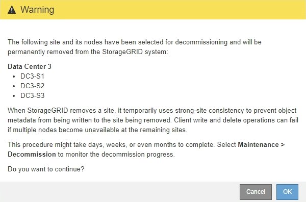

= Passaggio 5: risolvere i conflitti tra nodi (e avviare la dismissione)
:allow-uri-read: 
:icons: font
:imagesdir: ../media/

[role="lead"]
Dal passaggio 5 (Risoluzione conflitti tra nodi) della procedura guidata Dismissione sito, è possibile determinare se qualche nodo nel sistema StorageGRID è disconnesso o se qualche nodo nel sito selezionato appartiene a un gruppo ad alta disponibilità (HA).  Dopo aver risolto eventuali conflitti tra nodi, è possibile avviare la procedura di dismissione da questa pagina.

.Prima di iniziare
È necessario assicurarsi che tutti i nodi del sistema StorageGRID siano nello stato corretto, come segue:

* Tutti i nodi nel sistema StorageGRID devono essere connessi (image:../media/icon_alert_green_checkmark.png["Icona Avviso Segno di spunta verde"] ).
+

NOTE: Se si esegue la dismissione di un sito disconnesso, tutti i nodi del sito che si sta rimuovendo devono essere disconnessi e tutti i nodi di tutti gli altri siti devono essere connessi.

+

NOTE: La dismissione non verrà avviata se uno o più volumi sono offline (smontati) o se sono online (montati) ma in stato di errore.

+

NOTE: Se uno o più volumi vanno offline mentre è in corso una dismissione, il processo di dismissione viene completato dopo che i volumi tornano online.

* Nessun nodo nel sito che stai rimuovendo può avere un'interfaccia che appartiene a un gruppo ad alta disponibilità (HA).

.Informazioni su questo compito
Se un nodo è elencato per il passaggio 5 (Risoluzione dei conflitti tra nodi), è necessario correggere il problema prima di poter avviare la dismissione.

Prima di avviare la procedura di dismissione del sito da questa pagina, esaminare le seguenti considerazioni:

* È necessario prevedere un tempo adeguato per il completamento della procedura di disattivazione.
+

NOTE: Lo spostamento o l'eliminazione dei dati degli oggetti da un sito potrebbe richiedere giorni, settimane o persino mesi, a seconda della quantità di dati presenti nel sito, del carico sul sistema, delle latenze di rete e della natura delle modifiche ILM richieste.

* Mentre è in corso la procedura di dismissione del sito:
+
** Non è possibile creare regole ILM che facciano riferimento al sito in fase di dismissione.  Non è inoltre possibile modificare una regola ILM esistente per fare riferimento al sito.
** Non è possibile eseguire altre procedure di manutenzione, come l'espansione o l'aggiornamento.
+

NOTE: Se è necessario eseguire un'altra procedura di manutenzione durante la dismissione di un sito connesso, è possibile sospendere la procedura mentre vengono rimossi i nodi di archiviazione.  Il pulsante *Pausa* è abilitato durante la fase di "Dismissione dei dati replicati e codificati per la cancellazione".

** Se è necessario ripristinare un nodo dopo aver avviato la procedura di dismissione del sito, è necessario contattare l'assistenza.

.Passi
. Esaminare la sezione sui nodi disconnessi del passaggio 5 (Risoluzione dei conflitti tra nodi) per determinare se uno qualsiasi dei nodi nel sistema StorageGRID ha uno stato di connessione sconosciuto (image:../media/icon_alarm_blue_unknown.png["Icona Allarme Blu Sconosciuto"] ) o Amministrativamente inattivo (image:../media/icon_alarm_gray_administratively_down.png["Icona Allarme Grigio Amministrativamente Giù"] ).
+
image::../media/decommission_site_step_5_disconnected_nodes.png[Disattivazione del sito Fase 5 Risoluzione dei conflitti tra nodi]

. Se qualche nodo è disconnesso, riattivalo.
+
Vedi illink:../maintain/grid-node-procedures.html["Procedure del nodo"] . Se hai bisogno di assistenza, contatta il supporto tecnico.

. Una volta ripristinati tutti i nodi disconnessi, rivedere la sezione Gruppi HA del Passaggio 5 (Risoluzione dei conflitti tra nodi).
+
Questa tabella elenca tutti i nodi nel sito selezionato che appartengono a un gruppo ad alta disponibilità (HA).

+
image::../media/decommission_site_step_5_ha_groups.png[Decommissioning Site Step 5 Gruppi HA]

. Se sono elencati dei nodi, procedere in uno dei seguenti modi:
+
** Modificare ciascun gruppo HA interessato per rimuovere l'interfaccia del nodo.
** Rimuovi un gruppo HA che include solo nodi da questo sito.  Consultare le istruzioni per l'amministrazione StorageGRID.

+
Se tutti i nodi sono connessi e nessun nodo nel sito selezionato viene utilizzato in un gruppo HA, il campo *Passphrase di provisioning* è abilitato.

. Immettere la passphrase di provisioning.
+
Il pulsante *Avvia disattivazione* diventa attivo.

+
image::../media/decommission_site_step_5_provision_passphrase.png[Dismissione del sito Fase 5 Fornitura della passphrase]

. Se sei pronto ad avviare la procedura di dismissione del sito, seleziona *Avvia dismissione*.
+
Un avviso elenca il sito e i nodi che verranno rimossi.  Ti ricordiamo che potrebbero volerci giorni, settimane o addirittura mesi per rimuovere completamente il sito.

+

. Rivedi l'avviso.  Se sei pronto per iniziare, seleziona *OK*.
+
Viene visualizzato un messaggio durante la generazione della nuova configurazione della griglia.  Questo processo potrebbe richiedere del tempo, a seconda del tipo e del numero di nodi della rete dismessi.

+
image::../media/decommission_site_step_5_grid_configuration.png[Fase 5 del sito di dismissione Configurazione della griglia]

+
Una volta generata la nuova configurazione della griglia, viene visualizzato il passaggio 6 (Monitoraggio disattivazione).

+

NOTE: Il pulsante *Precedente* rimane disattivato finché la disattivazione non è completa.

