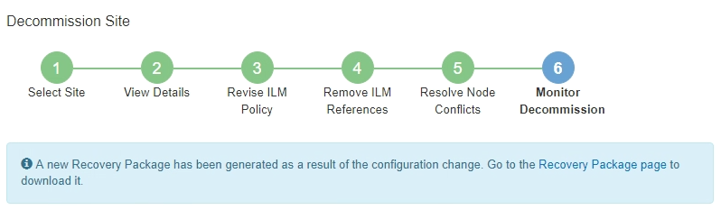

= Fase 6: Monitoraggio della dismissione
:allow-uri-read: 
:icons: font
:imagesdir: ../media/

[role="lead"]
Dal passaggio 6 (Monitoraggio dismissione) della procedura guidata della pagina Dismissione sito, è possibile monitorare l'avanzamento della rimozione del sito.

.Informazioni su questo compito
Quando StorageGRID rimuove un sito connesso, rimuove i nodi in questo ordine:

. Nodi gateway
. Nodi amministrativi
. Nodi di archiviazione

Quando StorageGRID rimuove un sito disconnesso, rimuove i nodi in questo ordine:

. Nodi gateway
. Nodi di archiviazione
. Nodi amministrativi

La rimozione di ciascun nodo gateway o nodo amministrativo potrebbe richiedere solo pochi minuti o un'ora; la rimozione dei nodi di archiviazione, invece, potrebbe richiedere giorni o settimane.

.Passi
. Non appena viene generato un nuovo pacchetto di ripristino, scaricare il file.
+

+

NOTE: Scarica il pacchetto di ripristino il prima possibile per assicurarti di poter ripristinare la tua rete se qualcosa va storto durante la procedura di dismissione.

+
.. Selezionare il collegamento nel messaggio oppure selezionare *MANUTENZIONE* > *Sistema* > *Pacchetto di ripristino*.
.. Scarica il `.zip` file.
+
Vedi le istruzioni perlink:downloading-recovery-package.html["scaricando il pacchetto di ripristino"] .

+

NOTE: Il file del pacchetto di ripristino deve essere protetto perché contiene chiavi di crittografia e password che possono essere utilizzate per ottenere dati dal sistema StorageGRID .

. Utilizzando il grafico Movimento dati, monitora lo spostamento dei dati degli oggetti da questo sito ad altri siti.
+
Lo spostamento dei dati è iniziato quando hai attivato la nuova policy ILM nel passaggio 3 (Revisione della policy ILM).  Lo spostamento dei dati avverrà durante tutta la procedura di disattivazione.

+
image::../media/decommission_site_step_6_data_movement.png[Dismissione del sito Fase 6 Spostamento dati]

. Nella sezione Avanzamento nodi della pagina, è possibile monitorare l'avanzamento della procedura di dismissione man mano che i nodi vengono rimossi.
+
Quando un nodo di archiviazione viene rimosso, ogni nodo attraversa una serie di fasi.  Sebbene la maggior parte di queste fasi avvenga rapidamente o addirittura in modo impercettibile, potrebbe essere necessario attendere giorni o addirittura settimane per il completamento di altre fasi, a seconda della quantità di dati da spostare.  È necessario ulteriore tempo per gestire i dati codificati in modo da essere cancellati e rivalutare l'ILM.

+
image::../media/decommission_site_step_6_storage_node.png[Nodo di archiviazione del passaggio 6 del sito di dismissione]

+
Se si sta monitorando l'avanzamento della dismissione di un sito connesso, fare riferimento a questa tabella per comprendere le fasi di dismissione di un nodo di archiviazione:

+
[cols="1a,2a"]
|===
| Palcoscenico | Durata stimata 

 a| 
In attesa di
 a| 
Minuto o meno

 a| 
Aspetta i blocchi
 a| 
Minuti

 a| 
Preparare l'attività
 a| 
Minuto o meno

 a| 
Marcatura LDR dismesso
 a| 
Minuti

 a| 
Dismissione dei dati replicati e codificati per cancellazione
 a| 
Ore, giorni o settimane in base alla quantità di dati

*Nota*: se è necessario eseguire altre attività di manutenzione, è possibile sospendere la dismissione del sito durante questa fase.

 a| 
Stato del set LDR
 a| 
Minuti

 a| 
Svuota le code di controllo
 a| 
Da minuti a ore, in base al numero di messaggi e alla latenza della rete.

 a| 
Completare
 a| 
Minuti

|===
+
Se si sta monitorando l'avanzamento della dismissione di un sito disconnesso, fare riferimento a questa tabella per comprendere le fasi di dismissione di un nodo di archiviazione:

+
[cols="1a,1a"]
|===
| Palcoscenico | Durata stimata 

 a| 
In attesa di
 a| 
Minuto o meno

 a| 
Aspetta i blocchi
 a| 
Minuti

 a| 
Preparare l'attività
 a| 
Minuto o meno

 a| 
Disabilita i servizi esterni
 a| 
Minuti

 a| 
Revoca del certificato
 a| 
Minuti

 a| 
Annulla registrazione nodo
 a| 
Minuti

 a| 
Grado di archiviazione Annulla registrazione
 a| 
Minuti

 a| 
Rimozione del gruppo di archiviazione
 a| 
Minuti

 a| 
Rimozione dell'entità
 a| 
Minuti

 a| 
Completare
 a| 
Minuti

|===
. Dopo che tutti i nodi hanno raggiunto la fase Completata, attendere il completamento delle operazioni di dismissione del sito rimanente.
+
** Durante la fase *Ripara Cassandra*, StorageGRID esegue tutte le riparazioni necessarie sui cluster Cassandra rimasti nella griglia.  Queste riparazioni potrebbero richiedere diversi giorni o più, a seconda di quanti nodi di archiviazione rimangono nella griglia.
+
image::../media/decommission_site_step_6_repair_cassandra.png[Fase 6: Riparazione del sito di dismissione Cassandra]

** Durante la fase *Disattiva profili EC ed elimina pool di archiviazione*, vengono apportate le seguenti modifiche ILM:
+
*** Tutti i profili di codifica di cancellazione che facevano riferimento al sito vengono disattivati.
*** Tutti i pool di archiviazione che facevano riferimento al sito vengono eliminati.
+

NOTE: Anche il pool di archiviazione All Storage Nodes (StorageGRID 11.6 e versioni precedenti) è stato rimosso perché utilizza il sito All Sites.

** Infine, durante la fase *Rimuovi configurazione*, tutti i riferimenti rimanenti al sito e ai suoi nodi vengono rimossi dal resto della griglia.
+
image::../media/decommission_site_step_6_remove_configuration.png[Disattivazione del sito Fase 6 Rimozione della configurazione]

. Una volta completata la procedura di dismissione, la pagina Decommission Site mostra un messaggio di successo e il sito rimosso non viene più visualizzato.
+
image::../media/decommission_site_success_message.png[Messaggio di successo della dismissione del sito]

.Dopo aver finito
Completare le seguenti attività dopo aver completato la procedura di dismissione del sito:

* Assicurarsi che le unità di tutti i nodi di archiviazione nel sito dismesso siano state cancellate.  Utilizzare uno strumento o un servizio di cancellazione dati disponibile in commercio per rimuovere in modo permanente e sicuro i dati dalle unità.
* Se il sito include uno o più nodi amministrativi e l'accesso Single Sign-On (SSO) è abilitato per il sistema StorageGRID , rimuovere tutti i trust delle parti affidabili per il sito da Active Directory Federation Services (AD FS).
* Dopo che i nodi sono stati spenti automaticamente come parte della procedura di disattivazione del sito connesso, rimuovere le macchine virtuali associate.

