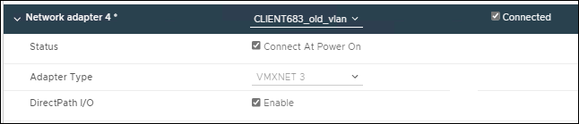

= VMware: aggiungi trunk o interfacce di accesso a un nodo
:allow-uri-read: 
:icons: font
:imagesdir: ../media/

[role="lead"]
È possibile aggiungere un trunk o un'interfaccia di accesso a un nodo VM dopo che il nodo è stato installato.  Le interfacce aggiunte vengono visualizzate nella pagina Interfacce VLAN e nella pagina Gruppi HA.

.Prima di iniziare
* Hai accesso alle istruzioni perlink:../vmware/index.html["installazione di StorageGRID sulla piattaforma VMware"] .
* Sono presenti macchine virtuali VMware Admin Node e Gateway Node.
* Hai una subnet di rete che non viene utilizzata come rete Grid, Admin o Client.
* Tu hai il `Passwords.txt` file.
* Hailink:../admin/admin-group-permissions.html["autorizzazioni di accesso specifiche"] .

CAUTION: Non tentare di aggiungere interfacce a un nodo mentre è in corso un aggiornamento software, una procedura di ripristino o una procedura di espansione.

.Informazioni su questo compito
Per aggiungere una o più interfacce extra a un nodo VMware dopo averlo installato, seguire questi passaggi.  Ad esempio, potresti voler aggiungere un'interfaccia trunk a un nodo di amministrazione o gateway, in modo da poter utilizzare le interfacce VLAN per separare il traffico appartenente a diverse applicazioni o tenant.  Oppure potresti voler aggiungere un'interfaccia di accesso da utilizzare in un gruppo ad alta disponibilità (HA).

Se si aggiunge un'interfaccia trunk, è necessario configurare un'interfaccia VLAN in StorageGRID.  Se si aggiunge un'interfaccia di accesso, è possibile aggiungerla direttamente a un gruppo HA; non è necessario configurare un'interfaccia VLAN.

Il nodo potrebbe non essere disponibile per un breve periodo quando si aggiungono interfacce.

.Passi
. In vCenter, aggiungere una nuova scheda di rete (tipo VMXNET3) a una VM Admin Node e Gateway Node.  Selezionare le caselle di controllo *Connesso* e *Connetti all'accensione*.
+

. Utilizzare SSH per accedere al nodo di amministrazione o al nodo gateway.
. Utilizzo `ip link show` per confermare che la nuova interfaccia di rete ens256 è stata rilevata.
+
[listing]
----
ip link show
1: lo: <LOOPBACK,UP,LOWER_UP> mtu 65536 qdisc noqueue state UNKNOWN mode DEFAULT group default qlen 1000
    link/loopback 00:00:00:00:00:00 brd 00:00:00:00:00:00
2: eth0: <BROADCAST,MULTICAST,UP,LOWER_UP> mtu 1400 qdisc mq state UP mode DEFAULT group default qlen 1000
    link/ether 00:50:56:a0:4e:5b brd ff:ff:ff:ff:ff:ff
3: eth1: <BROADCAST,MULTICAST> mtu 1500 qdisc noop state DOWN mode DEFAULT group default qlen 1000
    link/ether 00:50:56:a0:fa:ce brd ff:ff:ff:ff:ff:ff
4: eth2: <BROADCAST,MULTICAST,UP,LOWER_UP> mtu 1400 qdisc mq state UP mode DEFAULT group default qlen 1000
    link/ether 00:50:56:a0:d6:87 brd ff:ff:ff:ff:ff:ff
5: ens256: <BROADCAST,MULTICAST,UP,LOWER_UP> mtu 1500 qdisc mq master ens256vrf state UP mode DEFAULT group default qlen 1000
    link/ether 00:50:56:a0:ea:88 brd ff:ff:ff:ff:ff:ff
----

.Dopo aver finito
* Se hai aggiunto una o più interfacce trunk, vai alink:../admin/configure-vlan-interfaces.html["configurare le interfacce VLAN"] per configurare una o più interfacce VLAN per ogni nuova interfaccia padre.
* Se hai aggiunto una o più interfacce di accesso, vai alink:../admin/configure-high-availability-group.html["configurare gruppi ad alta disponibilità"] per aggiungere le nuove interfacce direttamente ai gruppi HA.

