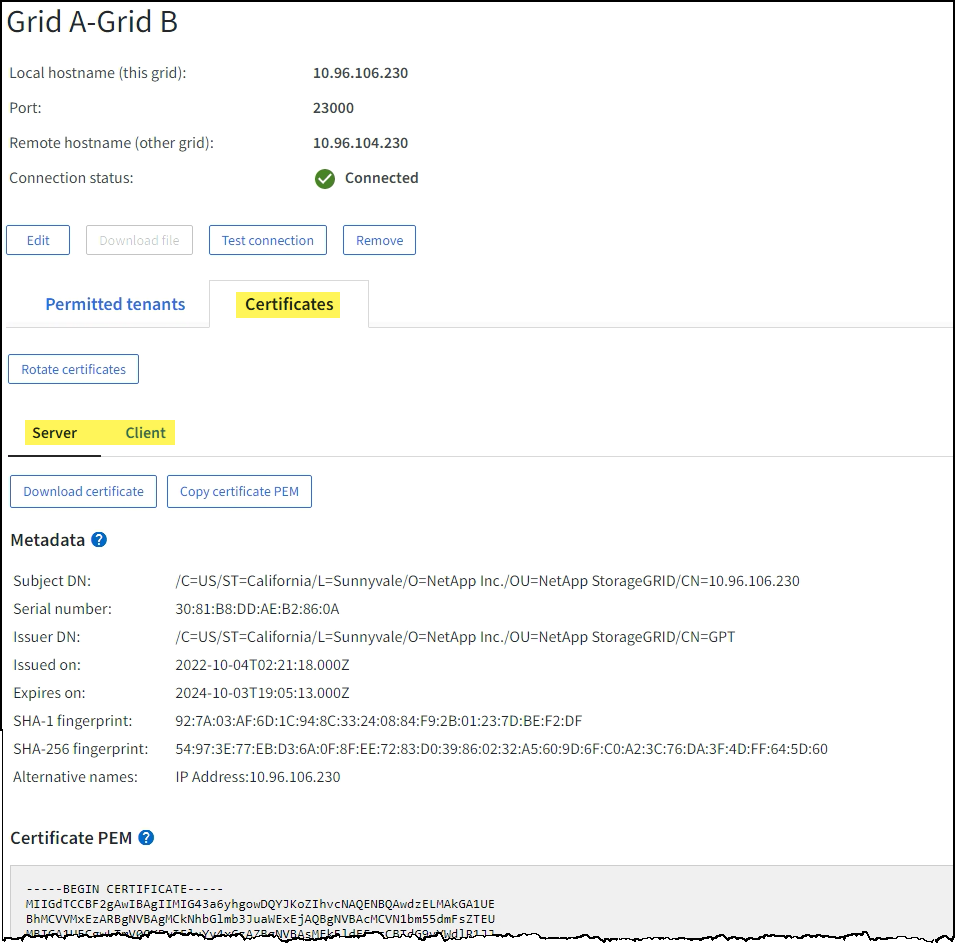

= Monitorare le connessioni della federazione di rete
:allow-uri-read: 
:icons: font
:imagesdir: ../media/

[role="lead"]
È possibile monitorare le informazioni di base su tuttilink:../admin/grid-federation-overview.html["connessioni della federazione di rete"] , informazioni dettagliate su una connessione specifica o metriche Prometheus sulle operazioni di replicazione tra griglie.  È possibile monitorare una connessione da entrambe le griglie.

.Prima di iniziare
* Hai effettuato l'accesso a Grid Manager su entrambe le griglie utilizzando unlink:../admin/web-browser-requirements.html["browser web supportato"] .
* Tu hai illink:../admin/admin-group-permissions.html["Permesso di accesso root"] per la griglia a cui hai effettuato l'accesso.

== Visualizza tutte le connessioni

La pagina Federazione di griglia mostra informazioni di base su tutte le connessioni di federazione di griglia e su tutti gli account tenant autorizzati a utilizzare le connessioni di federazione di griglia.

.Passi
. Selezionare *CONFIGURAZIONE* > *Sistema* > *Federazione di griglia*.
+
Viene visualizzata la pagina Federazione Grid.

. Per visualizzare le informazioni di base per tutte le connessioni su questa griglia, selezionare la scheda *Connessioni*.
+
Da questa scheda puoi:

+
** link:../admin/grid-federation-create-connection.html["Crea una nuova connessione"] .
** Seleziona una connessione esistente alink:../admin/grid-federation-manage-connection.html["modificare o testare"] .

+
image::../media/grid-federation-connections-tab.png[Scheda Connessioni federazione di griglia]

. Per visualizzare le informazioni di base per tutti gli account tenant su questa griglia che dispongono dell'autorizzazione *Usa connessione federata griglia*, selezionare la scheda *Tenant autorizzati*.
+
Da questa scheda puoi:

+
** link:../monitor/monitoring-tenant-activity.html["Visualizza la pagina dei dettagli per ogni inquilino autorizzato"] .
** Visualizza la pagina dei dettagli per ogni connessione. Vedere <<view-specific-connection,Visualizza una connessione specifica>> .
** Selezionare un inquilino autorizzato elink:../admin/grid-federation-manage-tenants.html["rimuovere il permesso"] .
** Verificare la presenza di errori di replicazione tra griglie e cancellare l'ultimo errore, se presente. Vedere link:../admin/grid-federation-troubleshoot.html["Risolvere gli errori di federazione della griglia"] .
+
image::../media/grid-federation-permitted-tenants-tab.png[Scheda Inquilini autorizzati della federazione di rete]

== [[view-specific-connection]]Visualizza una connessione specifica

È possibile visualizzare i dettagli di una specifica connessione di federazione di rete.

.Passi
. Selezionare una delle schede dalla pagina Federazione della griglia, quindi selezionare il nome della connessione dalla tabella.
+
Dalla pagina dei dettagli della connessione, puoi:

+
** Visualizza le informazioni di base sullo stato della connessione, inclusi i nomi host locali e remoti, la porta e lo stato della connessione.
** Seleziona una connessione alink:../admin/grid-federation-manage-connection.html["modificare, testare o rimuovere"] .

. Quando si visualizza una connessione specifica, selezionare la scheda *Tenant consentiti* per visualizzare i dettagli sui tenant consentiti per la connessione.
+
Da questa scheda puoi:

+
** link:../monitor/monitoring-tenant-activity.html["Visualizza la pagina dei dettagli per ogni inquilino autorizzato"] .
** link:../admin/grid-federation-manage-tenants.html["Rimuovere l'autorizzazione di un inquilino"]per utilizzare la connessione.
** Verificare la presenza di errori di replicazione tra griglie e cancellare l'ultimo errore. Vedere link:../admin/grid-federation-troubleshoot.html["Risolvere gli errori di federazione della griglia"] .
+
image::../media/grid-federation-permitted-tenants-tab-for-connection.png[federazione-griglia-inquilini-autorizzati-scheda-per-connessione]

. Quando si visualizza una connessione specifica, selezionare la scheda *Certificati* per visualizzare i certificati server e client generati dal sistema per questa connessione.
+
Da questa scheda puoi:

+
** link:../admin/grid-federation-manage-connection.html["Ruota i certificati di connessione"] .
** Selezionare *Server* o *Client* per visualizzare o scaricare il certificato associato o copiare il certificato PEM.
+

== Esaminare le metriche di replicazione tra griglie

È possibile utilizzare la dashboard Cross-Grid Replication in Grafana per visualizzare le metriche di Prometheus sulle operazioni di replica cross-grid sulla propria griglia.

.Passi
. Da Grid Manager, seleziona *SUPPORTO* > *Strumenti* > *Metriche*.
+

NOTE: Gli strumenti disponibili nella pagina Metriche sono destinati all'uso da parte del supporto tecnico.  Alcune funzionalità e voci di menu all'interno di questi strumenti sono intenzionalmente non funzionali e sono soggette a modifiche.  Vedi l'elenco dilink:../monitor/commonly-used-prometheus-metrics.html["metriche Prometheus comunemente utilizzate"] .

. Nella sezione Grafana della pagina, seleziona *Cross Grid Replication*.
+
Per istruzioni dettagliate, vederelink:../monitor/reviewing-support-metrics.html["Esaminare le metriche di supporto"] .

. Per riprovare la replica degli oggetti che non sono riusciti a replicare, vederelink:../admin/grid-federation-retry-failed-replication.html["Identificare e riprovare le operazioni di replicazione non riuscite"] .

