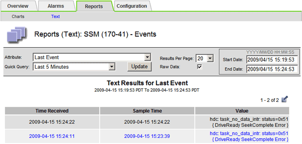

= Monitorare gli eventi
:allow-uri-read: 
:icons: font
:imagesdir: ../media/

[role="lead"]
È possibile monitorare gli eventi rilevati da un nodo della griglia, inclusi gli eventi personalizzati creati per tenere traccia degli eventi registrati sul server syslog.  Il messaggio Ultimo evento visualizzato in Grid Manager fornisce maggiori informazioni sull'evento più recente.

I messaggi di evento sono elencati anche in `/var/local/log/bycast-err.log` file di registro. Vedi illink:logs-files-reference.html["Riferimento ai file di registro"] .

L'allarme SMTT (eventi totali) può essere attivato ripetutamente da problemi quali problemi di rete, interruzioni di corrente o aggiornamenti.  Questa sezione contiene informazioni su come indagare sugli eventi, in modo da comprendere meglio il motivo per cui si sono verificati questi allarmi.  Se un evento si è verificato a causa di un problema noto, è possibile reimpostare i contatori degli eventi.

.Passi
. Esaminare gli eventi di sistema per ciascun nodo della griglia:
+
.. Selezionare *SUPPORTO* > *Strumenti* > *Topologia griglia*.
.. Seleziona *_site_* > *_grid node_* > *SSM* > *Eventi* > *Panoramica* > *Principale*.

. Genera un elenco di messaggi di eventi precedenti per aiutare a isolare i problemi verificatisi in passato:
+
.. Selezionare *SUPPORTO* > *Strumenti* > *Topologia griglia*.
.. Selezionare *_site_* > *_grid node_* > *SSM* > *Eventi* > *Report*.
.. Seleziona *Testo*.
+
L'attributo *Ultimo evento* non viene visualizzato inlink:using-charts-and-reports.html["visualizzazione dei grafici"] .  Per visualizzarlo:

.. Cambia *Attributo* in *Ultimo evento*.
.. Facoltativamente, seleziona un periodo di tempo per *Query rapida*.
.. Selezionare *Aggiorna*.
+

== Crea eventi syslog personalizzati

Gli eventi personalizzati consentono di tenere traccia di tutti gli eventi utente di livello kernel, daemon, errore e critico registrati sul server syslog.  Un evento personalizzato può essere utile per monitorare il verificarsi di messaggi di registro di sistema (e quindi eventi di sicurezza di rete e guasti hardware).

.Informazioni su questo compito
Prendi in considerazione la creazione di eventi personalizzati per monitorare i problemi ricorrenti.  Le seguenti considerazioni si applicano agli eventi personalizzati.

* Dopo aver creato un evento personalizzato, ogni sua occorrenza viene monitorata.
* Per creare un evento personalizzato basato sulle parole chiave nel `/var/local/log/messages` file, i registri in quei file devono essere:
+
** Generato dal kernel
** Generato dal demone o dal programma utente a livello di errore o critico

*Nota:* Non tutte le voci nel `/var/local/log/messages` i file verranno abbinati a meno che non soddisfino i requisiti sopra indicati.

.Passi
. Selezionare *SUPPORTO* > *Allarmi (legacy)* > *Eventi personalizzati*.
. Fai clic su *Modifica*image:../media/icon_nms_edit.gif["icona della matita"] (o *Inserisci*image:../media/icon_nms_insert.gif["icona più"] se questo non è il primo evento).
. Inserisci una stringa di evento personalizzata, ad esempio, arresto
+
image::../media/custom_events.png[screenshot che mostra dove inserire la stringa dell'evento personalizzato]

. Selezionare *Applica modifiche*.
. Selezionare *SUPPORTO* > *Strumenti* > *Topologia griglia*.
. Selezionare *_nodo griglia_* > *SSM* > *Eventi*.
. Individuare la voce Eventi personalizzati nella tabella Eventi e monitorare il valore per *Conteggio*.
+
Se il conteggio aumenta, significa che su quel nodo della griglia viene attivato un evento personalizzato che stai monitorando.

+
image::../media/custom_events_count.png[SSM > Eventi > Pagina panoramica]

== Reimposta a zero il conteggio degli eventi personalizzati

Se si desidera reimpostare il contatore solo per gli eventi personalizzati, è necessario utilizzare la pagina Topologia griglia nel menu Supporto.

L'azzeramento di un contatore fa sì che l'allarme venga attivato dall'evento successivo.  Al contrario, quando si riconosce un allarme, l'allarme viene riattivato solo se viene raggiunto il livello di soglia successivo.

.Passi
. Selezionare *SUPPORTO* > *Strumenti* > *Topologia griglia*.
. Selezionare *_grid node_* > *SSM* > *Eventi* > *Configurazione* > *Principale*.
. Selezionare la casella di controllo *Reimposta* per Eventi personalizzati.
+
image::../media/custom_events_reset.gif[screenshot in SSM > Eventi > Configurazione > Principale]

. Selezionare *Applica modifiche*.

