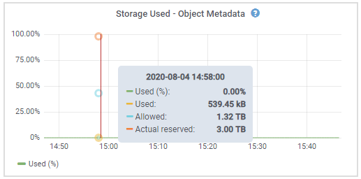

= Monitorare la capacità di archiviazione
:allow-uri-read: 
:icons: font
:imagesdir: ../media/

[role="lead"]
Monitorare lo spazio utilizzabile totale disponibile per garantire che il sistema StorageGRID non esaurisca lo spazio di archiviazione per gli oggetti o per i metadati degli oggetti.

StorageGRID archivia separatamente i dati degli oggetti e i metadati degli oggetti e riserva una quantità specifica di spazio per un database Cassandra distribuito che contiene i metadati degli oggetti.  Monitora la quantità totale di spazio occupato dagli oggetti e dai metadati degli oggetti, nonché le tendenze nella quantità di spazio occupato per ciascuno.  Ciò ti consentirà di pianificare in anticipo l'aggiunta di nodi ed evitare eventuali interruzioni del servizio.

Puoilink:viewing-storage-tab.html["visualizza le informazioni sulla capacità di archiviazione"] per l'intera griglia, per ciascun sito e per ciascun nodo di archiviazione nel sistema StorageGRID .

== Monitorare la capacità di archiviazione per l'intera rete

Monitora la capacità di archiviazione complessiva della tua griglia per assicurarti che rimanga spazio libero adeguato per i dati degli oggetti e i metadati degli oggetti.  Comprendere come la capacità di archiviazione cambia nel tempo può aiutarti a pianificare l'aggiunta di nodi di archiviazione o volumi di archiviazione prima che la capacità di archiviazione utilizzabile della griglia venga esaurita.

La dashboard di Grid Manager consente di valutare rapidamente la quantità di spazio di archiviazione disponibile per l'intera griglia e per ciascun data center.  La pagina Nodi fornisce valori più dettagliati per i dati degli oggetti e i metadati degli oggetti.

.Passi
. Valutare la quantità di spazio di archiviazione disponibile per l'intera rete e per ciascun data center.
+
.. Selezionare *Dashboard > Panoramica*.
.. Prendere nota dei valori nelle schede Ripartizione utilizzo spazio dati e Ripartizione utilizzo spazio metadati consentito.  Ogni scheda elenca la percentuale di utilizzo dello spazio di archiviazione, la capacità dello spazio utilizzato e lo spazio totale disponibile o consentito dal sito.
+

NOTE: Il riassunto non include supporti d'archivio.

+
image::../media/dashboard_data_and_metadata_space_usage_breakdown.png[Ripartizione dell'utilizzo dello spazio dati e metadati]

.. Notare il grafico sulla scheda Conservazione nel tempo.  Utilizza il menu a discesa del periodo di tempo per determinare la rapidità con cui viene consumato lo spazio di archiviazione.
+
image::../media/dashboard_storage_over_time.png[Grafico di conservazione nel tempo]

. Utilizzare la pagina Nodi per ulteriori dettagli sulla quantità di spazio di archiviazione utilizzata e su quanto spazio di archiviazione rimane disponibile sulla griglia per i dati degli oggetti e i metadati degli oggetti.
+
.. Selezionare *NODES*.
.. Selezionare *_grid_* > *Archiviazione*.
+
image::../media/nodes_deployment_storage_tab.png[Scheda Archiviazione distribuzione nodi]

.. Posiziona il cursore sui grafici *Spazio di archiviazione utilizzato - dati oggetto* e *Spazio di archiviazione utilizzato - metadati oggetto* per vedere quanto spazio di archiviazione oggetto e spazio di archiviazione metadati oggetto è disponibile per l'intera griglia e quanto è stato utilizzato nel tempo.
+

NOTE: I valori totali per un sito o per la griglia non includono i nodi che non hanno segnalato metriche per almeno cinque minuti, come i nodi offline.

. Pianificare l'esecuzione di un'espansione per aggiungere nodi di archiviazione o volumi di archiviazione prima che la capacità di archiviazione utilizzabile della griglia venga esaurita.
+
Quando si pianifica la tempistica di un'espansione, bisogna considerare quanto tempo ci vorrà per procurarsi e installare ulteriore spazio di archiviazione.

+

NOTE: Se la policy ILM utilizza la codifica di cancellazione, potrebbe essere preferibile espandere quando i nodi di archiviazione esistenti sono pieni al 70% circa, per ridurre il numero di nodi da aggiungere.

+
Per ulteriori informazioni sulla pianificazione di un'espansione dello storage, vederelink:../expand/index.html["istruzioni per espandere StorageGRID"] .

== Monitorare la capacità di archiviazione per ogni nodo di archiviazione

Monitorare lo spazio totale utilizzabile per ciascun nodo di archiviazione per garantire che il nodo disponga di spazio sufficiente per i nuovi dati degli oggetti.

.Informazioni su questo compito
Lo spazio utilizzabile è la quantità di spazio di archiviazione disponibile per riporre gli oggetti.  Lo spazio totale utilizzabile per un nodo di archiviazione viene calcolato sommando lo spazio disponibile su tutti gli archivi di oggetti all'interno del nodo.

image::../media/calculating_watermarks.gif[Disegno concettuale per lo spazio utilizzabile totale]

.Passi
. Selezionare *NODI* > *_Nodo di archiviazione_* > *Archiviazione*.
+
Vengono visualizzati i grafici e le tabelle per il nodo.

. Posiziona il cursore sul grafico dei dati dell'oggetto Spazio di archiviazione utilizzato.
+
Vengono mostrati i seguenti valori:

+
** *Utilizzato (%)*: la percentuale dello spazio utilizzabile totale che è stata utilizzata per i dati dell'oggetto.
** *Utilizzato*: quantità di spazio utilizzabile totale utilizzata per i dati dell'oggetto.
** *Dati replicati*: una stima della quantità di dati di oggetti replicati su questo nodo, sito o griglia.
** *Dati con codice di cancellazione*: una stima della quantità di dati di oggetti con codice di cancellazione su questo nodo, sito o griglia.
** *Totale*: quantità totale di spazio utilizzabile su questo nodo, sito o griglia.  Il valore utilizzato è il `storagegrid_storage_utilization_data_bytes` metrica.
+
image::../media/nodes_page_storage_used_object_data.png[Nodi Pagina Archiviazione utilizzata Oggetto Dati]

. Esaminare i valori disponibili nelle tabelle Volumi e Archivi oggetti, sotto i grafici.
+

NOTE: Per visualizzare i grafici di questi valori, fare clic sulle icone del graficoimage:../media/icon_chart_new_for_11_5.png["Icona del grafico"] nelle colonne Disponibili.

+
image::../media/nodes_page_storage_tables.png[Tabelle di negozi di oggetti]

. Monitorare i valori nel tempo per stimare la velocità con cui viene consumato lo spazio di archiviazione utilizzabile.
. Per mantenere il normale funzionamento del sistema, aggiungere nodi di archiviazione, aggiungere volumi di archiviazione o archiviare i dati degli oggetti prima che lo spazio utilizzabile venga consumato.
+
Quando si pianifica la tempistica di un'espansione, bisogna considerare quanto tempo ci vorrà per procurarsi e installare ulteriore spazio di archiviazione.

+

NOTE: Se la policy ILM utilizza la codifica di cancellazione, potrebbe essere preferibile espandere quando i nodi di archiviazione esistenti sono pieni al 70% circa, per ridurre il numero di nodi da aggiungere.

+
Per ulteriori informazioni sulla pianificazione di un'espansione dello storage, vederelink:../expand/index.html["istruzioni per espandere StorageGRID"] .

+
ILlink:../troubleshoot/troubleshooting-low-object-data-storage-alert.html["Bassa capacità di archiviazione dei dati degli oggetti"] L'avviso viene attivato quando non rimane spazio sufficiente per archiviare i dati degli oggetti su un nodo di archiviazione.

== Monitorare la capacità dei metadati degli oggetti per ogni nodo di archiviazione

Monitorare l'utilizzo dei metadati per ciascun nodo di archiviazione per garantire che rimanga disponibile spazio adeguato per le operazioni essenziali del database.  È necessario aggiungere nuovi nodi di archiviazione in ogni sito prima che i metadati degli oggetti superino il 100% dello spazio metadati consentito.

.Informazioni su questo compito
StorageGRID conserva tre copie dei metadati degli oggetti in ogni sito per garantire ridondanza e proteggere i metadati degli oggetti dalla perdita.  Le tre copie vengono distribuite uniformemente su tutti i nodi di archiviazione in ciascun sito, utilizzando lo spazio riservato ai metadati sul volume di archiviazione 0 di ciascun nodo di archiviazione.

In alcuni casi, la capacità dei metadati degli oggetti della griglia potrebbe essere consumata più velocemente della sua capacità di archiviazione degli oggetti.  Ad esempio, se in genere si acquisiscono grandi quantità di piccoli oggetti, potrebbe essere necessario aggiungere nodi di archiviazione per aumentare la capacità dei metadati, anche se rimane una capacità di archiviazione degli oggetti sufficiente.

Alcuni dei fattori che possono aumentare l'utilizzo dei metadati includono le dimensioni e la quantità di metadati e tag utente, il numero totale di parti in un caricamento multiparte e la frequenza delle modifiche alle posizioni di archiviazione ILM.

.Passi
. Selezionare *NODI* > *_Nodo di archiviazione_* > *Archiviazione*.
. Posiziona il cursore sul grafico dei metadati dell'oggetto Spazio di archiviazione utilizzato per visualizzare i valori per un periodo di tempo specifico.
+

+
Usato (%):: Percentuale dello spazio metadati consentito che è stato utilizzato su questo nodo di archiviazione.
+
--
Metriche di Prometheus: `storagegrid_storage_utilization_metadata_bytes` E `storagegrid_storage_utilization_metadata_allowed_bytes`

--
Usato:: I byte dello spazio metadati consentito che sono stati utilizzati su questo nodo di archiviazione.
+
--
Metrica di Prometeo: `storagegrid_storage_utilization_metadata_bytes`

--
Consentito:: Lo spazio consentito per i metadati degli oggetti su questo nodo di archiviazione.  Per sapere come viene determinato questo valore per ogni nodo di archiviazione, vederelink:../admin/managing-object-metadata-storage.html#allowed-metadata-space["descrizione completa dello spazio metadati consentito"] .
+
--
Metrica di Prometeo: `storagegrid_storage_utilization_metadata_allowed_bytes`

--
Effettivo riservato:: Lo spazio effettivamente riservato ai metadati su questo nodo di archiviazione.  Include lo spazio consentito e lo spazio richiesto per le operazioni essenziali sui metadati.  Per sapere come viene calcolato questo valore per ogni nodo di archiviazione, vederelink:../admin/managing-object-metadata-storage.html#actual-reserved-space-for-metadata["descrizione completa dello spazio effettivamente riservato per i metadati"] .
+
--
_La metrica Prometheus verrà aggiunta in una versione futura._

--

+

NOTE: I valori totali per un sito o per la griglia non includono i nodi che non hanno segnalato metriche per almeno cinque minuti, come i nodi offline.

. Se il valore *Utilizzato (%)* è pari o superiore al 70%, espandere il sistema StorageGRID aggiungendo nodi di archiviazione a ciascun sito.
+

CAUTION: L'avviso *Archiviazione metadati insufficiente* viene attivato quando il valore *Utilizzato (%)* raggiunge determinate soglie.  Se i metadati degli oggetti utilizzano più del 100% dello spazio consentito, si possono verificare risultati indesiderati.

+
Quando si aggiungono nuovi nodi, il sistema ribilancia automaticamente i metadati degli oggetti su tutti i nodi di archiviazione all'interno del sito. Vedi illink:../expand/index.html["istruzioni per espandere un sistema StorageGRID"] .

== Monitorare le previsioni di utilizzo dello spazio

Monitorare le previsioni di utilizzo dello spazio per i dati utente e i metadati per stimare quando sarà necessariolink:../expand/index.html["espandere una griglia"] .

Se noti che il tasso di consumo cambia nel tempo, seleziona un intervallo più breve dal menu a discesa *Media su* per riflettere solo i modelli di consumo più recenti.  Se noti modelli stagionali, seleziona un intervallo più lungo.

Se si dispone di una nuova installazione StorageGRID , consentire l'accumulo di dati e metadati prima di valutare le previsioni di utilizzo dello spazio.

.Passi
. Nella dashboard, seleziona *Archiviazione*.
. Visualizza le schede della dashboard, Previsione dell'utilizzo dei dati per pool di archiviazione e Previsione dell'utilizzo dei metadati per sito.
. Utilizzare questi valori per stimare quando sarà necessario aggiungere nuovi nodi di archiviazione per l'archiviazione di dati e metadati.

image::../media/forecast-metadata-usage.png[Previsione dell'utilizzo dei metadati per sito]
