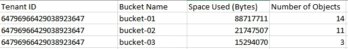

= Monitorare l'attività degli inquilini
:allow-uri-read: 
:icons: font
:imagesdir: ../media/

[role="lead"]
Tutte le attività del client S3 sono associate agli account tenant StorageGRID .  È possibile utilizzare Grid Manager per monitorare l'utilizzo dello storage o il traffico di rete per tutti i tenant o per un tenant specifico.  È possibile utilizzare il registro di controllo o le dashboard di Grafana per raccogliere informazioni più dettagliate su come i tenant utilizzano StorageGRID.

.Prima di iniziare
* Hai effettuato l'accesso a Grid Manager utilizzando unlink:../admin/web-browser-requirements.html["browser web supportato"] .
* Tu hai illink:../admin/admin-group-permissions.html["Accesso root o autorizzazione account tenant"] .

== Visualizza tutti gli inquilini

La pagina Inquilini mostra le informazioni di base per tutti gli account degli inquilini attuali.

.Passi
. Selezionare *INQUILINI*.
. Esaminare le informazioni mostrate nelle pagine dedicate agli inquilini.
+
Per ogni tenant vengono elencati lo spazio logico utilizzato, l'utilizzo della quota, la quota e il conteggio degli oggetti.  Se non è impostata una quota per un tenant, i campi Utilizzo quota e Quota contengono un trattino (&#8212;).

+

NOTE: I valori dello spazio utilizzato sono stime. Tali stime sono influenzate dalla tempistica degli ingest, dalla connettività di rete e dallo stato del nodo.

+
image::../media/tenant_accounts_page.png[Pagina Account inquilino]

. Facoltativamente, accedi a un account tenant selezionando il collegamento di accessoimage:../media/icon_tenant_sign_in.png["Icona di accesso dell'inquilino"] nella colonna * Sign in/Copia URL*.
. Facoltativamente, copia l'URL della pagina di accesso di un tenant selezionando il collegamento Copia URLimage:../media/icon_tenant_copy_url.png["Icona URL copia tenant"] nella colonna * Sign in/Copia URL*.
. Facoltativamente, seleziona *Esporta in CSV* per visualizzare ed esportare un `.csv` file contenente i valori di utilizzo per tutti gli inquilini.
+
Ti verrà chiesto di aprire o salvare il `.csv` file.

+
Il contenuto del `.csv` il file appare come nell'esempio seguente:

+
image::../media/tenant_accounts_example_csv.png[Esempio di account inquilino .csv]

+
Puoi aprire il `.csv` file in un'applicazione di fogli di calcolo o utilizzarlo nell'automazione.

. Se non è elencato alcun oggetto, facoltativamente, selezionare *Azioni* > *Elimina* per rimuovere uno o più tenant. Vedere link:../admin/deleting-tenant-account.html["Elimina account inquilino"] .
+
Non è possibile rimuovere un account tenant se l'account include bucket o contenitori.

== Visualizza un inquilino specifico

È possibile visualizzare i dettagli di un inquilino specifico.

.Passi
. Selezionare il nome dell'inquilino dalla pagina Inquilini.
+
Viene visualizzata la pagina dei dettagli dell'inquilino.

+
image::../media/tenant_usage_modal.png[Modalità di utilizzo dell'inquilino]

. Consulta la panoramica degli inquilini nella parte superiore della pagina.
+
Questa sezione della pagina dei dettagli fornisce informazioni riepilogative per il tenant, tra cui il conteggio degli oggetti del tenant, l'utilizzo della quota, lo spazio logico utilizzato e l'impostazione della quota.

. Dalla scheda *Ripartizione dello spazio*, esamina il grafico *Consumo di spazio*.
+
Questo grafico mostra il consumo totale di spazio per tutti i bucket S3 del tenant.

+
Se è stata impostata una quota per questo tenant, la quantità di quota utilizzata e rimanente viene visualizzata in testo (ad esempio, `85.00 GB of 100 GB used` ).  Se non è stata impostata alcuna quota, il tenant ha una quota illimitata e il testo include solo una quantità di spazio utilizzata (ad esempio, `85.00 GB used` ).  Il grafico a barre mostra la percentuale di quota in ciascun bucket o contenitore.  Se il tenant ha superato la quota di archiviazione di oltre l'1% e di almeno 1 GB, il grafico mostra la quota totale e la quantità eccedente.

+
È possibile posizionare il cursore sul grafico a barre per visualizzare lo spazio di archiviazione utilizzato da ciascun bucket o contenitore.  È possibile posizionare il cursore sul segmento di spazio libero per visualizzare la quota di archiviazione rimanente.

+
image::../media/tenant_bucket_space_consumption_GM.png[Grafico a barre del consumo del bucket dell'inquilino]

+

CAUTION: L'utilizzo delle quote si basa su stime interne e in alcuni casi potrebbe essere superato.  Ad esempio, StorageGRID controlla la quota quando un tenant inizia a caricare oggetti e rifiuta nuovi ingest se il tenant ha superato la quota.  Tuttavia, StorageGRID non tiene conto delle dimensioni del caricamento corrente quando determina se la quota è stata superata.  Se gli oggetti vengono eliminati, a un tenant potrebbe essere temporaneamente impedito di caricare nuovi oggetti finché non viene ricalcolato l'utilizzo della quota.  I calcoli dell'utilizzo delle quote possono richiedere 10 minuti o più.

+

NOTE: L'utilizzo della quota di un tenant indica la quantità totale di dati oggetto che il tenant ha caricato su StorageGRID (dimensione logica).  L'utilizzo della quota non rappresenta lo spazio utilizzato per archiviare copie di tali oggetti e dei relativi metadati (dimensioni fisiche).

+

NOTE: È possibile abilitare la regola di avviso *Utilizzo elevato della quota tenant* per determinare se i tenant stanno consumando le loro quote.  Se abilitato, questo avviso viene attivato quando un tenant ha utilizzato il 90% della sua quota. Per le istruzioni, vederelink:../monitor/editing-alert-rules.html["Modifica le regole di avviso"] .

. Dalla scheda *Ripartizione dello spazio*, rivedere i *Dettagli del bucket*.
+
Questa tabella elenca i bucket S3 per il tenant.  Lo spazio utilizzato è la quantità totale di dati oggetto nel bucket o nel contenitore.  Questo valore non rappresenta lo spazio di archiviazione richiesto per le copie ILM e i metadati degli oggetti.

. Facoltativamente, seleziona *Esporta in CSV* per visualizzare ed esportare un file .csv contenente i valori di utilizzo per ciascun bucket o contenitore.
+
Il contenuto di un singolo tenant S3 `.csv` il file appare come nell'esempio seguente:

+

+
Puoi aprire il `.csv` file in un'applicazione di fogli di calcolo o utilizzarlo nell'automazione.

. Facoltativamente, seleziona la scheda *Funzionalità consentite* per visualizzare un elenco delle autorizzazioni e delle funzionalità abilitate per il tenant.  Vederelink:../admin/editing-tenant-account.html["Modifica account inquilino"] se è necessario modificare una di queste impostazioni.
. Se il tenant dispone dell'autorizzazione *Usa connessione federazione griglia*, selezionare facoltativamente la scheda *Federazione griglia* per saperne di più sulla connessione.
+
Vederelink:../admin/grid-federation-overview.html["Che cos'è la federazione di rete?"] Elink:../admin/grid-federation-manage-tenants.html["Gestire gli inquilini autorizzati per la federazione della rete"] .

== Visualizza il traffico di rete

Se per un tenant sono in atto criteri di classificazione del traffico, esaminare il traffico di rete per quel tenant.

.Passi
. Selezionare *CONFIGURAZIONE* > *Rete* > *Classificazione del traffico*.
+
Viene visualizzata la pagina Criteri di classificazione del traffico e i criteri esistenti sono elencati nella tabella.

. Esaminare l'elenco delle policy per identificare quelle che si applicano a un inquilino specifico.
. Per visualizzare le metriche associate a una policy, selezionare il pulsante di opzione a sinistra della policy e selezionare *Metriche*.
. Analizza i grafici per determinare la frequenza con cui la policy limita il traffico e se è necessario modificarla.

Vedere link:../admin/managing-traffic-classification-policies.html["Gestire le policy di classificazione del traffico"] per maggiori informazioni.

== Utilizzare il registro di controllo

Facoltativamente, è possibile utilizzare il registro di controllo per un monitoraggio più dettagliato delle attività di un tenant.

Ad esempio, è possibile monitorare i seguenti tipi di informazioni:

* Operazioni client specifiche, come PUT, GET o DELETE
* Dimensioni degli oggetti
* La regola ILM applicata agli oggetti
* L'IP di origine delle richieste client

I registri di controllo vengono scritti in file di testo che è possibile analizzare utilizzando lo strumento di analisi dei registri scelto.  Ciò consente di comprendere meglio le attività dei clienti o di implementare modelli sofisticati di addebito e fatturazione.

Vedere link:../audit/index.html["Esaminare i registri di controllo"] per maggiori informazioni.

== Utilizzare le metriche di Prometheus

Facoltativamente, utilizzare le metriche di Prometheus per generare report sull'attività dei tenant.

* Nel Grid Manager, seleziona *SUPPORTO* > *Strumenti* > *Metriche*. È possibile utilizzare dashboard esistenti, come S3 Overview, per esaminare le attività dei clienti.
+

NOTE: Gli strumenti disponibili nella pagina Metriche sono destinati principalmente all'uso da parte del supporto tecnico.  Alcune funzionalità e voci di menu di questi strumenti sono intenzionalmente non funzionali.

* Nella parte superiore di Grid Manager, seleziona l'icona della guida e seleziona *Documentazione API*.  È possibile utilizzare le metriche nella sezione Metriche dell'API di gestione della griglia per creare regole di avviso e dashboard personalizzate per l'attività dei tenant.

Vedere link:reviewing-support-metrics.html["Esaminare le metriche di supporto"] per maggiori informazioni.
