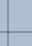

= Utilizzare diagrammi e grafici
:allow-uri-read: 
:icons: font
:imagesdir: ../media/

[role="lead"]
È possibile utilizzare grafici e report per monitorare lo stato del sistema StorageGRID e risolvere i problemi.

NOTE: Grid Manager viene aggiornato con ogni versione e potrebbe non corrispondere agli screenshot di esempio presenti in questa pagina.

== Tipi di grafici

I grafici e i diagrammi riepilogano i valori di specifiche metriche e attributi StorageGRID .

La dashboard di Grid Manager include schede che riepilogano lo spazio di archiviazione disponibile per la griglia e per ciascun sito.

image::../media/dashboard_data_and_metadata_space_usage_breakdown.png[Ripartizione dell'utilizzo dello spazio dei dati e dei metadati della dashboard]

Il pannello Utilizzo dello storage nella dashboard di Tenant Manager mostra quanto segue:

* Un elenco dei bucket (S3) o dei contenitori (Swift) più grandi per il tenant
* Un grafico a barre che rappresenta le dimensioni relative dei contenitori o dei bucket più grandi
* La quantità totale di spazio utilizzato e, se è impostata una quota, la quantità e la percentuale di spazio rimanente

image::../media/tenant_dashboard_with_buckets.png[Dashboard dell'inquilino]

Inoltre, nella pagina Nodi e nella pagina *SUPPORTO* > *Strumenti* > *Topologia griglia* sono disponibili grafici che mostrano come le metriche e gli attributi StorageGRID cambiano nel tempo.

Esistono quattro tipi di grafici:

* *Grafici Grafana*: mostrati nella pagina Nodi, i grafici Grafana vengono utilizzati per tracciare i valori delle metriche di Prometheus nel tempo.  Ad esempio, la scheda *NODI* > *Rete* per un nodo di archiviazione include un grafico Grafana per il traffico di rete.
+
image::../media/nodes_page_network_tab.png[Pagina Nodi Scheda Rete]

+

NOTE: I grafici Grafana sono inclusi anche nei dashboard predefiniti disponibili nella pagina *SUPPORTO* > *Strumenti* > *Metriche*.

* *Grafici lineari*: disponibili dalla pagina Nodi e dalla pagina *SUPPORTO* > *Strumenti* > *Topologia griglia* (selezionare l'icona del graficoimage:../media/icon_chart_new_for_11_5.png["Grafico delle icone (nuovo)"] dopo un valore di dati), i grafici lineari vengono utilizzati per tracciare i valori degli attributi StorageGRID che hanno un valore unitario (ad esempio l'offset di frequenza NTP, in ppm).  Le variazioni del valore vengono rappresentate graficamente in intervalli di dati regolari (bin) nel tempo.
+
image::../media/line_graph.gif[Grafico a linee]

* *Grafici ad area*: disponibili dalla pagina Nodi e dalla pagina *SUPPORTO* > *Strumenti* > *Topologia griglia* (selezionare l'icona del graficoimage:../media/icon_chart_new_for_11_5.png["Grafico delle icone (nuovo)"] dopo un valore di dati), i grafici ad area vengono utilizzati per tracciare quantità di attributi volumetrici, come conteggi di oggetti o valori di carico del servizio.  I grafici ad area sono simili ai grafici a linee, ma presentano una leggera ombreggiatura marrone sotto la linea.  Le variazioni del valore vengono rappresentate graficamente in intervalli di dati regolari (bin) nel tempo.
+
image::../media/area_graph.gif[Grafico ad area]

* Alcuni grafici sono contrassegnati da un diverso tipo di icona del graficoimage:../media/icon_chart_new_for_11_5.png["Icona del grafico"] e hanno un formato diverso:
+
image::../media/charts_lost_object_detected.png[Grafici Oggetto smarrito rilevato]

* *Grafico di stato*: disponibile dalla pagina *SUPPORTO* > *Strumenti* > *Topologia griglia* (selezionare l'icona del graficoimage:../media/icon_chart_new_for_11_5.png["Grafico delle icone (nuovo)"] dopo un valore di dati), i grafici di stato vengono utilizzati per tracciare i valori degli attributi che rappresentano stati distinti, ad esempio uno stato di servizio che può essere online, in standby o offline.  I grafici di stato sono simili ai grafici lineari, ma la transizione è discontinua, ovvero il valore salta da un valore di stato a un altro.
+
image::../media/state_graph.gif[Grafico di stato]

.Informazioni correlate
* link:viewing-nodes-page.html["Visualizza la pagina Nodi"]
* link:viewing-grid-topology-tree.html["Visualizza l'albero della topologia della griglia"]
* link:reviewing-support-metrics.html["Esaminare le metriche di supporto"]

== Legenda del grafico

Le linee e i colori utilizzati per disegnare i grafici hanno un significato specifico.

[cols="1a,3a"]
|===
| Esempio | Senso 

 a| 
image:../media/dark_green_chart_line.gif["screenshot che mostra una linea verde scuro"]
 a| 
I valori degli attributi segnalati vengono tracciati utilizzando linee verde scuro.

 a| 
image:../media/light_green_chart_line.gif["screenshot che mostra l'ombreggiatura che indica il binning dei dati"]
 a| 
L'ombreggiatura verde chiaro attorno alle linee verde scuro indica che i valori effettivi in quell'intervallo di tempo variano e sono stati "classificati" per una rappresentazione grafica più rapida.  La linea scura rappresenta la media ponderata.  L'intervallo in verde chiaro indica i valori massimo e minimo all'interno del contenitore.  Nei grafici ad area viene utilizzata l'ombreggiatura marrone chiaro per indicare i dati volumetrici.

 a| 
image:../media/no_data_plotted_chart.gif["screenshot che mostra le aree vuote sulla linea del grafico"]
 a| 
Le aree vuote (nessun dato tracciato) indicano che i valori degli attributi non erano disponibili.  Lo sfondo può essere blu, grigio o una combinazione di grigio e blu, a seconda dello stato del servizio che segnala l'attributo.

 a| 
image:../media/light_blue_chart_shading.gif["screenshot che mostra una sfumatura azzurra chiara che indica valori indeterminati"]
 a| 
L'ombreggiatura azzurra chiara indica che alcuni o tutti i valori degli attributi in quel momento erano indeterminati; l'attributo non segnalava valori perché il servizio era in uno stato sconosciuto.

 a| 
image:../media/gray_chart_shading.gif["screenshot che mostra ombreggiature grigie dovute a valori sconosciuti"]
 a| 
L'ombreggiatura grigia indica che alcuni o tutti i valori degli attributi in quel momento non erano noti perché il servizio che segnalava gli attributi era amministrativamente inattivo.

 a| 

 a| 
Una combinazione di ombreggiature grigie e blu indica che alcuni valori degli attributi in quel momento erano indeterminati (perché il servizio era in uno stato sconosciuto), mentre altri non erano noti perché il servizio che segnalava gli attributi era amministrativamente inattivo.

|===

== Visualizzare grafici e diagrammi

La pagina Nodi contiene i grafici e i diagrammi a cui dovresti accedere regolarmente per monitorare attributi quali capacità di archiviazione e produttività.  In alcuni casi, soprattutto quando si lavora con l'assistenza tecnica, è possibile utilizzare la pagina *SUPPORTO* > *Strumenti* > *Topologia griglia* per accedere a grafici aggiuntivi.

.Prima di iniziare
Devi aver effettuato l'accesso a Grid Manager utilizzando unlink:../admin/web-browser-requirements.html["browser web supportato"] .

.Passi
. Selezionare *NODES*. Quindi, seleziona un nodo, un sito o l'intera griglia.
. Seleziona la scheda di cui desideri visualizzare le informazioni.
+
Alcune schede includono uno o più grafici Grafana, utilizzati per tracciare i valori delle metriche di Prometheus nel tempo.  Ad esempio, la scheda *NODI* > *Hardware* per un nodo include due grafici Grafana.

+
image::../media/nodes_page_hardware_tab_graphs.png[Pagina Nodi Scheda Hardware Grafici]

. Facoltativamente, posiziona il cursore sul grafico per visualizzare valori più dettagliati per un determinato momento.
+
image::../media/nodes_page_memory_usage_details.png[Dettagli sull'utilizzo della memoria della pagina Nodi]

. A seconda delle necessità, spesso è possibile visualizzare un grafico per un attributo o una metrica specifici.  Dalla tabella nella pagina Nodi, seleziona l'icona del graficoimage:../media/icon_chart_new_for_11_5.png["Icona del grafico"] a destra del nome dell'attributo.
+

NOTE: I grafici non sono disponibili per tutte le metriche e tutti gli attributi.

+
*Esempio 1*: dalla scheda Oggetti per un nodo di archiviazione, è possibile selezionare l'icona del graficoimage:../media/icon_chart_new_for_11_5.png["Icona del grafico"] per visualizzare il numero totale di query di archiviazione metadati riuscite per il nodo di archiviazione.

+
image::../media/nodes_page_objects_successful_metadata_queries.png[Query di metadati riuscite]

+
image::../media/nodes_page-objects_chart_successful_metadata_queries.png[Grafici Query di metadati riuscite]

+
*Esempio 2*: Dalla scheda Oggetti per un nodo di archiviazione, è possibile selezionare l'icona del graficoimage:../media/icon_chart_new_for_11_5.png["Icona del grafico"] per vedere il grafico Grafana del conteggio degli oggetti persi rilevati nel tempo.

+
image::../media/object_count_table.png[Tabella di conteggio degli oggetti]

+
image::../media/charts_lost_object_detected.png[Grafici Oggetto smarrito rilevato]

. Per visualizzare i grafici per gli attributi non mostrati nella pagina Nodo, selezionare *SUPPORTO* > *Strumenti* > *Topologia griglia*.
. Selezionare *_nodo griglia_* > *_componente o servizio_* > *Panoramica* > *Principale*.
+
image::../media/nms_chart.gif[screenshot descritto dal testo circostante]

. Seleziona l'icona del graficoimage:../media/icon_chart_new_for_11_5.png["Icona del grafico"] accanto all'attributo.
+
La visualizzazione passa automaticamente alla pagina *Report* > *Grafici*.  Il grafico mostra i dati dell'attributo nel giorno precedente.

== Genera grafici

I grafici mostrano una rappresentazione grafica dei valori dei dati degli attributi.  È possibile creare report su un sito di data center, un nodo di griglia, un componente o un servizio.

.Prima di iniziare
* Devi aver effettuato l'accesso a Grid Manager utilizzando unlink:../admin/web-browser-requirements.html["browser web supportato"] .
* Hailink:../admin/admin-group-permissions.html["autorizzazioni di accesso specifiche"] .

.Passi
. Selezionare *SUPPORTO* > *Strumenti* > *Topologia griglia*.
. Selezionare *_nodo griglia_* > *_componente o servizio_* > *Report* > *Grafici*.
. Selezionare l'attributo da segnalare dall'elenco a discesa *Attributo*.
. Per forzare l'asse Y a partire da zero, deselezionare la casella di controllo *Scala verticale*.
. Per visualizzare i valori con la massima precisione, selezionare la casella di controllo *Dati grezzi* oppure, per arrotondare i valori a un massimo di tre cifre decimali (ad esempio, per gli attributi riportati come percentuali), deselezionare la casella di controllo *Dati grezzi*.
. Selezionare il periodo di tempo su cui effettuare il report dall'elenco a discesa *Query rapida*.
+
Selezionare l'opzione Query personalizzata per selezionare un intervallo di tempo specifico.

+
Il grafico appare dopo qualche istante.  Per la tabulazione di intervalli di tempo lunghi, attendere alcuni minuti.

. Se hai selezionato Query personalizzata, personalizza il periodo di tempo per il grafico inserendo *Data di inizio* e *Data di fine*.
+
Utilizzare il formato `_YYYY/MM/DDHH:MM:SS_` nell'ora locale.  Per rispettare il formato è necessario utilizzare gli zeri iniziali.  Ad esempio, 2017/4/6 7:30:00 non supera la convalida.  Il formato corretto è: 2017/04/06 07:30:00.

. Selezionare *Aggiorna*.
+
Dopo pochi secondi viene generato un grafico.  Per la tabulazione di intervalli di tempo lunghi, attendere alcuni minuti.  A seconda della durata impostata per la query, viene visualizzato un report di testo grezzo o un report di testo aggregato.

