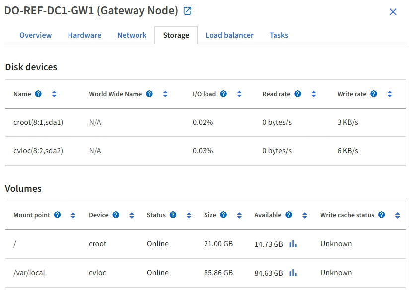

= Visualizza la scheda Hardware
:allow-uri-read: 
:icons: font
:imagesdir: ../media/

[role="lead"]
La scheda Hardware visualizza l'utilizzo della CPU e della memoria per ciascun nodo, nonché informazioni hardware aggiuntive sugli apparecchi.

NOTE: Grid Manager viene aggiornato con ogni versione e potrebbe non corrispondere agli screenshot di esempio presenti in questa pagina.

La scheda Hardware viene visualizzata per tutti i nodi.

image::../media/nodes_page_hardware_tab_graphs.png[Scheda Hardware della pagina Nodi]

Per visualizzare un intervallo di tempo diverso, seleziona uno dei controlli sopra il grafico.  È possibile visualizzare le informazioni disponibili per intervalli di 1 ora, 1 giorno, 1 settimana o 1 mese.  È anche possibile impostare un intervallo personalizzato, che consente di specificare intervalli di data e ora.

Per visualizzare i dettagli sull'utilizzo della CPU e della memoria, posiziona il cursore su ciascun grafico.

image::../media/nodes_page_memory_usage_details.png[Pagina Nodi > Hardware > Dettagli sull'utilizzo della memoria]

Se il nodo è un nodo appliance, questa scheda include anche una sezione con maggiori informazioni sull'hardware dell'appliance.

== Visualizza informazioni sui nodi di archiviazione dell'appliance

Nella pagina Nodi sono elencate le informazioni sullo stato del servizio e su tutte le risorse di calcolo, dei dispositivi disco e di rete per ciascun nodo di archiviazione dell'appliance.  È inoltre possibile visualizzare la memoria, l'hardware di archiviazione, la versione del firmware del controller, le risorse di rete, le interfacce di rete, gli indirizzi di rete e la ricezione e la trasmissione dei dati.

.Passi
. Dalla pagina Nodi, seleziona un nodo di archiviazione dell'appliance.
. Selezionare *Panoramica*.
+
La sezione Informazioni nodo della scheda Panoramica visualizza informazioni riepilogative sul nodo, come il nome, il tipo, l'ID e lo stato della connessione.  L'elenco degli indirizzi IP include il nome dell'interfaccia per ciascun indirizzo, come segue:

+
** *eth*: Rete Grid, Rete di amministrazione o Rete client.
** *hic*: Una delle porte fisiche da 10, 25 o 100 GbE sull'appliance.  Queste porte possono essere collegate tra loro e connesse alla rete StorageGRID Grid (eth0) e alla rete client (eth2).
** *mtc*: Una delle porte fisiche da 1 GbE sull'appliance.  Una o più interfacce mtc sono collegate per formare l'interfaccia di rete di amministrazione StorageGRID (eth1).  È possibile lasciare disponibili altre interfacce mtc per la connettività locale temporanea di un tecnico nel data center.
+
image::../media/nodes_page_overview_tab_extended.png[Panoramica estesa della pagina dei nodi]

+
La sezione Avvisi della scheda Panoramica visualizza tutti gli avvisi attivi per il nodo.

. Selezionare *Hardware* per visualizzare maggiori informazioni sull'apparecchio.
+
.. Visualizza i grafici di utilizzo della CPU e della memoria per determinare le percentuali di utilizzo della CPU e della memoria nel tempo.  Per visualizzare un intervallo di tempo diverso, seleziona uno dei controlli sopra il grafico.  È possibile visualizzare le informazioni disponibili per intervalli di 1 ora, 1 giorno, 1 settimana o 1 mese.  È anche possibile impostare un intervallo personalizzato, che consente di specificare intervalli di data e ora.
+
image::../media/nodes_page_hardware_tab_graphs.png[Grafici hardware]

.. Scorrere verso il basso per visualizzare la tabella dei componenti dell'apparecchio.  Questa tabella contiene informazioni quali il nome del modello dell'apparecchio, i nomi dei controller, i numeri di serie e gli indirizzi IP, nonché lo stato di ciascun componente.
+

NOTE: Alcuni campi, come Compute controller BMC IP e Compute hardware, vengono visualizzati solo per gli apparecchi dotati di tale funzionalità.

+
I componenti per i ripiani di stoccaggio e i ripiani di espansione, se fanno parte dell'installazione, vengono visualizzati in una tabella separata sotto la tabella degli elettrodomestici.

+
image::../media/nodes_page_hardware_tab_for_appliance.png[Scheda Hardware della pagina Nodi per l'appliance]

+
[cols="1a,2a"]
|===
| Campo nella tabella Appliance | Descrizione 

 a| 
Modello di elettrodomestico
 a| 
Il numero di modello per questo dispositivo StorageGRID mostrato in SANtricity OS.

 a| 
Nome del controller di archiviazione
 a| 
Nome di questo dispositivo StorageGRID mostrato in SANtricity OS.

 a| 
Controller di archiviazione A IP di gestione
 a| 
Indirizzo IP per la porta di gestione 1 sul controller di archiviazione A. Utilizzare questo IP per accedere a SANtricity OS per risolvere i problemi di archiviazione.

 a| 
IP di gestione del controller di archiviazione B
 a| 
Indirizzo IP per la porta di gestione 1 sul controller di archiviazione B. Utilizzare questo IP per accedere a SANtricity OS per risolvere i problemi di archiviazione.

Alcuni modelli di elettrodomestici non dispongono di un controller di archiviazione B.

 a| 
WWID del controller di archiviazione
 a| 
Identificatore mondiale del controller di archiviazione mostrato in SANtricity OS.

 a| 
Numero di serie del telaio dell'apparecchio di archiviazione
 a| 
Numero di serie del telaio dell'apparecchio.

 a| 
Versione del firmware del controller di archiviazione
 a| 
La versione del firmware sul controller di archiviazione per questo dispositivo.

 a| 
Versione del sistema operativo SANtricity del controller di archiviazione
 a| 
La versione SANtricity OS del controller di archiviazione A.

 a| 
Versione NVSRAM del controller di archiviazione
 a| 
Versione NVSRAM del controller di archiviazione come riportato da SANtricity System Manager.

Per SG6060 e SG6160, se c'è una mancata corrispondenza della versione NVSRAM tra i due controller, viene visualizzata la versione del controller A.  Se il controller A non è installato o non è operativo, viene visualizzata la versione del controller B.

 a| 
Hardware di archiviazione
 a| 
Stato generale dell'hardware del controller di archiviazione.  Se SANtricity System Manager segnala lo stato "Necessita attenzione" per l'hardware di archiviazione, anche il sistema StorageGRID segnala questo valore.

Se lo stato è "richiede attenzione", controllare prima il controller di archiviazione utilizzando SANtricity OS.  Quindi, assicurarsi che non vi siano altri avvisi applicabili al controller di elaborazione.

 a| 
Conteggio unità non riuscite del controller di archiviazione
 a| 
Numero di unità non ottimali.

 a| 
Controllore di archiviazione A
 a| 
Lo stato del controller di archiviazione A.

 a| 
Controllore di archiviazione B
 a| 
Lo stato del controller di archiviazione B. Alcuni modelli di appliance non dispongono di un controller di archiviazione B.

 a| 
Alimentatore del controller di archiviazione A
 a| 
Lo stato dell'alimentatore A per il controller di archiviazione.

 a| 
Alimentatore del controller di archiviazione B
 a| 
Lo stato dell'alimentatore B per il controller di archiviazione.

 a| 
Tipo di unità di archiviazione dati
 a| 
Il tipo di unità presenti nell'appliance, ad esempio HDD (disco rigido) o SSD (unità a stato solido).

 a| 
Dimensioni dell'unità di archiviazione dati
 a| 
La dimensione effettiva di un'unità dati.

Per il modello SG6160 viene visualizzata anche la dimensione dell'unità cache.

*Nota*: Per i nodi con ripiani di espansione, utilizzare<<shelf_data_drive_size,Dimensioni dell'unità dati per ogni ripiano>> Invece.  Le dimensioni effettive dell'unità potrebbero variare a seconda dello scaffale.

 a| 
Modalità RAID di archiviazione
 a| 
Modalità RAID configurata per l'appliance.

 a| 
Connettività di archiviazione
 a| 
Lo stato di connettività dell'archiviazione.

 a| 
Alimentazione elettrica complessiva
 a| 
Lo stato di tutte le alimentazioni elettriche dell'apparecchio.

 a| 
Controller di calcolo BMC IP
 a| 
L'indirizzo IP della porta del controller di gestione della scheda madre (BMC) nel controller di elaborazione.  Utilizzare questo IP per connettersi all'interfaccia BMC per monitorare e diagnosticare l'hardware dell'appliance.

Questo campo non viene visualizzato per i modelli di appliance che non contengono un BMC.

 a| 
Numero di serie del controller di calcolo
 a| 
Numero di serie del controller di elaborazione.

 a| 
Hardware di calcolo
 a| 
Lo stato dell'hardware del controller di elaborazione.  Questo campo non viene visualizzato per i modelli di appliance che non dispongono di hardware di elaborazione e hardware di archiviazione separati.

 a| 
Temperatura della CPU del controller di calcolo
 a| 
Lo stato della temperatura della CPU del controller di elaborazione.

 a| 
Calcola la temperatura del telaio del controller
 a| 
Lo stato della temperatura del controller di calcolo.

|===
+
[cols="1a,2a"]
|===
| Colonna nella tabella Scaffali portaoggetti | Descrizione 

 a| 
Numero di serie del telaio dello scaffale
 a| 
Numero di serie del telaio del ripiano portaoggetti.

 a| 
ID scaffale
 a| 
Identificatore numerico per lo scaffale di stoccaggio.

*** 99: Ripiano del controller di archiviazione
*** 0: Primo scaffale di espansione
*** 1: Secondo ripiano di espansione

*Nota:* i ripiani di espansione sono disponibili solo per i modelli SG6060 e SG6160.

 a| 
Stato di conservazione
 a| 
Lo stato generale dello scaffale di stoccaggio.

 a| 
Stato dell'IOM
 a| 
Lo stato dei moduli di input/output (IOM) in tutti gli scaffali di espansione.  N/D se non si tratta di uno scaffale di espansione.

 a| 
Stato dell'alimentazione
 a| 
Lo stato generale degli alimentatori per lo scaffale di stoccaggio.

 a| 
Stato del cassetto
 a| 
Lo stato dei cassetti nello scaffale portaoggetti.  N/D se lo scaffale non contiene cassetti.

 a| 
Stato del fan
 a| 
Stato generale delle ventole di raffreddamento nel ripiano portaoggetti.

 a| 
Slot di unità
 a| 
Numero totale di slot per unità nello scaffale di archiviazione.

 a| 
Unità dati
 a| 
Numero di unità nello spazio di archiviazione utilizzate per l'archiviazione dei dati.

 a| 
[[shelf_data_drive_size]]Dimensione dell'unità dati
 a| 
La dimensione effettiva di un'unità dati nello spazio di archiviazione.

 a| 
Unità cache
 a| 
Numero di unità nello spazio di archiviazione utilizzate come cache.

 a| 
Dimensioni dell'unità cache
 a| 
La dimensione dell'unità cache più piccola nello spazio di archiviazione.  Di solito, le unità cache hanno tutte le stesse dimensioni.

 a| 
Stato di configurazione
 a| 
Lo stato di configurazione dello scaffale di stoccaggio.

|===
.. Verificare che tutti gli stati siano "Nominali".
+
Se uno stato non è "Nominale", rivedere tutti gli avvisi correnti.  È anche possibile utilizzare SANtricity System Manager per saperne di più su alcuni di questi valori hardware.  Consultare le istruzioni per l'installazione e la manutenzione dell'apparecchio.

. Selezionare *Rete* per visualizzare le informazioni per ciascuna rete.
+
Il grafico del traffico di rete fornisce un riepilogo del traffico di rete complessivo.

+
image::../media/nodes_page_network_traffic_graph.png[Grafico del traffico di rete della pagina dei nodi]

+
.. Consultare la sezione Interfacce di rete.
+
image::../media/nodes_page_network_interfaces.png[Nodi Pagina Interfacce di rete]

+
Utilizzare la seguente tabella con i valori nella colonna *Velocità* nella tabella Interfacce di rete per determinare se le porte di rete 10/25-GbE sull'appliance sono state configurate per utilizzare la modalità attiva/backup o la modalità LACP.

+

NOTE: I valori indicati nella tabella presuppongono l'utilizzo di tutti e quattro i collegamenti.

+
[cols="1a,1a,1a,1a"]
|===
| Modalità di collegamento | Modalità Bond | Velocità di collegamento HIC individuale (hic1, hic2, hic3, hic4) | Velocità di rete prevista per Grid/Client (eth0,eth2) 

 a| 
Aggregato
 a| 
LACP
 a| 
25
 a| 
100

 a| 
Fisso
 a| 
LACP
 a| 
25
 a| 
50

 a| 
Fisso
 a| 
Attivo/Backup
 a| 
25
 a| 
25

 a| 
Aggregato
 a| 
LACP
 a| 
10
 a| 
40

 a| 
Fisso
 a| 
LACP
 a| 
10
 a| 
20

 a| 
Fisso
 a| 
Attivo/Backup
 a| 
10
 a| 
10

|===
+
Vedere https://docs.netapp.com/us-en/storagegrid-appliances/installconfig/configuring-network-links.html["Configurare i collegamenti di rete"^] per ulteriori informazioni sulla configurazione delle porte 10/25-GbE.

.. Rivedere la sezione Comunicazione di rete.
+
Le tabelle di ricezione e trasmissione mostrano quanti byte e pacchetti sono stati ricevuti e inviati su ciascuna rete, nonché altre metriche di ricezione e trasmissione.

+
image::../media/nodes_page_network_communication.png[Nodi Pagina Rete Comm]

. Selezionare *Archiviazione* per visualizzare grafici che mostrano le percentuali di spazio di archiviazione utilizzato nel tempo per i dati degli oggetti e i metadati degli oggetti, nonché informazioni su dispositivi disco, volumi e archivi di oggetti.
+
image::../media/nodes_page_storage_used_object_data.png[Archiviazione utilizzata - Dati oggetto]

+
image::../media/storage_used_object_metadata.png[Archiviazione utilizzata - Metadati dell'oggetto]

+
.. Scorrere verso il basso per visualizzare la quantità di spazio di archiviazione disponibile per ciascun volume e archivio oggetti.
+
Il nome mondiale di ciascun disco corrisponde all'identificatore mondiale del volume (WWID) visualizzato quando si visualizzano le proprietà standard del volume in SANtricity OS (il software di gestione connesso al controller di archiviazione dell'appliance).

+
Per aiutarti a interpretare le statistiche di lettura e scrittura del disco relative ai punti di montaggio del volume, la prima parte del nome mostrato nella colonna *Nome* della tabella Dispositivi disco (ovvero _sdc_, _sdd_, _sde_ e così via) corrisponde al valore mostrato nella colonna *Dispositivo* della tabella Volumi.

+
image::../media/nodes_page_storage_tables.png[Tabelle di archiviazione delle pagine dei nodi]

== Visualizza informazioni sui nodi di amministrazione dell'appliance e sui nodi gateway

La pagina Nodi elenca le informazioni sullo stato del servizio e su tutte le risorse di calcolo, dei dispositivi disco e di rete per ogni appliance di servizi utilizzata come nodo di amministrazione o nodo gateway.  È inoltre possibile visualizzare la memoria, l'hardware di archiviazione, le risorse di rete, le interfacce di rete, gli indirizzi di rete e la ricezione e la trasmissione di dati.

.Passi
. Dalla pagina Nodi, seleziona un nodo di amministrazione dell'appliance o un nodo gateway dell'appliance.
. Selezionare *Panoramica*.
+
La sezione Informazioni nodo della scheda Panoramica visualizza informazioni riepilogative sul nodo, come il nome, il tipo, l'ID e lo stato della connessione.  L'elenco degli indirizzi IP include il nome dell'interfaccia per ciascun indirizzo, come segue:

+
** *adllb* e *adlli*: visualizzati se viene utilizzato il bonding attivo/di backup per l'interfaccia di rete di amministrazione
** *eth*: Rete Grid, Rete di amministrazione o Rete client.
** *hic*: Una delle porte fisiche da 10, 25 o 100 GbE sull'appliance.  Queste porte possono essere collegate tra loro e connesse alla rete StorageGRID Grid (eth0) e alla rete client (eth2).
** *mtc*: Una delle porte fisiche da 1 GbE sull'appliance.  Una o più interfacce mtc sono collegate per formare l'interfaccia di rete di amministrazione (eth1).  È possibile lasciare disponibili altre interfacce mtc per la connettività locale temporanea di un tecnico nel data center.
+
image::../media/nodes_page_overview_tab_services_appliance.png[Scheda Panoramica della pagina Nodi per l'appliance dei servizi]

+
La sezione Avvisi della scheda Panoramica visualizza tutti gli avvisi attivi per il nodo.

. Selezionare *Hardware* per visualizzare maggiori informazioni sull'apparecchio.
+
.. Visualizza i grafici di utilizzo della CPU e della memoria per determinare le percentuali di utilizzo della CPU e della memoria nel tempo.  Per visualizzare un intervallo di tempo diverso, seleziona uno dei controlli sopra il grafico.  È possibile visualizzare le informazioni disponibili per intervalli di 1 ora, 1 giorno, 1 settimana o 1 mese.  È anche possibile impostare un intervallo personalizzato, che consente di specificare intervalli di data e ora.
+
image::../media/nodes_page_hardware_tab_graphs_services_appliance.png[Grafici della scheda Hardware della pagina Nodi per l'appliance dei servizi]

.. Scorrere verso il basso per visualizzare la tabella dei componenti dell'apparecchio.  Questa tabella contiene informazioni quali il nome del modello, il numero di serie, la versione del firmware del controller e lo stato di ciascun componente.
+
image::../media/nodes_page_hardware_tab_services_appliance.png[Scheda Hardware della pagina Nodi per l'appliance dei servizi]

+
[cols="1a,2a"]
|===
| Campo nella tabella Appliance | Descrizione 

 a| 
Modello di elettrodomestico
 a| 
Numero di modello per questo dispositivo StorageGRID .

 a| 
Conteggio unità non riuscite del controller di archiviazione
 a| 
Numero di unità non ottimali.

 a| 
Tipo di unità di archiviazione dati
 a| 
Il tipo di unità presenti nell'appliance, ad esempio HDD (disco rigido) o SSD (unità a stato solido).

 a| 
Dimensioni dell'unità di archiviazione dati
 a| 
La dimensione effettiva di un'unità dati.

 a| 
Modalità RAID di archiviazione
 a| 
La modalità RAID per l'appliance.

 a| 
Alimentazione elettrica complessiva
 a| 
Lo stato di tutti gli alimentatori dell'apparecchio.

 a| 
Controller di calcolo BMC IP
 a| 
L'indirizzo IP della porta del controller di gestione della scheda madre (BMC) nel controller di elaborazione.  È possibile utilizzare questo IP per connettersi all'interfaccia BMC per monitorare e diagnosticare l'hardware dell'appliance.

Questo campo non viene visualizzato per i modelli di appliance che non contengono un BMC.

 a| 
Numero di serie del controller di calcolo
 a| 
Numero di serie del controller di elaborazione.

 a| 
Hardware di calcolo
 a| 
Lo stato dell'hardware del controller di elaborazione.

 a| 
Temperatura della CPU del controller di calcolo
 a| 
Lo stato della temperatura della CPU del controller di elaborazione.

 a| 
Calcola la temperatura del telaio del controller
 a| 
Lo stato della temperatura del controller di calcolo.

|===
.. Verificare che tutti gli stati siano "Nominali".
+
Se uno stato non è "Nominale", rivedere tutti gli avvisi correnti.

. Selezionare *Rete* per visualizzare le informazioni per ciascuna rete.
+
Il grafico del traffico di rete fornisce un riepilogo del traffico di rete complessivo.

+
image::../media/nodes_page_network_traffic_graph.png[Grafico del traffico di rete della pagina dei nodi]

+
.. Consultare la sezione Interfacce di rete.
+
image::../media/nodes_page_hardware_tab_network_services_appliance.png[Pagina Nodi Scheda Hardware Servizi di rete Appliance]

+
Utilizzare la seguente tabella con i valori nella colonna *Velocità* nella tabella Interfacce di rete per determinare se le quattro porte di rete 40/100-GbE sull'appliance sono state configurate per utilizzare la modalità attiva/backup o la modalità LACP.

+

NOTE: I valori indicati nella tabella presuppongono l'utilizzo di tutti e quattro i collegamenti.

+
[cols="1a,1a,1a,1a"]
|===
| Modalità di collegamento | Modalità Bond | Velocità di collegamento HIC individuale (hic1, hic2, hic3, hic4) | Velocità prevista della rete Grid/Client (eth0, eth2) 

 a| 
Aggregato
 a| 
LACP
 a| 
100
 a| 
400

 a| 
Fisso
 a| 
LACP
 a| 
100
 a| 
200

 a| 
Fisso
 a| 
Attivo/Backup
 a| 
100
 a| 
100

 a| 
Aggregato
 a| 
LACP
 a| 
40
 a| 
160

 a| 
Fisso
 a| 
LACP
 a| 
40
 a| 
80

 a| 
Fisso
 a| 
Attivo/Backup
 a| 
40
 a| 
40

|===
.. Rivedere la sezione Comunicazione di rete.
+
Le tabelle di ricezione e trasmissione mostrano quanti byte e pacchetti sono stati ricevuti e inviati su ciascuna rete, nonché altre metriche di ricezione e trasmissione.

+
image::../media/nodes_page_network_communication.png[Nodi Pagina Rete Comm]

. Selezionare *Archiviazione* per visualizzare informazioni sui dispositivi disco e sui volumi nell'appliance dei servizi.
+

