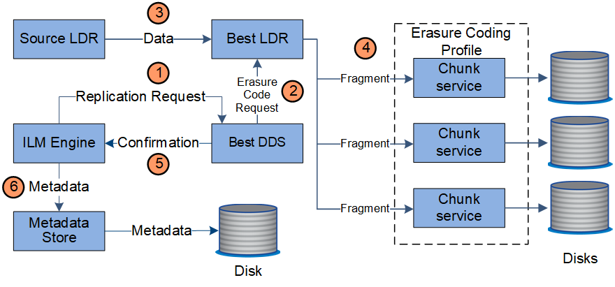

= Gestione delle copie
:allow-uri-read: 
:icons: font
:imagesdir: ../media/

[role="lead"]
I dati degli oggetti sono gestiti dalle policy ILM attive e dalle regole ILM associate.  Le regole ILM creano copie replicate o con codice di cancellazione per proteggere i dati degli oggetti dalla perdita.

Potrebbero essere necessari tipi o posizioni diverse di copie di oggetti in momenti diversi della vita dell'oggetto.  Le regole ILM vengono valutate periodicamente per garantire che gli oggetti vengano posizionati come richiesto.

I dati degli oggetti sono gestiti dal servizio LDR.

== Protezione del contenuto: replicazione

Se le istruzioni di posizionamento del contenuto di una regola ILM richiedono copie replicate dei dati dell'oggetto, le copie vengono create e archiviate su disco dai nodi di archiviazione che compongono il pool di archiviazione configurato.

Il motore ILM nel servizio LDR controlla la replicazione e garantisce che il numero corretto di copie venga archiviato nelle posizioni corrette e per il periodo di tempo corretto.

image::../media/replication_data_flow.png[diagramma che mostra il processo descritto nel testo circostante]

. Il motore ILM interroga il servizio ADC per determinare il miglior servizio LDR di destinazione all'interno del pool di archiviazione specificato dalla regola ILM.  Invia quindi al servizio LDR un comando per avviare la replica.
. Il servizio LDR di destinazione interroga il servizio ADC per individuare la posizione di origine migliore.  Invia quindi una richiesta di replica al servizio LDR di origine.
. Il servizio LDR di origine invia una copia al servizio LDR di destinazione.
. Il servizio LDR di destinazione notifica al motore ILM che i dati dell'oggetto sono stati archiviati.
. Il motore ILM aggiorna l'archivio dei metadati con i metadati sulla posizione degli oggetti.

== Protezione dei contenuti: codifica di cancellazione

Se una regola ILM include istruzioni per creare copie con codifica di cancellazione dei dati dell'oggetto, lo schema di codifica di cancellazione applicabile suddivide i dati dell'oggetto in frammenti di dati e di parità e distribuisce tali frammenti tra i nodi di archiviazione configurati nel profilo di codifica di cancellazione.

Il motore ILM, che è un componente del servizio LDR, controlla la codifica di cancellazione e garantisce che il profilo di codifica di cancellazione venga applicato ai dati dell'oggetto.

. Il motore ILM interroga il servizio ADC per determinare quale servizio DDS può eseguire al meglio l'operazione di codifica di cancellazione.  Una volta determinato, il motore ILM invia una richiesta di "avvio" a quel servizio.
. Il servizio DDS istruisce un LDR a cancellare il codice dei dati dell'oggetto.
. Il servizio LDR di origine invia una copia al servizio LDR selezionato per la codifica di cancellazione.
. Dopo aver creato il numero appropriato di frammenti di parità e di dati, il servizio LDR distribuisce tali frammenti tra i nodi di archiviazione (servizi Chunk) che costituiscono il pool di archiviazione del profilo di codifica di cancellazione.
. Il servizio LDR notifica al motore ILM la corretta distribuzione dei dati dell'oggetto.
. Il motore ILM aggiorna l'archivio dei metadati con i metadati sulla posizione degli oggetti.

== Protezione dei contenuti: Cloud Storage Pool

Se le istruzioni di posizionamento del contenuto di una regola ILM richiedono che una copia replicata dei dati dell'oggetto venga archiviata in un Cloud Storage Pool, i dati dell'oggetto vengono duplicati nel bucket S3 esterno o nel contenitore di archiviazione BLOB di Azure specificato per il Cloud Storage Pool.

Il motore ILM, che è un componente del servizio LDR, e il servizio Data Mover controllano lo spostamento degli oggetti nel Cloud Storage Pool.

image::../media/cloud_storage_pool_data_flow.png[Flusso di dati del pool di archiviazione cloud]

. Il motore ILM seleziona un servizio Data Mover da replicare nel Cloud Storage Pool.
. Il servizio Data Mover invia i dati dell'oggetto al Cloud Storage Pool.
. Il servizio Data Mover notifica al motore ILM che i dati dell'oggetto sono stati archiviati.
. Il motore ILM aggiorna l'archivio dei metadati con i metadati sulla posizione degli oggetti.

