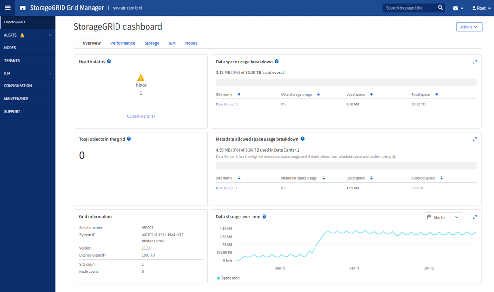

= Esplora Grid Manager
:allow-uri-read: 
:icons: font
:imagesdir: ../media/

[role="lead"]
Grid Manager è l'interfaccia grafica basata su browser che consente di configurare, gestire e monitorare il sistema StorageGRID .

NOTE: Grid Manager viene aggiornato con ogni versione e potrebbe non corrispondere agli screenshot di esempio presenti in questa pagina.

Quando accedi a Grid Manager, ti connetti a un nodo di amministrazione.  Ogni sistema StorageGRID include un nodo amministrativo primario e un numero qualsiasi di nodi amministrativi non primari. È possibile connettersi a qualsiasi nodo di amministrazione e ogni nodo di amministrazione visualizza una vista simile del sistema StorageGRID .

È possibile accedere al Grid Manager utilizzando unlink:../admin/web-browser-requirements.html["browser web supportato"] .

== Dashboard di Grid Manager

Quando accedi per la prima volta a Grid Manager, puoi utilizzare la dashboard perlink:../monitor/viewing-dashboard.html["monitorare le attività del sistema"] a colpo d'occhio.

La dashboard contiene informazioni sullo stato e sulle prestazioni del sistema, sull'utilizzo dello storage, sui processi ILM, sulle operazioni S3 e sui nodi nella griglia.  Puoilink:../monitor/viewing-dashboard.html["configurare la dashboard"] selezionando da una raccolta di schede che contengono le informazioni necessarie per monitorare efficacemente il tuo sistema.

Per una spiegazione delle informazioni mostrate su ogni scheda, seleziona l'icona della guidaimage:../media/icon_nms_question.png["icona punto interrogativo"] per quella carta.

== Campo di ricerca

Il campo *Cerca* nella barra dell'intestazione consente di navigare rapidamente verso una pagina specifica all'interno di Grid Manager.  Ad esempio, puoi immettere *km* per accedere alla pagina del server di gestione delle chiavi (KMS).

È possibile utilizzare *Cerca* per trovare voci nella barra laterale di Grid Manager e nei menu Configurazione, Manutenzione e Supporto.  È anche possibile cercare per nome elementi come nodi della griglia e account tenant.

== Menu di aiuto

Il menu di aiutoimage:../media/icon-help-menu-bar.png["icona di aiuto sulla barra dei menu"] fornisce accesso a:

* ILlink:../fabricpool/use-fabricpool-setup-wizard.html["FabricPool"] Elink:../admin/use-s3-setup-wizard.html["Configurazione S3"] procedura guidata
* Il centro di documentazione StorageGRID per la versione corrente
* link:../admin/using-grid-management-api.html["Documentazione API"]
* Informazioni sulla versione di StorageGRID attualmente installata

== Menu avvisi

Il menu Avvisi fornisce un'interfaccia di facile utilizzo per rilevare, valutare e risolvere i problemi che potrebbero verificarsi durante il funzionamento StorageGRID .

Dal menu Avvisi, puoi fare quanto segue perlink:../monitor/managing-alerts.html["gestire gli avvisi"] :

* Rivedi gli avvisi attuali
* Esamina gli avvisi risolti
* Configura i silenzi per sopprimere le notifiche di avviso
* Definisci regole di avviso per le condizioni che attivano gli avvisi
* Configurare il server di posta elettronica per le notifiche di avviso

== Pagina dei nodi

ILlink:../monitor/viewing-nodes-page.html["Pagina dei nodi"] visualizza informazioni sull'intera griglia, su ciascun sito nella griglia e su ciascun nodo in un sito.

La home page dei nodi mostra le metriche combinate per l'intera griglia. Per visualizzare le informazioni relative a un sito o a un nodo specifico, seleziona il sito o il nodo.

image::../media/nodes_page.png[nodi pagina principale]

== Pagina degli inquilini

ILlink:../admin/managing-tenants.html["Pagina degli inquilini"] ti permette dilink:../tenant/index.html["creare e monitorare gli account dei tenant di storage"] per il tuo sistema StorageGRID .  È necessario creare almeno un account tenant per specificare chi può archiviare e recuperare oggetti e quali funzionalità sono a sua disposizione.

La pagina Inquilini fornisce anche dettagli sull'utilizzo per ciascun inquilino, tra cui la quantità di spazio di archiviazione utilizzato e il numero di oggetti.  Se imposti una quota quando crei il tenant, puoi vedere quanta di quella quota è stata utilizzata.

image::../media/tenants_page.png[Menu e pagina degli inquilini]

== Menù ILM

ILlink:using-information-lifecycle-management.html["Menù ILM"] ti permette dilink:../ilm/index.html["configurare le regole e le policy di gestione del ciclo di vita delle informazioni (ILM)"] che regolano la durabilità e la disponibilità dei dati.  È anche possibile immettere un identificatore di oggetto per visualizzare i metadati di tale oggetto.

Dal menu ILM è possibile visualizzare e gestire ILM:

* Regole
* Politiche
* Tag di policy
* Pool di stoccaggio
* Gradi di stoccaggio
* Regioni
* Ricerca metadati oggetto

== Menu di configurazione

Il menu Configurazione consente di specificare le impostazioni di rete, le impostazioni di sicurezza, le impostazioni di sistema, le opzioni di monitoraggio e le opzioni di controllo degli accessi.

=== Attività di rete

Le attività di rete includono:

* link:../admin/managing-high-availability-groups.html["Gestione di gruppi ad alta disponibilità"]
* link:../admin/managing-load-balancing.html["Gestione degli endpoint del bilanciatore del carico"]
* link:../admin/configuring-s3-api-endpoint-domain-names.html["Configurazione dei nomi di dominio degli endpoint S3"]
* link:../admin/managing-traffic-classification-policies.html["Gestione delle politiche di classificazione del traffico"]
* link:../admin/configure-vlan-interfaces.html["Configurazione delle interfacce VLAN"]

=== Compiti di sicurezza

I compiti di sicurezza includono:

* link:../admin/using-storagegrid-security-certificates.html["Gestione dei certificati di sicurezza"]
* link:../admin/manage-firewall-controls.html["Gestione dei controlli del firewall interno"]
* link:../admin/kms-configuring.html["Configurazione dei server di gestione delle chiavi"]
* Configurazione delle impostazioni di sicurezza, incluso illink:../admin/manage-tls-ssh-policy.html["Politica TLS e SSH"] ,link:../admin/changing-network-options-object-encryption.html["opzioni di sicurezza di rete e oggetti"] , Elink:../admin/changing-browser-session-timeout-interface.html["impostazioni di sicurezza dell'interfaccia"] .
* Configurazione delle impostazioni per unlink:../admin/configuring-storage-proxy-settings.html["proxy di archiviazione"] o unlink:../admin/configuring-admin-proxy-settings.html["proxy amministratore"]

=== Attività di sistema

Le attività di sistema includono:

* Utilizzandolink:../admin/grid-federation-overview.html["federazione di rete"] per clonare le informazioni dell'account tenant e replicare i dati degli oggetti tra due sistemi StorageGRID .
* Facoltativamente, abilitando illink:../admin/configuring-stored-object-compression.html["Comprimi gli oggetti memorizzati"] opzione.
* link:../ilm/managing-objects-with-s3-object-lock.html["Gestione del blocco degli oggetti S3"]
* Comprendere le opzioni di archiviazione comelink:../admin/what-object-segmentation-is.html["segmentazione degli oggetti"] Elink:../admin/what-storage-volume-watermarks-are.html["filigrane del volume di archiviazione"] .
* link:../ilm/manage-erasure-coding-profiles.html["Gestisci i profili di codifica di cancellazione"] .

=== Attività di monitoraggio

Le attività di monitoraggio includono:

* link:../monitor/configure-audit-messages.html["Configurazione dei messaggi di controllo e delle destinazioni dei registri"]
* link:../monitor/using-snmp-monitoring.html["Utilizzo del monitoraggio SNMP"]

=== Attività di controllo degli accessi

Le attività di controllo degli accessi includono:

* link:../admin/managing-admin-groups.html["Gestione dei gruppi di amministrazione"]
* link:../admin/managing-users.html["Gestione degli utenti amministratori"]
* Cambiando illink:../admin/changing-provisioning-passphrase.html["passphrase di provisioning"] Olink:../admin/change-node-console-password.html["password della console del nodo"]
* link:../admin/using-identity-federation.html["Utilizzo della federazione delle identità"]
* link:../admin/configuring-sso.html["Configurazione SSO"]

== Menu di manutenzione

Il menu Manutenzione consente di eseguire attività di manutenzione, manutenzione del sistema e manutenzione della rete.

=== Compiti

Le attività di manutenzione includono:

* link:../maintain/decommission-procedure.html["Operazioni di dismissione"]per rimuovere nodi e siti della griglia non utilizzati
* link:../expand/index.html["Operazioni di espansione"]per aggiungere nuovi nodi e siti della griglia
* link:../maintain/warnings-and-considerations-for-grid-node-recovery.html["Procedure di ripristino del nodo della griglia"]per sostituire un nodo guasto e ripristinare i dati
* link:../maintain/rename-grid-site-node-overview.html["Rinominare le procedure"]per modificare i nomi visualizzati della griglia, dei siti e dei nodi
* link:../troubleshoot/verifying-object-integrity.html["Operazioni di controllo dell'esistenza dell'oggetto"]per verificare l'esistenza (anche se non la correttezza) dei dati dell'oggetto
* Esecuzione di unlink:../maintain/rolling-reboot-procedure.html["riavvio progressivo"] per riavviare più nodi della griglia
* link:../maintain/restoring-volume.html["Operazioni di ripristino del volume"]

=== Sistema

Le attività di manutenzione del sistema che puoi eseguire includono:

* link:../admin/viewing-storagegrid-license-information.html["Visualizzazione delle informazioni sulla licenza StorageGRID"]Olink:../admin/updating-storagegrid-license-information.html["aggiornamento delle informazioni sulla licenza"]
* Generazione e download dellink:../maintain/downloading-recovery-package.html["Pacchetto di recupero"]
* Esecuzione di aggiornamenti software StorageGRID , inclusi aggiornamenti software, hotfix e aggiornamenti al software SANtricity OS su appliance selezionate
+
** link:../upgrade/index.html["Procedura di aggiornamento"]
** link:../maintain/storagegrid-hotfix-procedure.html["Procedura di hotfix"]
** https://docs.netapp.com/us-en/storagegrid-appliances/sg6000/upgrading-santricity-os-on-storage-controllers-using-grid-manager-sg6000.html["Aggiornare il sistema operativo SANtricity sui controller di archiviazione SG6000 utilizzando Grid Manager"^]
** https://docs.netapp.com/us-en/storagegrid-appliances/sg5700/upgrading-santricity-os-on-storage-controllers-using-grid-manager-sg5700.html["Aggiornare il sistema operativo SANtricity sui controller di archiviazione SG5700 utilizzando Grid Manager"^]

=== Rete

Le attività di manutenzione della rete che puoi eseguire includono:

* link:../maintain/configuring-dns-servers.html["Configurazione dei server DNS"]
* link:../maintain/updating-subnets-for-grid-network.html["Aggiornamento delle subnet della rete Grid"]
* link:../maintain/configuring-ntp-servers.html["Gestione dei server NTP"]

== Menu di supporto

Il menu Supporto fornisce opzioni che aiutano il supporto tecnico ad analizzare e risolvere i problemi del sistema.

=== Utensili

Dalla sezione Strumenti del menu Supporto, puoi:

* link:../admin/configure-autosupport-grid-manager.html["Configura AutoSupport"]
* link:../monitor/running-diagnostics.html["Eseguire la diagnostica"]sullo stato attuale della rete
* link:../monitor/viewing-grid-topology-tree.html["Accedi all'albero della topologia della griglia"]per visualizzare informazioni dettagliate sui nodi, sui servizi e sugli attributi della griglia
* link:../monitor/collecting-log-files-and-system-data.html["Raccogli file di registro e dati di sistema"]
* link:../monitor/reviewing-support-metrics.html["Esaminare le metriche di supporto"]
+

NOTE: Gli strumenti disponibili nell'opzione *Metriche* sono destinati all'uso da parte del supporto tecnico.  Alcune funzionalità e voci di menu di questi strumenti sono intenzionalmente non funzionali.

=== Allarmi (legacy)

Le informazioni sugli allarmi legacy sono state rimosse da questa versione della documentazione. Fare riferimento a https://docs.netapp.com/us-en/storagegrid-118/monitor/managing-alerts-and-alarms.html["Gestire avvisi e allarmi (documentazione StorageGRID 11.8)"^] .

=== Altro

Dalla sezione Altro del menu Supporto, puoi:

* Maneggiolink:../admin/manage-link-costs.html["costo del collegamento"]
* Visualizzazionelink:../admin/viewing-notification-status-and-queues.html["Sistema di gestione della rete (NMS)"] voci
* Maneggiolink:../admin/what-storage-volume-watermarks-are.html["filigrane di archiviazione"]

