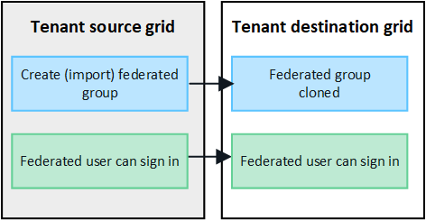

= Clona gruppi tenant e utenti
:allow-uri-read: 
:icons: font
:imagesdir: ../media/

[role="lead"]
Se un tenant è stato creato o modificato per utilizzare una connessione di federazione della griglia, tale tenant viene replicato da un sistema StorageGRID (il tenant di origine) a un altro sistema StorageGRID (il tenant di replica).  Dopo che il tenant è stato replicato, tutti i gruppi e gli utenti aggiunti al tenant di origine vengono clonati nel tenant replica.

Il sistema StorageGRID in cui il tenant viene creato originariamente è la _griglia sorgente_ del tenant.  Il sistema StorageGRID in cui viene replicato il tenant è la _griglia di destinazione_ del tenant.  Entrambi gli account tenant hanno lo stesso ID account, nome, descrizione, quota di archiviazione e autorizzazioni assegnate, ma il tenant di destinazione inizialmente non ha una password utente root.  Per i dettagli, vederelink:../admin/grid-federation-what-is-account-clone.html["Che cosa è il clone dell'account"] Elink:../admin/grid-federation-manage-tenants.html["Gestire gli inquilini autorizzati"] .

La clonazione delle informazioni dell'account dell'inquilino è richiesta perlink:../admin/grid-federation-what-is-cross-grid-replication.html["replicazione cross-grid"] di oggetti secchio.  Avere gli stessi gruppi di tenant e utenti su entrambe le griglie garantisce l'accesso ai bucket e agli oggetti corrispondenti su entrambe le griglie.

== Flusso di lavoro del tenant per la clonazione dell'account

Se il tuo account tenant dispone dell'autorizzazione *Usa connessione federazione griglia*, rivedi il diagramma del flusso di lavoro per vedere i passaggi da eseguire per clonare gruppi, utenti e chiavi di accesso S3.

image::../media/grid-federation-account-clone-workflow-tm.png[flusso di lavoro del tenant per la clonazione dell'account.  I passaggi sono descritti nel testo seguente.]

Questi sono i passaggi principali del flusso di lavoro:

.image:https://raw.githubusercontent.com/NetAppDocs/common/main/media/number-1.png["Uno"]Sign in al tenant
[role="quick-margin-para"]
Sign in all'account del tenant sulla griglia di origine (la griglia in cui è stato inizialmente creato il tenant).

.image:https://raw.githubusercontent.com/NetAppDocs/common/main/media/number-2.png["Due"]Facoltativamente, configurare la federazione delle identità
[role="quick-margin-para"]
Se il tuo account tenant dispone dell'autorizzazione *Usa la propria origine identità* per utilizzare gruppi e utenti federati, configura la stessa origine identità (con le stesse impostazioni) sia per l'account tenant di origine che per quello di destinazione.  I gruppi e gli utenti federati non possono essere clonati a meno che entrambe le griglie non utilizzino la stessa origine identità. Per le istruzioni, vederelink:using-identity-federation.html["Utilizzare la federazione delle identità"] .

.image:https://raw.githubusercontent.com/NetAppDocs/common/main/media/number-3.png["Tre"]Crea gruppi e utenti
[role="quick-margin-para"]
Quando si creano gruppi e utenti, iniziare sempre dalla griglia di origine del tenant.  Quando aggiungi un nuovo gruppo, StorageGRID lo clona automaticamente nella griglia di destinazione.

[role="quick-margin-list"]
* Se la federazione delle identità è configurata per l'intero sistema StorageGRID o per il tuo account tenant,link:creating-groups-for-s3-tenant.html["creare nuovi gruppi di tenant"] importando gruppi federati dalla fonte dell'identità.

[role="quick-margin-list"]
* Se non si utilizza la federazione delle identità,link:creating-groups-for-s3-tenant.html["creare nuovi gruppi locali"] poilink:managing-local-users.html["creare utenti locali"] .

.image:https://raw.githubusercontent.com/NetAppDocs/common/main/media/number-4.png["Quattro"]Crea chiavi di accesso S3
[role="quick-margin-para"]
Puoilink:creating-your-own-s3-access-keys.html["crea le tue chiavi di accesso"] o alink:creating-another-users-s3-access-keys.html["creare le chiavi di accesso di un altro utente"] sulla griglia di origine o sulla griglia di destinazione per accedere ai bucket su quella griglia.

.image:https://raw.githubusercontent.com/NetAppDocs/common/main/media/number-5.png["Cinque"]Facoltativamente, clona le chiavi di accesso S3
[role="quick-margin-para"]
Se devi accedere ai bucket con le stesse chiavi di accesso su entrambe le griglie, crea le chiavi di accesso sulla griglia di origine e poi usa l'API Tenant Manager per clonarle manualmente sulla griglia di destinazione. Per le istruzioni, vederelink:../tenant/grid-federation-clone-keys-with-api.html["Clona le chiavi di accesso S3 utilizzando l'API"] .

== Come vengono clonati gruppi, utenti e chiavi di accesso S3?

Esaminare questa sezione per comprendere come gruppi, utenti e chiavi di accesso S3 vengono clonati tra la griglia di origine del tenant e la griglia di destinazione del tenant.

=== I gruppi locali creati sulla griglia di origine vengono clonati

Dopo che un account tenant è stato creato e replicato nella griglia di destinazione, StorageGRID clona automaticamente tutti i gruppi locali aggiunti alla griglia di origine del tenant nella griglia di destinazione del tenant.

Sia il gruppo originale che il suo clone hanno la stessa modalità di accesso, le stesse autorizzazioni di gruppo e la stessa policy di gruppo S3. Per le istruzioni, vederelink:creating-groups-for-s3-tenant.html["Crea gruppi per il tenant S3"] .

image::../media/grid-federation-account-clone.png[immagine che mostra che i gruppi locali vengono clonati dalla griglia di origine alla griglia di destinazione]

NOTE: Tutti gli utenti selezionati quando si crea un gruppo locale nella griglia di origine non vengono inclusi quando il gruppo viene clonato nella griglia di destinazione.  Per questo motivo, non selezionare gli utenti quando crei il gruppo.  In alternativa, seleziona il gruppo quando crei gli utenti.

=== Gli utenti locali creati sulla griglia di origine vengono clonati

Quando si crea un nuovo utente locale sulla griglia di origine, StorageGRID clona automaticamente tale utente nella griglia di destinazione. Sia l'utente originale che il suo clone hanno lo stesso nome completo, lo stesso nome utente e l'impostazione *Nega accesso*. Entrambi gli utenti appartengono anche agli stessi gruppi. Per le istruzioni, vederelink:managing-local-users.html["Gestisci gli utenti locali"] .

Per motivi di sicurezza, le password degli utenti locali non vengono clonate nella griglia di destinazione. Se un utente locale deve accedere a Tenant Manager sulla griglia di destinazione, l'utente root dell'account tenant deve aggiungere una password per tale utente sulla griglia di destinazione. Per le istruzioni, vederelink:managing-local-users.html["Gestisci gli utenti locali"] .

image::../media/grid-federation-local-user-clone.png[immagine che mostra che gli utenti locali vengono clonati dalla griglia di origine alla griglia di destinazione]

=== I gruppi federati creati sulla griglia di origine vengono clonati

Supponendo che i requisiti per l'utilizzo del clone dell'account conlink:../admin/grid-federation-what-is-account-clone.html#account-clone-sso["accesso unico"] Elink:../admin/grid-federation-what-is-account-clone.html#account-clone-identity-federation["federazione di identità"] sono stati soddisfatti, i gruppi federati creati (importati) per il tenant nella griglia di origine vengono automaticamente clonati nel tenant nella griglia di destinazione.

Entrambi i gruppi hanno la stessa modalità di accesso, le stesse autorizzazioni di gruppo e la stessa policy di gruppo S3.

Dopo che i gruppi federati sono stati creati per il tenant di origine e clonati nel tenant di destinazione, gli utenti federati possono accedere al tenant su entrambe le griglie.

=== Le chiavi di accesso S3 possono essere clonate manualmente

StorageGRID non clona automaticamente le chiavi di accesso S3 perché la sicurezza è migliorata dalla presenza di chiavi diverse su ogni griglia.

Per gestire le chiavi di accesso sulle due griglie, puoi procedere in uno dei seguenti modi:

* Se non hai bisogno di usare le stesse chiavi per ogni griglia, puoilink:creating-your-own-s3-access-keys.html["crea le tue chiavi di accesso"] Olink:creating-another-users-s3-access-keys.html["creare le chiavi di accesso di un altro utente"] su ogni griglia.
* Se devi utilizzare le stesse chiavi su entrambe le griglie, puoi creare chiavi sulla griglia di origine e quindi utilizzare l'API Tenant Manager per crearle manualmentelink:../tenant/grid-federation-clone-keys-with-api.html["clonare le chiavi"] alla griglia di destinazione.

image::../media/grid-federation-s3-access-key.png[immagine che mostra che le chiavi di accesso S3 possono essere facoltativamente clonate dalla griglia di origine alla griglia di destinazione]

NOTE: Quando si clonano le chiavi di accesso S3 per un utente federato, sia l'utente sia le chiavi di accesso S3 vengono clonati nel tenant di destinazione.

=== I gruppi e gli utenti aggiunti alla griglia di destinazione non vengono clonati

La clonazione avviene solo dalla griglia di origine del tenant alla griglia di destinazione del tenant.  Se si creano o si importano gruppi e utenti nella griglia di destinazione del tenant, StorageGRID non clonerà questi elementi nella griglia di origine del tenant.

image::../media/grid-federation-account-not-cloned.png[immagine che mostra che i dettagli sulla griglia di destinazione non vengono clonati nella griglia di origine]

=== I gruppi, gli utenti e le chiavi di accesso modificati o eliminati non vengono clonati

La clonazione avviene solo quando si creano nuovi gruppi e utenti.

Se modifichi o elimini gruppi, utenti o chiavi di accesso su una delle due griglie, le modifiche non verranno clonate nell'altra griglia.

image::../media/grid-federation-account-clone-edit-delete.png[immagine che mostra che i dettagli modificati o eliminati non vengono clonati]
