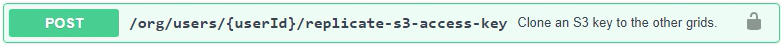

= Clona le chiavi di accesso S3 utilizzando l'API
:allow-uri-read: 
:icons: font
:imagesdir: ../media/

[role="lead"]
Se il tuo account tenant dispone dell'autorizzazione *Usa connessione federazione griglia*, puoi utilizzare l'API di gestione tenant per clonare manualmente le chiavi di accesso S3 dal tenant sulla griglia di origine al tenant sulla griglia di destinazione.

.Prima di iniziare
* L'account tenant ha l'autorizzazione *Usa connessione federata alla griglia*.
* La connessione della federazione di rete ha uno *Stato di connessione* pari a *Connesso*.
* Hai effettuato l'accesso al Tenant Manager sulla griglia di origine del tenant utilizzando unlink:../admin/web-browser-requirements.html["browser web supportato"] .
* Appartieni a un gruppo di utenti che ha illink:tenant-management-permissions.html["Gestisci le tue credenziali S3 o l'autorizzazione di accesso Root"] .
* Se si clonano le chiavi di accesso per un utente locale, l'utente esiste già su entrambe le griglie.
+

NOTE: Quando si clonano le chiavi di accesso S3 per un utente federato, sia l'utente sia le chiavi di accesso S3 vengono aggiunti al tenant di destinazione.

== Clona le tue chiavi di accesso

Puoi clonare le tue chiavi di accesso se hai bisogno di accedere agli stessi bucket su entrambe le griglie.

.Passi
. Utilizzando Tenant Manager sulla griglia di origine,link:creating-your-own-s3-access-keys.html["crea le tue chiavi di accesso"] e scarica il `.csv` file.
. Nella parte superiore di Tenant Manager, seleziona l'icona della guida e seleziona *Documentazione API*.
. Nella sezione *s3*, seleziona il seguente endpoint:
+
`POST /org/users/current-user/replicate-s3-access-key`

+
image::../media/grid-federation-post-current-user-replicate.png[Endpoint POST per replicare la propria chiave di accesso]

. Seleziona *Provalo*.
. Nella casella di testo *corpo*, sostituisci le voci di esempio per *accessKey* e *secretAccessKey* con i valori del file *.csv* scaricato.
+
Assicuratevi di mantenere le virgolette doppie attorno a ciascuna stringa.

+
image::../media/grid-federation-clone-access-key.png[API Tenant Manager che immette valori per clonare la chiave di accesso]

. Se la chiave scadrà, sostituire la voce di esempio per *expires* con la data e l'ora di scadenza come stringa nel formato data-ora ISO 8601 (ad esempio, `2024-02-28T22:46:33-08:00` ).  Se la chiave non scade, immettere *null* come valore per la voce *expires* (oppure rimuovere la riga *Expires* e la virgola precedente).
. Selezionare *Esegui*.
. Verificare che il codice di risposta del server sia *204*, a indicare che la chiave è stata clonata correttamente nella griglia di destinazione.

== Clona le chiavi di accesso di un altro utente

È possibile clonare le chiavi di accesso di un altro utente se quest'ultimo ha bisogno di accedere agli stessi bucket su entrambe le griglie.

.Passi
. Utilizzando Tenant Manager sulla griglia di origine,link:creating-another-users-s3-access-keys.html["creare le chiavi di accesso S3 dell'altro utente"] e scarica il `.csv` file.
. Nella parte superiore di Tenant Manager, seleziona l'icona della guida e seleziona *Documentazione API*.
. Ottieni l'ID utente.  Questo valore ti servirà per clonare le chiavi di accesso dell'altro utente.
+
.. Dalla sezione *utenti*, seleziona il seguente endpoint:
+
`GET /org/users`

.. Seleziona *Provalo*.
.. Specificare i parametri che si desidera utilizzare durante la ricerca degli utenti.
.. Selezionare *Esegui*.
.. Trova l'utente di cui vuoi clonare le chiavi e copia il numero nel campo *id*.

. Nella sezione *s3*, seleziona il seguente endpoint:
+
`POST /org/users/{userId}/replicate-s3-access-key`

+

. Seleziona *Provalo*.
. Nella casella di testo *userId*, incolla l'ID utente che hai copiato.
. Nella casella di testo *corpo*, sostituire le voci di esempio per *chiave di accesso di esempio* e *chiave di accesso segreta* con i valori del file *.csv* per quell'utente.
+
Assicuratevi di mantenere le virgolette doppie attorno alla stringa.

. Se la chiave scadrà, sostituire la voce di esempio per *expires* con la data e l'ora di scadenza come stringa nel formato data-ora ISO 8601 (ad esempio, `2023-02-28T22:46:33-08:00` ).  Se la chiave non scade, immettere *null* come valore per la voce *expires* (oppure rimuovere la riga *Expires* e la virgola precedente).
. Selezionare *Esegui*.
. Verificare che il codice di risposta del server sia *204*, a indicare che la chiave è stata clonata correttamente nella griglia di destinazione.

