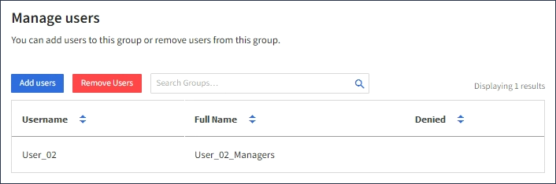

= Gestisci gruppi
:allow-uri-read: 
:icons: font
:imagesdir: ../media/

[role="lead"]
Gestisci i tuoi gruppi di tenant in base alle tue esigenze per visualizzare, modificare o duplicare un gruppo e altro ancora.

.Prima di iniziare
* Hai effettuato l'accesso al Tenant Manager tramite unlink:../admin/web-browser-requirements.html["browser web supportato"] .
* Appartieni a un gruppo di utenti che ha illink:tenant-management-permissions.html["Permesso di accesso root"] .

== Visualizza o modifica il gruppo

È possibile visualizzare e modificare le informazioni di base e i dettagli per ciascun gruppo.

.Passi
. Selezionare *GESTIONE ACCESSI* > *Gruppi*.
. Esaminare le informazioni fornite nella pagina Gruppi, che elenca le informazioni di base per tutti i gruppi locali e federati per questo account tenant.
+
Se l'account tenant dispone dell'autorizzazione *Usa connessione federazione griglia* e si stanno visualizzando i gruppi sulla griglia di origine del tenant:

+
** Un messaggio banner indica che se modifichi o rimuovi un gruppo, le modifiche non verranno sincronizzate con l'altra griglia.
** Se necessario, un messaggio banner indica se i gruppi non sono stati clonati nel tenant sulla griglia di destinazione.  Puoi<<clone-groups,riprovare un clone di gruppo>> che ha fallito.

. Se vuoi cambiare il nome del gruppo:
+
.. Selezionare la casella di controllo per il gruppo.
.. Seleziona *Azioni* > *Modifica nome gruppo*.
.. Inserisci il nuovo nome.
.. Seleziona *Salva modifiche.*

. Se desideri visualizzare maggiori dettagli o apportare modifiche aggiuntive, procedi in uno dei seguenti modi:
+
** Selezionare il nome del gruppo.
** Seleziona la casella di controllo per il gruppo e seleziona *Azioni* > *Visualizza dettagli gruppo*.

. Esaminare la sezione Panoramica, che mostra le seguenti informazioni per ciascun gruppo:
+
** Nome da visualizzare
** Nome univoco
** Tipo
** Modalità di accesso
** Permessi
** Politica S3
** Numero di utenti in questo gruppo
** Campi aggiuntivi se l'account tenant dispone dell'autorizzazione *Usa connessione federazione griglia* e si sta visualizzando il gruppo sulla griglia di origine del tenant:
+
*** Stato della clonazione, *Riuscito* o *Fallito*
*** Un banner blu che indica che se modifichi o elimini questo gruppo, le tue modifiche non verranno sincronizzate con l'altra griglia.

. Modificare le impostazioni del gruppo secondo necessità. Vederelink:creating-groups-for-s3-tenant.html["Creare gruppi per un tenant S3"] Elink:creating-groups-for-swift-tenant.html["Creare gruppi per un tenant Swift"] per i dettagli su cosa inserire.
+
.. Nella sezione Panoramica, modifica il nome visualizzato selezionando il nome o l'icona di modificaimage:../media/icon_edit_tm.png["Icona di modifica"] .
.. Nella scheda *Autorizzazioni gruppo*, aggiorna le autorizzazioni e seleziona *Salva modifiche*.
.. Nella scheda *Criteri di gruppo*, apportare le modifiche desiderate e selezionare *Salva modifiche*.
+
*** Se si sta modificando un gruppo S3, è possibile selezionare facoltativamente un criterio di gruppo S3 diverso oppure immettere la stringa JSON per un criterio personalizzato, a seconda delle necessità.
*** Se stai modificando un gruppo Swift, seleziona o deseleziona facoltativamente la casella di controllo *Amministratore Swift*.

. Per aggiungere uno o più utenti locali esistenti al gruppo:
+
.. Selezionare la scheda Utenti.
+

.. Seleziona *Aggiungi utenti*.
.. Seleziona gli utenti esistenti che desideri aggiungere e seleziona *Aggiungi utenti*.
+
In alto a destra appare un messaggio di conferma.

. Per rimuovere gli utenti locali dal gruppo:
+
.. Selezionare la scheda Utenti.
.. Seleziona *Rimuovi utenti*.
.. Seleziona gli utenti che vuoi rimuovere e seleziona *Rimuovi utenti*.
+
In alto a destra appare un messaggio di conferma.

. Conferma di aver selezionato *Salva modifiche* per ogni sezione modificata.

== Gruppo duplicato

È possibile duplicare un gruppo esistente per creare nuovi gruppi più rapidamente.

NOTE: Se l'account del tenant dispone dell'autorizzazione *Usa connessione federazione griglia* e si duplica un gruppo dalla griglia di origine del tenant, il gruppo duplicato verrà clonato nella griglia di destinazione del tenant.

.Passi
. Selezionare *GESTIONE ACCESSI* > *Gruppi*.
. Seleziona la casella di controllo relativa al gruppo che desideri duplicare.
. Selezionare *Azioni* > *Duplica gruppo*.
. Vederelink:creating-groups-for-s3-tenant.html["Creare gruppi per un tenant S3"] Olink:creating-groups-for-swift-tenant.html["Creare gruppi per un tenant Swift"] per i dettagli su cosa inserire.
. Seleziona *Crea gruppo*.

== [[clone-groups]]Riprova a clonare il gruppo

Per riprovare una clonazione non riuscita:

. Selezionare ciascun gruppo che indica _(Clonazione non riuscita)_ sotto il nome del gruppo.
. Selezionare *Azioni* > *Clona gruppi*.
. Visualizza lo stato dell'operazione di clonazione dalla pagina dei dettagli di ciascun gruppo che stai clonando.

Per ulteriori informazioni, vederelink:grid-federation-account-clone.html["Clona gruppi tenant e utenti"] .

== Elimina uno o più gruppi

È possibile eliminare uno o più gruppi.  Gli utenti che appartengono solo a un gruppo eliminato non potranno più accedere a Tenant Manager o utilizzare l'account tenant.

NOTE: Se l'account tenant dispone dell'autorizzazione *Usa connessione federazione griglia* e si elimina un gruppo, StorageGRID non eliminerà il gruppo corrispondente sull'altra griglia.  Se è necessario mantenere sincronizzate queste informazioni, è necessario eliminare lo stesso gruppo da entrambe le griglie.

.Passi
. Selezionare *GESTIONE ACCESSI* > *Gruppi*.
. Seleziona la casella di controllo per ogni gruppo che desideri eliminare.
. Selezionare *Azioni* > *Elimina gruppo* o *Azioni* > *Elimina gruppi*.
+
Viene visualizzata una finestra di dialogo di conferma.

. Selezionare *Elimina gruppo* o *Elimina gruppi*.

