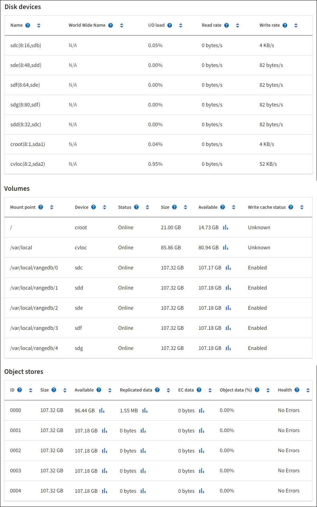

= Errori dell'archivio oggetti (volume di archiviazione)
:allow-uri-read: 
:icons: font
:imagesdir: ../media/

[role="lead"]
Lo storage sottostante su un nodo di storage è suddiviso in archivi di oggetti.  Gli archivi di oggetti sono anche noti come volumi di archiviazione.

È possibile visualizzare le informazioni sull'archivio oggetti per ciascun nodo di archiviazione. Gli archivi degli oggetti vengono visualizzati nella parte inferiore della pagina *NODI* > *Nodo di archiviazione_* > *Archiviazione*.

Per vedere di piùlink:../monitor/viewing-grid-topology-tree.html["dettagli su ciascun nodo di archiviazione"] , segui questi passaggi:

. Selezionare *SUPPORTO* > *Strumenti* > *Topologia griglia*.
. Selezionare *_site_* > *_Storage Node_* > *LDR* > *Storage* > *Panoramica* > *Principale*.

image::../media/storage_node_object_stores.png[Archivio oggetti del nodo di archiviazione]

A seconda della natura del guasto, i guasti con un volume di archiviazione potrebbero riflettersi inlink:../monitor/alerts-reference.html["avvisi sul volume di archiviazione"] .  Se un volume di archiviazione si guasta, è necessario ripararlo per ripristinare la piena funzionalità del nodo di archiviazione il prima possibile.  Se necessario, puoi andare alla scheda *Configurazione* elink:../maintain/checking-storage-state-after-recovering-storage-volumes.html["posizionare il nodo di archiviazione in uno stato di sola lettura"] in modo che il sistema StorageGRID possa utilizzarlo per il recupero dei dati mentre ci si prepara per un ripristino completo del server.
