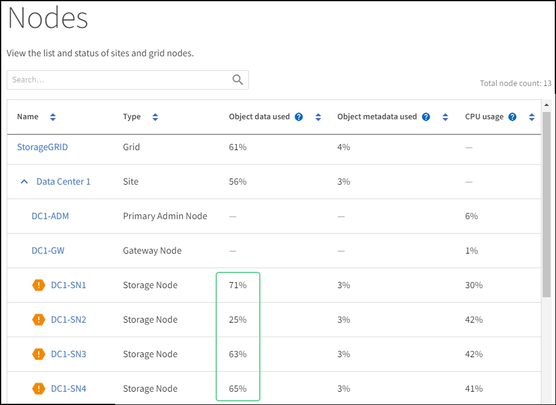

= Risoluzione dei problemi relativi agli avvisi di override della filigrana di sola lettura bassa
:allow-uri-read: 
:icons: font
:imagesdir: ../media/

[role="lead"]
Se si utilizzano valori personalizzati per le filigrane del volume di archiviazione, potrebbe essere necessario risolvere l'avviso *Sostituzione filigrana di sola lettura bassa*.  Se possibile, dovresti aggiornare il tuo sistema per iniziare a utilizzare i valori ottimizzati.

Nelle versioni precedenti, i trelink:../admin/what-storage-volume-watermarks-are.html["filigrane del volume di archiviazione"] erano impostazioni globali, ovvero gli stessi valori applicati a ogni volume di archiviazione su ogni nodo di archiviazione.  A partire da StorageGRID 11.6, il software è in grado di ottimizzare queste filigrane per ciascun volume di archiviazione, in base alle dimensioni del nodo di archiviazione e alla capacità relativa del volume.

Quando si esegue l'aggiornamento a StorageGRID 11.6 o versione successiva, le filigrane ottimizzate di sola lettura e di lettura-scrittura vengono applicate automaticamente a tutti i volumi di archiviazione, a meno che non si verifichi una delle seguenti condizioni:

* Il sistema è prossimo alla capacità massima e non sarebbe in grado di accettare nuovi dati se fossero applicate filigrane ottimizzate.  In questo caso StorageGRID non modificherà le impostazioni della filigrana.
* In precedenza hai impostato una qualsiasi delle filigrane del volume di archiviazione su un valore personalizzato.  StorageGRID non sovrascriverà le impostazioni personalizzate della filigrana con valori ottimizzati.  Tuttavia, StorageGRID potrebbe attivare l'avviso *Sostituzione filigrana di sola lettura bassa* se il valore personalizzato per la filigrana di sola lettura software del volume di archiviazione è troppo piccolo.

== Comprendere l'avviso

Se si utilizzano valori personalizzati per le filigrane del volume di archiviazione, potrebbe essere attivato l'avviso *Sostituzione filigrana di sola lettura bassa* per uno o più nodi di archiviazione.

Ogni istanza dell'avviso indica che il valore personalizzato della filigrana di sola lettura software del volume di archiviazione è inferiore al valore minimo ottimizzato per quel nodo di archiviazione.  Se si continua a utilizzare l'impostazione personalizzata, lo spazio disponibile sul nodo di archiviazione potrebbe esaurirsi prima di poter passare in sicurezza allo stato di sola lettura.  Alcuni volumi di archiviazione potrebbero diventare inaccessibili (smontati automaticamente) quando il nodo raggiunge la capacità massima.

Ad esempio, supponiamo di aver precedentemente impostato la filigrana di sola lettura software del volume di archiviazione su 5 GB.  Supponiamo ora che StorageGRID abbia calcolato i seguenti valori ottimizzati per i quattro volumi di archiviazione nel nodo di archiviazione A:

[cols="2a,2a"]
|===

 a| 
Volume 0
 a| 
12 GB

 a| 
Volume 1
 a| 
12 GB

 a| 
Volume 2
 a| 
11 GB

 a| 
Volume 3
 a| 
15 GB

|===
L'avviso *Sostituzione filigrana di sola lettura bassa* viene attivato per il nodo di archiviazione A perché la filigrana personalizzata (5 GB) è inferiore al valore minimo ottimizzato per tutti i volumi in quel nodo (11 GB).  Se si continua a utilizzare l'impostazione personalizzata, lo spazio disponibile sul nodo potrebbe esaurirsi prima di poter passare in sicurezza allo stato di sola lettura.

== Risolvi l'avviso

Seguire questi passaggi se sono stati attivati uno o più avvisi di *sostituzione della filigrana di sola lettura bassa*.  Puoi utilizzare queste istruzioni anche se attualmente utilizzi impostazioni di filigrana personalizzate e desideri iniziare a utilizzare impostazioni ottimizzate anche se non sono stati attivati avvisi.

.Prima di iniziare
* Hai completato l'aggiornamento a StorageGRID 11.6 o versione successiva.
* Hai effettuato l'accesso a Grid Manager utilizzando unlink:../admin/web-browser-requirements.html["browser web supportato"] .
* Tu hai illink:../admin/admin-group-permissions.html["Permesso di accesso root"] .

.Informazioni su questo compito
È possibile risolvere l'avviso *Sostituzione filigrana di sola lettura bassa* aggiornando le impostazioni della filigrana personalizzata con le nuove sostituzioni filigrana.  Tuttavia, se uno o più nodi di archiviazione sono quasi pieni o si hanno requisiti ILM speciali, è necessario prima visualizzare le filigrane di archiviazione ottimizzate e determinare se è sicuro utilizzarle.

=== Valutare l'utilizzo dei dati degli oggetti per l'intera griglia

.Passi
. Selezionare *NODES*.
. Per ogni sito nella griglia, espandere l'elenco dei nodi.
. Esaminare i valori percentuali mostrati nella colonna *Dati oggetto utilizzati* per ciascun nodo di archiviazione in ogni sito.
+

. Seguire il passaggio appropriato:
+
.. Se nessuno dei nodi di archiviazione è quasi pieno (ad esempio, tutti i valori dei *dati oggetto utilizzati* sono inferiori all'80%), è possibile iniziare a utilizzare le impostazioni di override. Vai a<<use-optimized-watermarks,Utilizza filigrane ottimizzate>> .
.. Se le regole ILM utilizzano un comportamento di acquisizione rigoroso o se specifici pool di archiviazione sono quasi pieni, eseguire i passaggi in<<view-optimized-watermarks,Visualizza le filigrane di archiviazione ottimizzate>> E<<determine-optimized-watermarks,Determina se puoi utilizzare filigrane ottimizzate>> .

=== [[view-optimized-watermarks]]Visualizza le filigrane di archiviazione ottimizzate

StorageGRID utilizza due metriche Prometheus per mostrare i valori ottimizzati calcolati per la filigrana di sola lettura software del volume di archiviazione.  È possibile visualizzare i valori ottimizzati minimi e massimi per ciascun nodo di archiviazione nella griglia.

.Passi
. Selezionare *SUPPORTO* > *Strumenti* > *Metriche*.
. Nella sezione Prometheus, seleziona il collegamento per accedere all'interfaccia utente di Prometheus.
. Per visualizzare il watermark minimo consigliato per la sola lettura software, immettere la seguente metrica Prometheus e selezionare *Esegui*:
+
`storagegrid_storage_volume_minimum_optimized_soft_readonly_watermark`

+
L'ultima colonna mostra il valore minimo ottimizzato della filigrana di sola lettura software per tutti i volumi di archiviazione su ciascun nodo di archiviazione.  Se questo valore è maggiore dell'impostazione personalizzata per la filigrana di sola lettura software del volume di archiviazione, viene attivato l'avviso *Sostituzione filigrana di sola lettura insufficiente* per il nodo di archiviazione.

. Per visualizzare il limite massimo consigliato per la sola lettura software, immettere la seguente metrica Prometheus e selezionare *Esegui*:
+
`storagegrid_storage_volume_maximum_optimized_soft_readonly_watermark`

+
L'ultima colonna mostra il valore massimo ottimizzato della filigrana di sola lettura software per tutti i volumi di archiviazione su ciascun nodo di archiviazione.

. [[maximum_optimized_value]]Nota il valore massimo ottimizzato per ogni nodo di archiviazione.

=== [[determine-optimized-watermarks]]Determina se puoi utilizzare watermark ottimizzati

.Passi
. Selezionare *NODES*.
. Ripetere questi passaggi per ogni nodo di archiviazione online:
+
.. Selezionare *_Nodo di archiviazione_* > *Archiviazione*.
.. Scorrere verso il basso fino alla tabella Archivi oggetti.
.. Confronta il valore *Disponibile* per ciascun archivio oggetti (volume) con il limite massimo ottimizzato annotato per quel nodo di archiviazione.

. Se almeno un volume su ogni nodo di archiviazione online ha più spazio disponibile rispetto al limite massimo ottimizzato per quel nodo, vai a<<use-optimized-watermarks,Utilizza filigrane ottimizzate>> per iniziare a utilizzare le filigrane ottimizzate.
+
Altrimenti, espandi la griglia il prima possibile.  Olink:../expand/adding-storage-volumes-to-storage-nodes.html["aggiungere volumi di archiviazione"] a un nodo esistente olink:../expand/adding-grid-nodes-to-existing-site-or-adding-new-site.html["aggiungere nuovi nodi di archiviazione"] .  Poi vai a<<use-optimized-watermarks,Utilizza filigrane ottimizzate>> per aggiornare le impostazioni della filigrana.

. Se è necessario continuare a utilizzare valori personalizzati per le filigrane del volume di archiviazione,link:../monitor/silencing-alert-notifications.html["silenzio"] Olink:../monitor/disabling-alert-rules.html["disabilitare"] l'avviso *Sostituzione filigrana di sola lettura bassa*.
+

NOTE: Gli stessi valori di filigrana personalizzati vengono applicati a ogni volume di archiviazione su ogni nodo di archiviazione.  L'utilizzo di valori inferiori a quelli consigliati per le filigrane del volume di archiviazione potrebbe causare l'inaccessibilità di alcuni volumi di archiviazione (smontaggio automatico) quando il nodo raggiunge la capacità massima.

=== [[use-optimized-watermarks]]Usa filigrane ottimizzate

.Passi
. Vai a *SUPPORTO* > *Altro* > *Filigrane di archiviazione*.
. Selezionare la casella di controllo *Usa valori ottimizzati*.
. Seleziona *Salva*.

Le impostazioni ottimizzate della filigrana del volume di archiviazione sono ora attive per ogni volume di archiviazione, in base alle dimensioni del nodo di archiviazione e alla capacità relativa del volume.
