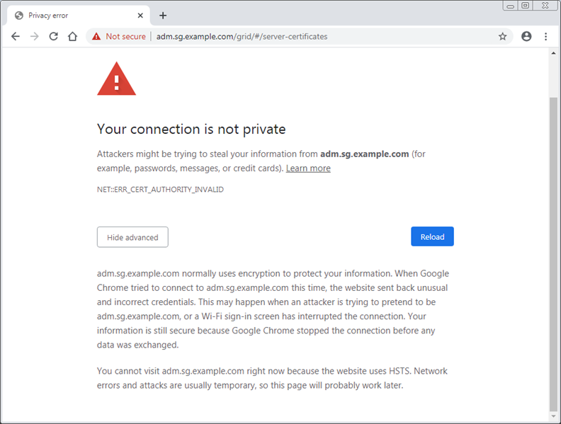

= Risolvere gli errori del certificato
:allow-uri-read: 
:icons: font
:imagesdir: ../media/

[role="lead"]
Se riscontri un problema di sicurezza o di certificato quando provi a connetterti a StorageGRID tramite un browser Web, un client S3 o uno strumento di monitoraggio esterno, dovresti controllare il certificato.

.Informazioni su questo compito
Gli errori del certificato possono causare problemi quando si tenta di connettersi a StorageGRID tramite Grid Manager, Grid Management API, Tenant Manager o Tenant Management API.  Gli errori del certificato possono verificarsi anche quando si tenta di connettersi a un client S3 o a uno strumento di monitoraggio esterno.

Se si accede a Grid Manager o Tenant Manager utilizzando un nome di dominio anziché un indirizzo IP, il browser visualizza un errore di certificato senza un'opzione per ignorarlo se si verifica una delle seguenti situazioni:

* Il certificato dell'interfaccia di gestione personalizzata scade.
* Si passa da un certificato di interfaccia di gestione personalizzato al certificato del server predefinito.

L'esempio seguente mostra un errore del certificato quando il certificato dell'interfaccia di gestione personalizzata è scaduto:

Per garantire che le operazioni non vengano interrotte da un certificato server non riuscito, l'avviso *Scadenza del certificato server per l'interfaccia di gestione* viene attivato quando il certificato server sta per scadere.

Quando si utilizzano certificati client per l'integrazione esterna di Prometheus, gli errori dei certificati possono essere causati dal certificato dell'interfaccia di gestione StorageGRID o dai certificati client.  L'avviso *Scadenza dei certificati client configurati nella pagina Certificati* viene attivato quando un certificato client sta per scadere.

.Passi
Se hai ricevuto una notifica di avviso relativa a un certificato scaduto, accedi ai dettagli del certificato: . Selezionare *CONFIGURAZIONE* > *Sicurezza* > *Certificati* e quindilink:../admin/using-storagegrid-security-certificates.html#access-security-certificates["seleziona la scheda del certificato appropriata"] .

. Verificare il periodo di validità del certificato.  + Alcuni browser Web e client S3 non accettano certificati con un periodo di validità superiore a 398 giorni.
. Se il certificato è scaduto o scadrà a breve, carica o genera un nuovo certificato.
+
** Per un certificato del server, vedere i passaggi perlink:../admin/configuring-custom-server-certificate-for-grid-manager-tenant-manager.html#add-a-custom-management-interface-certificate["configurazione di un certificato server personalizzato per Grid Manager e Tenant Manager"] .
** Per un certificato client, vedere i passaggi perlink:../admin/configuring-administrator-client-certificates.html["configurazione di un certificato client"] .

. Per gli errori del certificato del server, provare una o entrambe le seguenti opzioni:
+
** Assicurarsi che il nome alternativo del soggetto (SAN) del certificato sia compilato e che il SAN corrisponda all'indirizzo IP o al nome host del nodo a cui ci si sta connettendo.
** Se si tenta di connettersi a StorageGRID utilizzando un nome di dominio:
+
... Immettere l'indirizzo IP del nodo di amministrazione anziché il nome di dominio per aggirare l'errore di connessione e accedere a Grid Manager.
... Da Grid Manager, seleziona *CONFIGURAZIONE* > *Sicurezza* > *Certificati* e poilink:../admin/using-storagegrid-security-certificates.html#access-security-certificates["seleziona la scheda del certificato appropriata"] per installare un nuovo certificato personalizzato o continuare con il certificato predefinito.
... Nelle istruzioni per l'amministrazione StorageGRID, vedere i passaggi perlink:../admin/configuring-custom-server-certificate-for-grid-manager-tenant-manager.html#add-a-custom-management-interface-certificate["configurazione di un certificato server personalizzato per Grid Manager e Tenant Manager"] .

